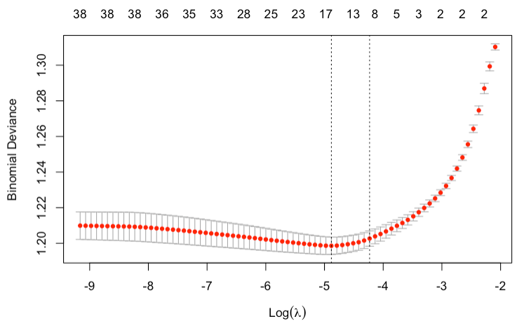
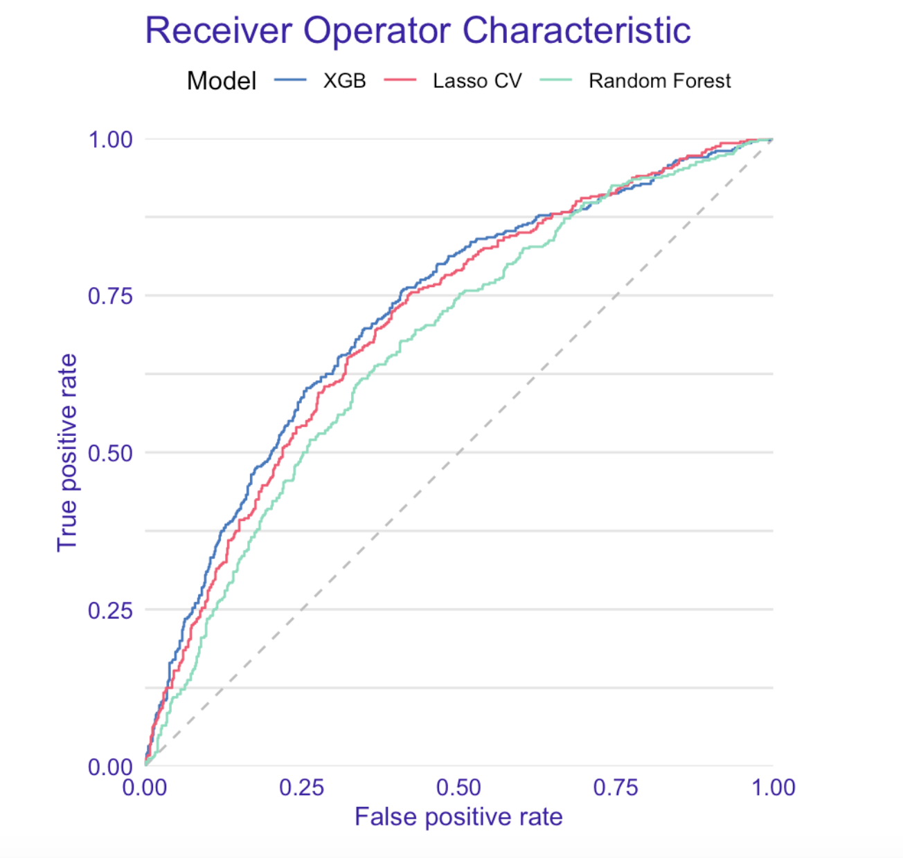
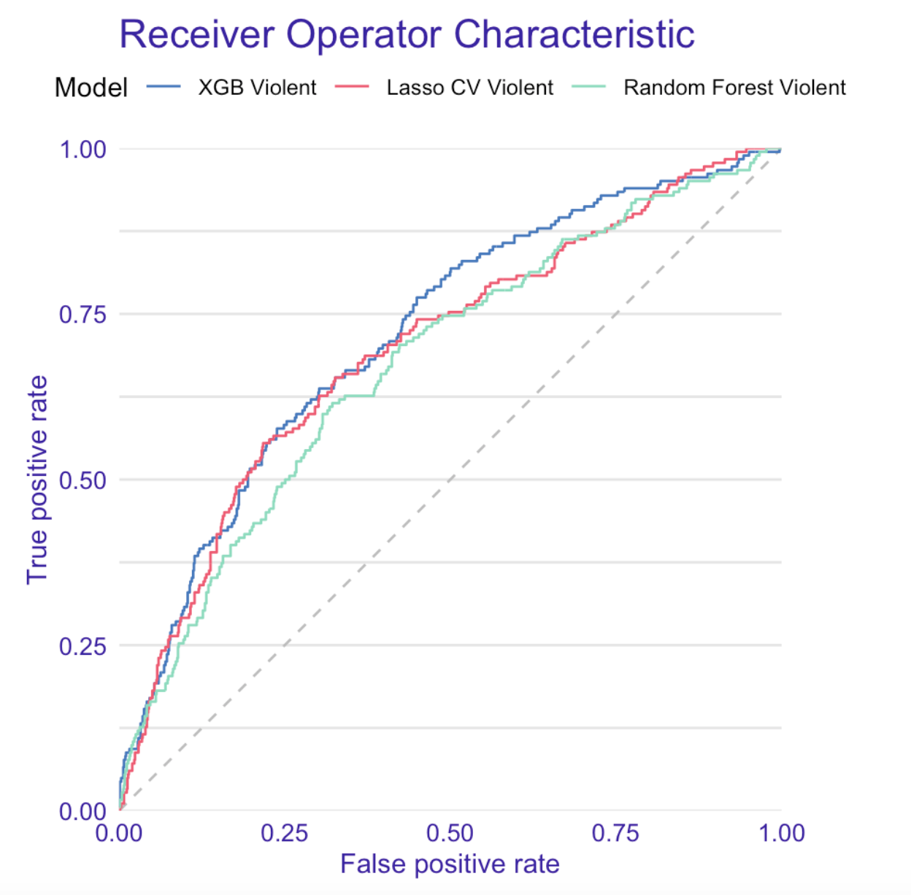
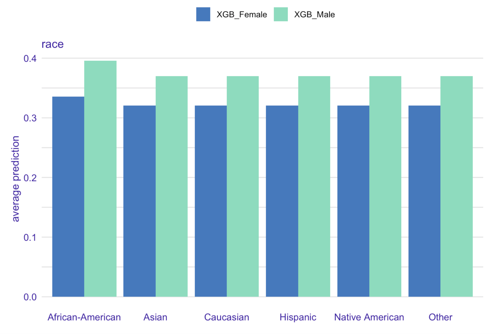
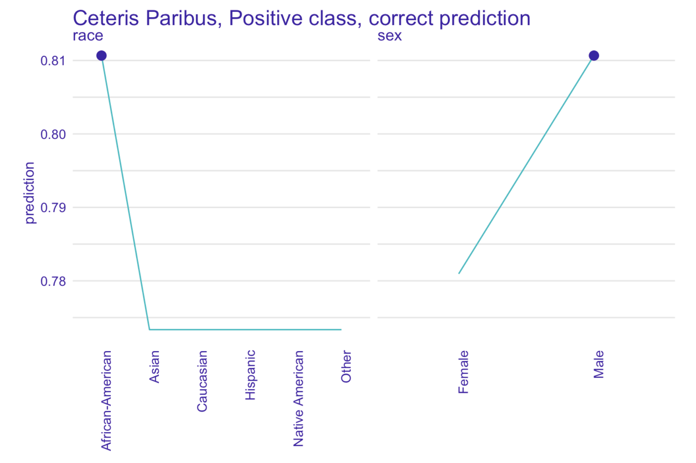
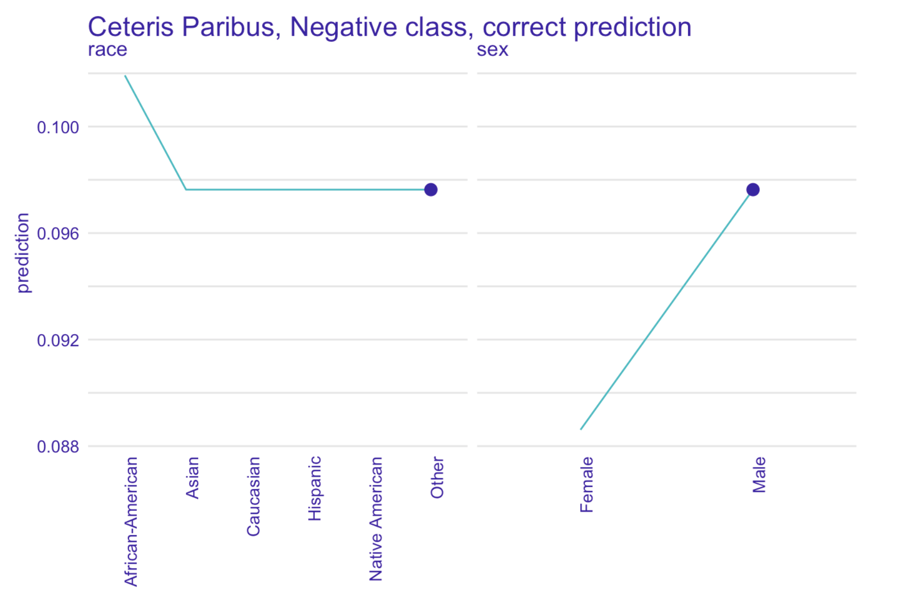

# Story COMPAS: recidivism reloaded {#story-compas}

*Authors: Łukasz Grad (University of Warsaw), Katarzyna Koprowska (Warsaw University of Technology), Jakub Kozak (SGH Warsaw School of Economics)*

*Mentors: Michał Miktus (McKinsey)*

## Introduction 

The study concerns the COMPAS algorithm, which stands for Correctional Offender Management Profiling for Alternative Sanctions, created by a for-profit company Northpointe. COMPAS is a widely popular commercial algorithm used by judges and parole officers for scoring a criminal defendant’s likelihood of recidivism. It was designed to help judges identify potentially more dangerous individuals (those with higher scores) and award them with longer sentences. It is easy to notice that COMPAS results may have very serious consequences for the lives of many people in the United States. yet the algorithm is (because of its proprietary nature) still a black-box for the wide audience – meaning that we cannot easily identify which factors did it take into account when classifying an individual as a person with a high or low likelihood of reoffending. 

It is natural that many questions have arised about the fairness of such an algorithm, especially as the fairness required to be defined in advance.

### Previous work

One of the first and the most known investigators wanting to validate COMPAS results was ProPublica group. They have provoked a vigorous discussion about the fairness of black-box models with their 2016 study, which attempted to reconstruct COMPAS methodology. They have collected criminal records from Broward County FL for several thousand people, as well as reports about their offenses in a two-year follow-up period. The overall accuracy of ProPublica’s reconstructed model was only 61%, but their main discovery was a racial bias in favour of Caucasian defendants over those of African-American origins. According to the study, black defendants were particularly likely to be falsely flagged as future criminals almost twice as often as white ones, who were also more often mislabeled as low risk. The researchers believed that this disparity cannot be explained by either defendant’s prior crimes, type of crimes, gender or age. 

The ProPublica study was, however, criticized for its flawed methodology. One of the critics was Northpointe, the creator of the COMPAS algorithm, who defended the accuracy of its test, because the results from ProPublica do not accurately reflect their model.

After ProPublica’s publication, confusion and doubts, whether COMPAS should still be relied on, began to appear among researchers, which led several of them to propose their own validations of the algorithm, based on data provided by ProPublica. One of the most reliable work seems to be the 2019 study “The age of secrecy and unfairness in recidivism prediction” by Rudin et al., which verifies the analysis conducted by ProPublica, indicating cases where the results given by COMPAS may be non-intuitive and possible explanations. The authors believe that ProPublica has drawn conclusions from incorrect assumptions and lack of knowledge of all data: for instance, they assumed linearity in age (as stated in official COMPAS documentation from Northpointe), which appeared to be untrue; they also did not have access to the answers from questionnaires given to defendants (also introduced by the Northpointe as predictors for their model), which can be highly correlated with race and shift the outcome. 

Disproving ProPublica’s study was not, however, the main objective of Rudin et al. They described what they believed was the real problem of COMPAS: its proprietary nature, which, along with over a hundred of (manually-entered) variables collected from questionnaires not accessible to anyone but Northpointe, does not allow to identify data entry errors, data integration errors, missing data and other types of inaccuracies. The researchers even identified some individuals with a rich criminal history and low probability of recidivism given by model, highly suggesting that their scores were based on flawed data.
The main conclusion of this analysis was to replace black-box machine learning models by interpretable models, which, as Rudin et al. suggested, can be equally accurate for predicting recidivism.

We believe, however, that we are capable of achieving better accuracy results than the aforementioned researchers and that, thanks to the explainability techniques, a trade-off between accuracy and interpretability is no longer unavoidable.

## Models

Our goal was to predict the recidivism and violent recidivism in a two-year follow-up period. Therefore, we modeled both problems as binary classification tasks.
Data we used for modelling was largely derived from the “The age of unfairness” study dataset combined with several factors extracted from the raw Broward County FL database used by ProPublica for their analysis. 

In our model, we analyzed data from 5727 subjects from Broward County FL, whose likelihood of recidivism and violent recidivism
we were trying to predict. We have used both 29 variables: 
**personal** (6) including current age, age at first offence, sex, race, marital status, custody status, **criminal involvement** (20) consisting of number and types of previous charges and arrests, as well as those leading to COMPAS screening and **history of non-compliance** (3) concerning behaviour while on probation.

### Recidivism

In order to find the best model, we have tried different approaches: Extreme Gradient Boosting (XGBoost), LASSO Logistic Regression and Random Forest. We focused on tuning the XGBoost model, as it provides state-of-the-art results on many tabular datasets, and wanted to compare it with a white box logistic regression model along with out-of-the-box Random Forest. 

Comparison with a linear model can give us insights on whether the relationships between recidivism and given predictors is highly nonlinear or not. On the other hand, comparison with Random Forest model will reveal how important is careful parameter tuning for this task.

#### XGBoost

Since the volume of our datasets is not substantial, we performed  XGBoost tuning with exhaustive grid search method in a coarse-to-fine manner. With a coarse parameter search we assessed the relative importance of each parameter and narrowed down its potential range of values. Next, with a much finer search we obtained out final sets of parameters. As a metric during parameter tuning we used AUC on the full training set with out-of-fold scores within a 5-fold CV scheme. In our analysis, we used `xgboost` package in R.

| Model   | Tree Number | Max Depth | Eta  | Colsample | Subsample | Min Child Weight | Alpha | Lambda
|:----------:|:-----------:|:----------:|:-----:|:---------:|:---------:|:----------------:|:-----:|:-----:|
| XGB        |     12      | 3       | 0.3  |    1      |  0.8      |   3   |  1    |   1   |
| XGB Violent|      19     | 3       | 0.3  |    0.8    |  0.8      |   10  |  1    |   0   |
*Selected final parameter sets for recidivism and violent recidivism XGBoost models*

#### LASSO regression

Since we had strong suspicions about collinearity between predictors, we used Logistic Regression with L1 penalty (LASSO) as our linear model of choice. The penalty term, similarily to XGBoost, was tuned with 5-fold CV on the training set. We utilized a well known `glmnet` package in R to efficiently find optimal penalty terms using the Lasso path. Final models had $17$ and $28$ non-zero weights, for recidivism and violent recidivism models. Below we present the Lasso path for recidivism model.

*Lasso path for recidivism model. On top we see the number of non-zero weights. We can see the optimal penalty term chosen close to $e^{-5}$. Best model had 17 non-zero weights, although models with less than 10 chosen predictors also perform well*

#### Random Forest

As for the Random Forest model, we relied on the default implementation in `RandomForest` R package, without any finetuning. We set the number of trees to 50, seeing that the chosen XGBoost models were also sparse in tree count.

*Figure above presents ROC curve for three recidivism classifiers.*

We decidecied to compare our models using a receiver operating characteristic or ROC curve in short. As it turned out, the most accurate algorithm was XGBoost with AUC of 0.72.  

*Figure above presents ROC curve for three violent recidivism classifiers.*

We did similar calculations for violent recidivism and again the best results gave us XGBoost. In both cases, ROC AUC was 0.72, which is much more than ProPublika score and also significantly more than COMPAS.

## Explanations

### Model specific

In order to identify the effect of features on prediction we used Permutation Variable Importance.

Not surprisingly, the most relevant variable turned out to be number of previous arrests. Another factor that is greatly affecting prediction is age – younger people tend to be much more likely to commit crime again. It is tightly followed by the number of previous misdemeanors, suggesting that people commiting lesser crimes are more likely to do it again. Last of the important characteristics is the age of first offense, indicating that people whose criminal history begins in their teens are more likely to re-offend.

Similarly to recidivism modeling, the number of previous arrests and current age are also the most important factors in predicting violent recidivism. The deciding factor is, however, the number of previous violent charges – people committing violent crimes tend to be more likely to proceed to do it in the future. The impact of the age at first offense is lower comparing to the recidivism model.

Our model predicted African-Americans to be, on average, more likely to re-offend than individuals of any other race. 

### Instance specific

In order to identify, whether it is not caused by other factors correlated with race, we have performed an instance level analysis using Ceteris Paribus on observations with the most accurate predictions.

Neither is our model – but it has been fitted on real world data full of systematic bias, making it unfair towards African-Americans,as Ceteris Paribus freezes all the other factors.

It is very surprising that the COMPAS itself seems to (for some of the subjects) favorite black people over other races, as it can be seen on the picture.

Another question arises whether we do not have a gender bias, because both models - ours and COMPAS - seem to drastically change their predictions for male subjects when controlling for other factors.

In our next steps we would like to investigate other factors affecting predictions and check whether biases other than racial occur as well.

## Summary and conclusions 

One may ask: what is the big deal? If data shows that certain individuals are more likely to be classified as reoffending, then our models should include that information.

We do not know, however, how existing racial bias influenced the actual data: what if white people were simply less often arrested, had fewer charges and more let go with a warning? This scenario is not so difficult to imagine.

As data scientists it is our social duty to make sure we do not propagate any existing biases and do our best to eliminate them. 

