# Story House Sale Prices: eXplainable predictions for house sale {#story-house_sale_prices}

*Authors: Piotr Grązka (SGH Warsaw School of Economics), Anna Kozak (Warsaw University of Technology), Paweł Wicherek (Warsaw University of Technology)*

*Mentors: Mateusz Zawisza (McKinsey & Company), Adam Zmaczyński (McKinsey & Company)*

> ''That's all your house is: it's a place to keep your stuff while you go out and get more stuff.''
>  `r tufte::quote_footer('George Carlin')`

### Take-away messages {-}

```{r take-away-02, out.width="700", fig.align="center", echo=FALSE}
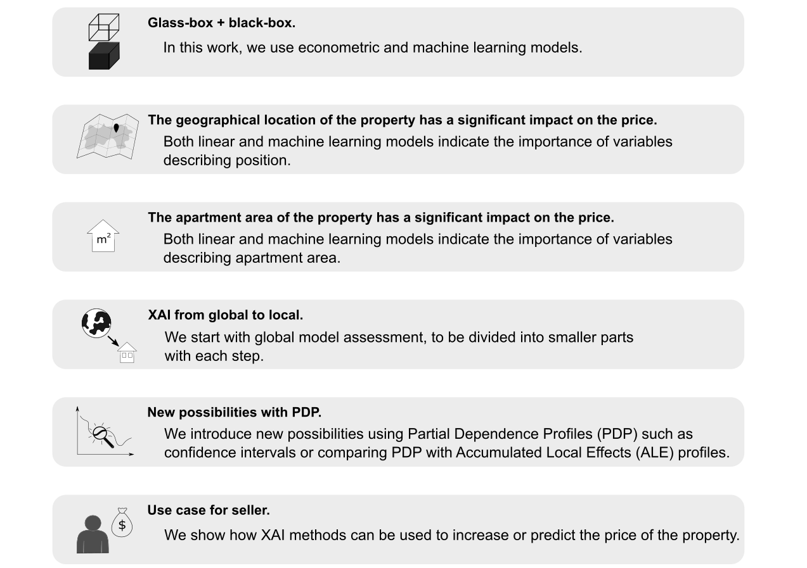
```

## Introduction 

Everybody needs a roof over their heads. It can be a house, a villa, or a flat. Everybody, at some point in life, faces a choice whether to buy a house, and if so, which one. And why are they so expensive?

The topic of real estate is not only the topic you just have to deal with. It can also be very interesting. There are plenty of TV Shows, for instance, [*Property Brothers*](https://en.wikipedia.org/wiki/Property_Brothers), of which plot is based on examples of people buying and renovating houses. This particular one is the most famous in the world and has been running already for almost a decade. For many people houses are also an investment that generates profits.


Regardless of motives of buying and selling real estate, both sides agree on a price. It is always good to know **how much** a house is worth, what is the expected transaction price. Furthermore, it may be even more important **why** is the price like that, what has an impact on it.

In this work, we want to find an answer to both questions with a stronger emphasis on the latter. This paper intends to be a comprehensive use case of how to deal with a regression problem for Data Scientists. Let us start with a couple of questions that allow to define and understand problems regarding house pricing.

- *The seller does not know how to increase the value of the apartment so that the investment outlay is lower than the added value (e.g. building a pool may increase the price and renovating the bathroom is not worth it).*

- *The seller does not know how much to sell the apartment for (he makes an offer on the portal and does not know if the price is adequate).*

- *The buyer does not know how much the apartment is worth (as above, whether the price is adequate).*

- *Commercial problem: auction services may be interested in tools to support sellers and buyers (to highlight the sections in the offers that most affect the price).*

These are just some of the questions we can ask. As a definition of our problem, we set the property valuation, and through explanations we try to get an answer depending on the position we choose.

The structure of this paper is as follows. In chapter 1 we introduce the problem of sale house prediction. Chapter 2 shows original data, transformation of variables and external data. Modelling can be found in chapter 3. In chapter 4 we present global and local explanations. Chapter 5 includes a use case for sellers. Chapter 6 summarizes the work. The diagram (Figure \@ref(fig:plan)) presents how the research is organized.


```{r plan, out.width="700", fig.align="center", echo=FALSE, fig.cap='Roadmap of the analyses carried out.'}
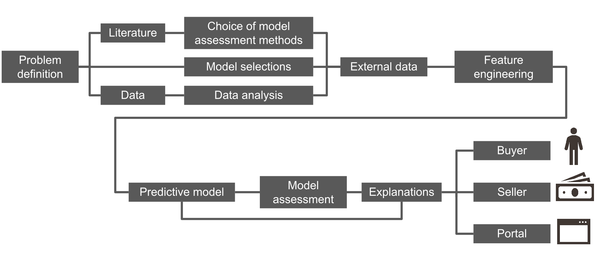
```

We started our work with a literature review. The problem of house pricing is typically explained on a basis of hedonic demand theory. It states that each characteristic of a house (such as size or location) has some contribution in its price. Since our data consists of different features of houses, it fits the hedonic theory. Over the years, the problem of property evaluation was solved in many different ways. Statistical tools used by analysts to explain house prices range from simple linear regression to more complex techniques such as artificial neural networks. In the literature we can distinguish two trends, these are publications describing linear models compared to advanced machine learning algorithms [@house_prices_1] and [@house_prices]. In the [@house_prices] research, can see an artificial neural network prediction errors as compared to linear regression. We can conclude from Figure \@ref(fig:paper-plot) that we reduce the interpretability to an increase in the quality of model fitting. The second trend in articles is the contribution of machine learning to price prediction [@house_prices_3] and [@house_prices_2]. The authors often consider variables that describe the location of a property as an important element of pricing modeling. These include relationships such as postal codes, distances from public transport (bus stops, subways), parks, or cultural sites [@house_prices_4] and [@house_prices_5].


```{r paper-plot, out.width="600", fig.align="center", echo=FALSE, fig.cap=' Comparison of performance of linear regression model and ANN (artificial neural networks). The models forecast with a logarithm from the property price. On the x-axis we have the prediction measures, and on the y-axis we have the value of this measure on the set divided into linear model and ANN.'}
knitr::include_graphics('images/02-article.png')
```

We can conclude from Figure \@ref(fig:paper-plot) that in referred research it was possible to reduce interpretability in order to increase the quality of model fitting.


The next point was data analysis. We work on a dataset which contains house sale prices for King County, which includes Seattle. It includes homes sold between May 2014 and May 2015. Data available on [Kaggle](https://www.kaggle.com/harlfoxem/housesalesprediction) and [OpenML](https://www.openml.org/d/42079).

## Data

We analyzed the data,  [more](https://github.com/kozaka93/InterpretableHouseSalePrices/tree/master/Data/DataAnalysis). Data contains 19 house features plus the price and the id columns, along with 21613 observations. Below the table describes the variables in the data set.
 

|Variable | Description|
|---------|------------|
|`id`| unique ID for each house sold|
|`date`| date of the house sale|
|`price`| price of each house sold|
|`bedrooms`| number of bedrooms|
|`bathrooms`| number of bathrooms, where .5 accounts for a room with a toilet but no shower|
|`sqft_living`| square footage of the apartments interior living space|
|`sqft_lot`| square footage of the land space|
|`floors`| number of floors|
|`waterfront`| apartment was overlooking the waterfront or not|
|`view`| how good the view of the property was|
|`condition`| condition of the apartment|
|`grade`| level of construction and design|
|`sqft_above`| the square footage of the interior housing space that is above ground level|
|`sqft_basement`| the square footage of the interior housing space that is below ground level|
|`yr_built`| the year the house was initially built|
|`yr_renovated`| the year of the house's last renovation|
|`zipcode`| zipcode area|
|`lat`| lattitude|
|`long`| longitude|
|`sqft_living15`| the square footage of interior housing living space for the nearest 15 neighbors|
|`sqft_lot15`| the square footage of the land lots of the nearest 15 neighbors|

Table: Description of variables in the dataset.

Another idea of how to enrich our solution was to add external data. Our hypothesis is that the location of the property can significantly affect the price. We therefore also took into account the distance from public transport and the number of cultural facilities within a kilometer radius.


### Data preperation
[Original data from kaggle](https://www.kaggle.com/harlfoxem/housesalesprediction) is in good quality at the start, but we needed to preprocess it to suit our needs. In this section we describe how we prepared ready-to-use text files of the train and test data  ([`train.csv`](https://github.com/kozaka93/InterpretableHouseSalePrices/blob/master/Data/TrainAndTest/test.csv), [`test.csv`](https://github.com/kozaka93/InterpretableHouseSalePrices/blob/master/Data/TrainAndTest/train.csv)). This includes variable transformations, joining external data, records processing.

Firstly, we discovered that there are houses that were sold twice, and one house that was sold three times. One can assume that it was bought, renovated and then sold for more. But they have the same explanatory variables, without changes. Each pair (or triple) representing the same house we decide to aggregate into a single row, averaging the price. 

### External data 

We decided to add external data.  We believe most variables describe the house properly. What we were missing is some spatial information. Except for zip code, we have information about longitude and latitude, but we wanted to explain it in more detail. Why do some locations tend to be more expensive? Maybe it is because of public transport availability. That is why we decided to add a variable describing a distance to the nearest bus or subway stop. Data sources can be found [here](https://www.kingcounty.gov/depts/transportation/metro/travel-options/bus/app-center/developer-resources.aspx).

There might also be another reason. Maybe some houses are more expensive, because of some interesting places around, like museums, galleries or fine restaurants. Let us call them *cultural places*. Those places are not only standalone facilities, but they are connected to other infrastructure, which generally should increase the price. This time we decided to look in the neighborhood: we searched for a number of such places in an arbitrarily chosen 1km range. Data was obtained from [here](https://data.seattle.gov/Community/Seattle-Cultural-Space-Inventory/vsxr-aydq).

Both of these external data we visualize in Figure \@ref(fig:house-stops-cult). Stops are shown on the left and cultural places on the right. Each point indicates the location of the property (marked in green). The blue and red points respectively indicate the location of public transport stops and cultural sites. There are 7549 bus stops and 1214 cultural places in this data.


```{r house-stops-cult, out.width="700", fig.align="center", echo=FALSE, fig.cap='Spatial external data. Stops on the left and cultural places on the right. Each point indicates the location of the property (marked in green). The blue and red points respectively indicate the location of public transport stops and cultural sites. On the x-axis we have longitude values, while on the y-axis we have latitude values.'}
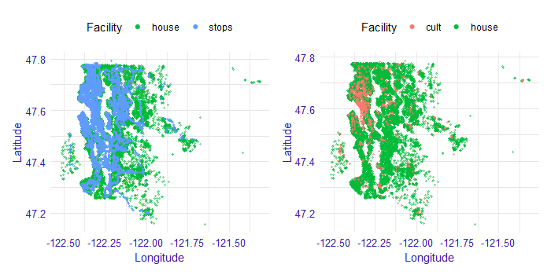
```


Most of the cultural places are located in the city center. So this column also tells some story *how much of the city center does this house have*.  Since not all of those places are in the city center, then those other points should reflect some *local centers*.  

Public transport stops are very dense in the city center, so they even cover house dots on the plot. Outside of the city center, one can also notice bus routes. It is quite clear that not every house has a good connection to public transport. That can, for example, force parents to drive their children where they need to. For some people it can be an obstacle, so they rather be more skeptical about that particular house.


We also did several variable transformations. Since the authors use metric system, we changed square feet into square meters. Zip code and waterfront are saved as factors. Further, it is easier for us to interpret the age of a building rather than a year when it was built. We also know if and when a house was renovated. We can also analyze *relative age*, that is the time which has passed since the last renovation (variable `since_renovated`). We chose natural logarithm of price as target variable, since we want to work on a relative scale - we assume that the random error is multiplicative.

The last step was dividing the data into train and test samples randomly with a ratio 70/30.

Ready script for processing the original data from kaggle can be found on GitHub. For spatial data analysis, we used a short script [`geofast`](https://github.com/kozaka93/InterpretableHouseSalePrices/blob/master/Data/TrainAndTest/geofast.py). Distances between two arbitrary points on earth can be obtained from the `geopy` [@geopy] package for Python. However, general and precise formula is computationally expensive. With a simple trick, it can be adjusted to our case without losing almost any precision. This can be done by providing distances to measure are not exceeding several hundred kilometers. The original idea was published  [here](https://blog.mapbox.com/fast-geodesic-approximations-with-cheap-ruler-106f229ad016).


## Model 

Based on the literature we decided to test linear regression models and machine learning models. Below is a list of models that we are considering. 

- linear regression

- fixed effects model

- mixed effects model

- decision tree

- random forest

- gradient boosting

- xgboost

We collected methods to evaluate the performance of the regression model and decided to use RMSE (root mean square for our models’ assessment).

### Linear models

Inspired by literature, we started our analysis by building a white-box linear model. The aim was not to build an ideal model, but rather to get an insight into the relationships in the data and to have a point of reference for more complex models performance and interpretations. Based on economic interpretation, we chose the natural logarithm of price as the dependent variable. The continuous variables characterizing areas were also transformed with natural logarithm. Variables referring to latitude and longitude were omitted since they are unlikely to have a linear effect on price. Instead, zip codes were used to model geographical effects. To avoid collinearity with years since renovation variable, age variable was omitted.

#### Log-log linear model

Three versions of the model were estimated. The first model ignores information about house location almost completely (part of this information is carried only by variables such as distance to the nearest bus stop). It assumes that the price of a house in the city center is driven by the same effects as the price of a house in the suburbs. One could argue that this assumption is almost never true, and instead, the data should be modeled by the panel or spatial techniques. 

#### Fixed effects model

Taking this into consideration, we developed a second model that allows for prices of houses belonging in different zip codes to have their own intercept. The underlying assumption is that the closest area of houses will have a *fixed effect* on their price. It is the same model as before but with new binary variables (in number equal to a number of zip codes - in our case: 70) indicating whether a house belongs to a certain zip code or not.

#### Mixed effects model

A neighborhood, however, can also have an impact on the effect of the particular variables on price. Increasing an area of a house can have a different impact on its price, depending on whether the house is located in the city centre, or in the suburbs. The final model takes this argument into consideration, allowing for houses in different zip codes to have different slopes coefficients for certain variables. Technically, those differences are modeled as random deviations from the general effects. The model was estimated using `lme4` [@lme4] package in R software.

The choice of variables that include random effect was made arbitrarily, to reduce the complexity of the problem. Only variables for which a random deviation of their impact could be easily interpreted were chosen (e. g. view importance can vary between geographical locations, since the views themselves are different).
We are aware that one could find different approaches that could better fit the data. However, since our scope was not to maximize fit, and no further analysis yielded considerably different results, we decided to limit the consideration to the three models presented.

### Linear models assessment

Estimated coefficients are presented in the table below. All of the estimates (apart from `m_2_lot_log` in first model) are statistically significant on at least 1% level.Since the dependent variable is the logarithm of price, the coefficients have an interpretation of a percentage change. For variables intercept to since_renovated a 1 unit change results in a coefficient *100% change of dependent variable. For variables that were logarithmized (`m_2_lot_log` to `m_2_lot_15_log`) a 1% change results in a coefficient % change of dependent variable.

Looking at the estimates, a couple of general observations can be made. Firstly, there are no major differences in the coefficients between models, especially between (2) and (3). This tells us that the models can be considered stable. Basing on RMSE, we should note a significant improvement of fit resulting from introducing zip code-based fixed effects in the model (2). A slight, but noticeable improvement was also made by allowing for coefficients to have a random effects in the model (3). These observations suggest that our hypothesis about neighborhood having a significant impact on a house price, but also about particular variables’ effect on price, was reasonable.


| Model | Log-loglinear (1) | Fixed effects (2) |Mixed effects (3)|
|--|:--:|:--:|:--:|
|(Intercept)  | 8.1531 | | 8.8260(RE) |
|bedrooms|-0.0304|-0.0096|-0.0079 |
|bathrooms|0.0579|0.0409|0.0379|
|floors|0.0293|-0.0339|-0.0186|
|waterfront|0.4605|0.5208|0.4641(RE)|
|view|0.0559|0.0609|0.0543(RE)|
|condition|0.0495|0.0557|0.0586|
|grade|0.1886|0.0885|0.0876|
|dist_stop_km|-0.0106|-0.0041|-0.0047|
|ncult|0.0134|0.0016|0.0026|
|since_renovated|0.0038|-0.0002|-0.0007|
|m_2_lot_log|0.0043|0.0727|0.0841(RE)|
|m_2_above_log|0.3257|0.4099|0.3844(RE)|
|m_2_basement_log|0.0446|0.0270|0.0271|
|m_2_living_15_log|0.2877|0.1729|0.1566(RE)|
|m_2_lot_15_log|-0.0314|-0.0126|(RE)|

Table: Estimated coefficients for linear models.

|||||
|--|:--:|:--:|:--:|
|RMSE(train)|0.3054|0.1797|0.1707|
|RMSE(test)|0.3061|0.1801|0.1762|

Estimated coefficients can be interpreted rather intuitively. It is not surprising that the area of the house has a considerable positive impact on price. The same can be said about variables characterizing the quality of the property (`grade`, `condition`) and its surroundings (`view`, `waterfront`). Especially we can note how important access to the waterfront is in Seattle, that is related to the city geography. Since it is more convenient to have more bathrooms in the house, `bathrooms` coefficient is also positive. Higher distance to bus stop results in a slight decrease in house value, which again is correct with intuitive expectations. The number of floors, which impact is also negative, can be associated with lower convenience. One may be wondering why years passing since the last renovation does not have a great impact on price. It can be explained by the fact that we already include variables characterizing the condition of the building, and with those being constant – years become not much more than number.

To further assess the model performance, we may take a look into the residual density (Figure \@ref(fig:resid-lm-density)). Most of the residuals being in (-0,5; 0,5) range means our model makes the biggest error of approximate -40% and +66%.


```{r resid-lm-density, out.width="700", fig.align="center", echo=FALSE, fig.cap='The distribution of the residuals from the mixed effects (3) model. On the x-axis, we have the rest of the model for the natural logarithm of price.'}
knitr::include_graphics('images/02-residuals-lm.png')
```

Plotting residuals against the explained variable gives us some more insight into what happened in the model.

```{r resid-lm-scatter, out.width="700", fig.align="center", echo=FALSE, fig.cap='Plot the residual for the mixed effect model. The residuals correspond to the difference between the value of the target variable and the prediction from the model. On the x-axis we have the value of the target variable (price logarithm), on the y-axis of the residual, each point corresponds to the observation from the test set. The cyan line indicates local smooths.'}
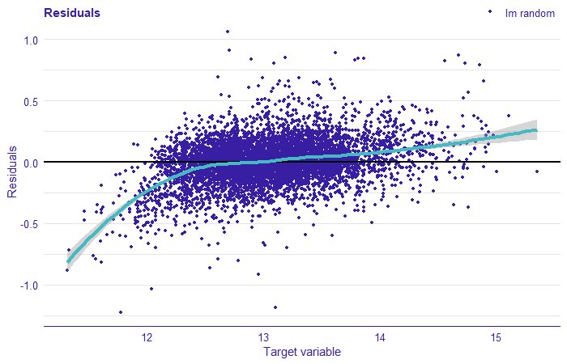
```

We can note a lot of points being in the bottom left part of the plot. This tells us that the model overestimated prices of low-valued houses. The residuals cannot be considered normally distributed. The analysis of residuals clearly suggests that there are some other effects in the data that we failed to model with linear regression. These may result from too few variables being taken into consideration, or, what is more, interesting for us in this work – from the relationships in data being complex and nonlinear. In the following sections, we focus on machine learning models that can perform better in complex environments.

### Machine Learning models

Our main goal, as we mentioned before, is to explain the model of choice. Along self-explanatory linear models included as comparison, we considered models including:

- decision tree

- random forest

- gradient boosting

- xgboost.

As mentioned earlier, the variables `zipcode` and `waterfront` were introduced as categorical. Additionally, for the `zipcode` variable, which has 70 levels, we use one-hot encoding and build models again. The models were built using `mlr` [@mlr] R package with `ranger` [@ranger], `gbm` [@gbm], `xgboost` [@XGBoost] and `rpart` [@rpart].

For the models the RMSE score was calculated on the training and test set using the R `auditor` [@auditor] package.The results are presented in  Figure \@ref(fig:rmse-train-test). The smallest RMSE can be observed for random forest model, xgboost, xgboost with one-hot encoding, and gbm with one-hot encoding. Other models have a greater error. Let us take a look at these four models.
 

```{r rmse-train-test, out.width="700", fig.align="center", echo=FALSE, fig.cap='Comparison of model performance by RMSE on training and test set. In the plot the trained models are marked with points, on the x-axis we have RMSE measure for the training set, on the y-axis the RMSE score for the test set, the line stands for RMSE equal on training and test sets.'}
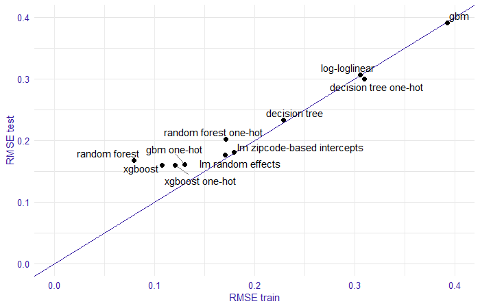
```


|Model |RMSE train | RMSE test |
|------|:---------:|:---------:|
|random forest | 0.07931109 |	0.1674559 |
|xgboost |	0.1076962 |	0.1600113|


Table: Model results on the training and test set.

By analyzing the estimated models we obtained the following results. The random forest model seems to be overfitted, while the xgboost model is more stable. On the test set, they obtained similar scores. Figure \@ref(fig:residual-1) shows the density of the residuals, for both models. We see that the xgboost model has greater residuals than the random forest model.


```{r residual-1, out.width="700", fig.align="center", echo=FALSE, fig.cap=' Density of residuals for random forest and xgboost models. On the x-axis, we have the rest of the model for the price without transformation.'}
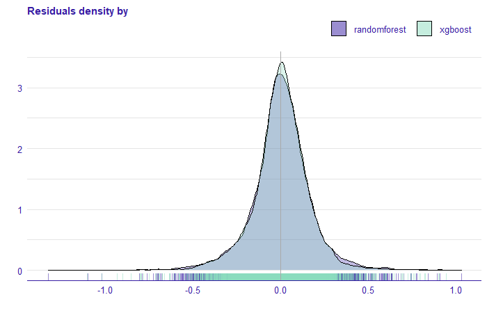
```


Comparing the xgboost model with one-hot encoding and gbm with one-hot encoding we see that the RMSE score on the training and test set is very similar. Furthermore, the residual density plot (Figure \@ref(fig:residual-2) ) is practically identical.


|Model |RMSE train | RMSE test |
|------|:---------:|:---------:|
|xgboost one-hot |	0.1207626 |	0.1595913|
|gbm one-hot |	0.1302585 |	0.1607376 |


Table: Model results on the training and test set with one-hot encoding.

```{r residual-2, out.width="700", fig.align="center", echo=FALSE, fig.cap=' Density of residuals for gbm and xgboost models. On the x-axis, we have the rest of the model for the price without transformation.'}
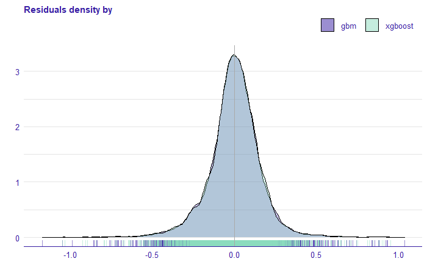
```

## Explanations

In this chapter, wepresent the methods of explainable machine learning models. They allow us to understand the compiled models. Following the plan from Figure \@ref(fig:plan), we continue the analytical approach to the regression problem and show how to apply XAI methods in model evaluation. We want to understand how these models work. At the beginning we start explaining four of them, dropping some along the way. This analysis let us derive the explanations for the three groups (seller, buyer, and ad portal) in the next sections.


### XAI for geographical location

We want to approach _explanations_ by discovering them. As we write this chapter, there are some ideas on how to organize the explainable machine learning workflow, but they are only emerging. We want to explore XAI tools by experimenting with them. We predict that we may face some dead ends on the way, but that is also informative: one can learn from their mistakes. We not only want to show where we are, but also how we got there. We begin our XAI Story by looking at what kind of tools we have. Some are instance-level, some are dataset-level. Some discuss performance, some discuss predictions. Problem with instance-level tools is that they can be applied to every single instance and there are tens of thousands of them in our dataset. Of course we can choose several ones, but the choice is not obvious. Some suggest analyzing those, in case of which the model has the highest residuals [@ema]. This to work quite nicely as a bottom-up approach. So why not try to explore the top-down approach in this chapter. Start with four models that had the best scores and see what happens.


### Feature importance

It is highly unlikely that each of explanatory variables used has the same impact on the prediction. We use Feature Importance to evaluate which variables are important in each model. This measure helps the Data Scientists assess which variables have the greatest influence. 

Below, in Figure \@ref(fig:fi), we present Feature Importance diagrams for four models that have the best RMSE performance.

```{r fi, out.width="700", fig.align="center", echo=FALSE, fig.cap='Comparison of the importance of the permutation variables for four models with the best RMSE score. Colour indicates the model, each bar shows the difference between the loss function for the original data (dashed line) and the permuted data for a particular variable, the longer the bar the greater the difference. The bars for each model start in a different position on the x-axis, this depends on the value of the loss function for the original data set.'}
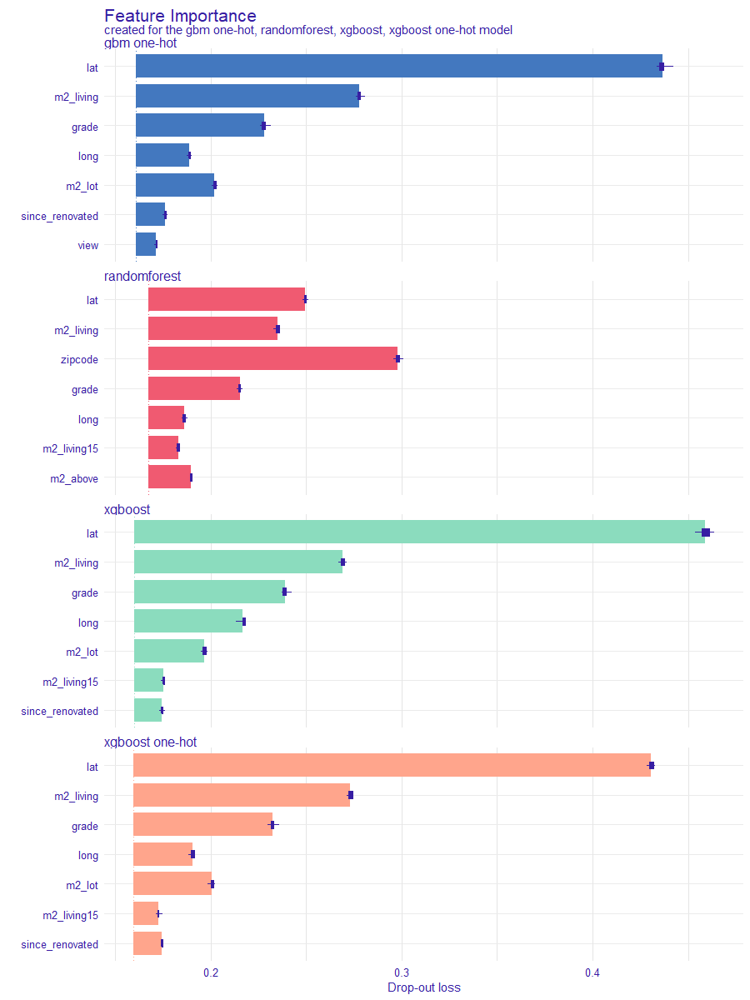
```

The comparison shows that the importance of variables differs across the models. It is reasonable since the method of fitting to the data is different for each model. Regardless of the model, however, variables referring to latitude and area of the house seem to have an important impact on the price. This fact suggests that these two variables are the main components of the house price. We can analyze the impact with more detailed techniques.


### Partial Dependence Plots (PDP)

The models agree on importance of `lat` and `long` variables, which are latitude and longitude (basic knowledge might be memorization resistant: longitude describes _horizontal (W-E)_ position, latitude the _vertical (N-S)_ position). In Figure \@ref(fig:latlong) we can see that the models for the `long` variable are compatible, the partial dependence profiles are very similar. For the variable `lat`, we can see that the random forest model behaves no differently. Analyzing PDP we can state that the prices of apartments located to the north are, in general, higher than those to the south, and properties located to the west have a higher price prediction than those located to the east.


```{r latlong, out.width="700", fig.align="center", echo=FALSE, fig.cap='Partial Dependence Profiles for four models, on the left for the variable `lat` and on the right for the variable `long`. Each line corresponds to a PDP for one of the four models. The x-axis shows the values of the variable for `lat` and `long`, while the y-axis shows the value of price prediction.'}
knitr:::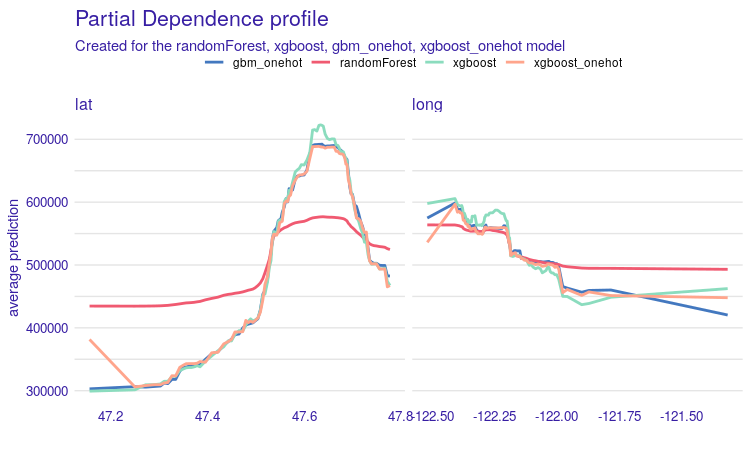
```

The second variable worth investigation is `m2_living` - house surface in square meters. What we expect is a more or less linear increase. The plot seems to confirm this expectation. With `grade`, we also expected increasing curves, but not necessarily linear. What is interesting, the price goes much higher, if the `grade` changes from 5-6 to 8-9. We will discuss this phenomenon in detail in chapter 6.

```{r m2-grade, out.width="700", fig.align="center", echo=FALSE, fig.cap='Partial Dependence profiles for `m2_living` and `grade` variables. In both cases we see an increase in the value of the prediction along with an increase in the variable. Each line corresponds to one of the four models. On the x-axis we have values of variables corresponding to m2_living and grade. On the y-axis we see the value of property price prediction.'}
knitr:::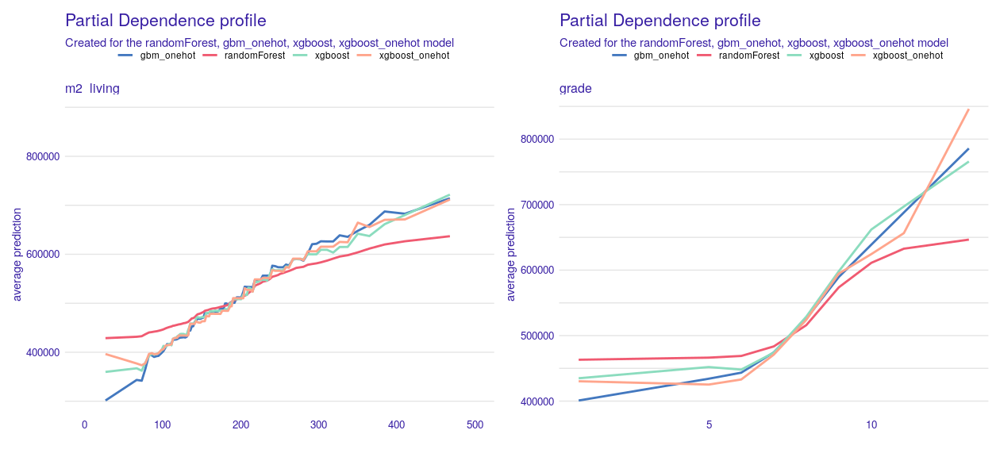
```

Next, we analyze the zipcode variable, which appears to be crucial for random forest model. In this case, to compare all four models, we need a different approach, since two models used the variable encoded as a categorical variable and the other two with one-hot encoding. For models with the zipcode categorical variable, we can see that for the random forest model there are regions for which price prediction is significantly higher than in the others, while for the xgboost model the zipcode variable has no major impact on the price prediction of immovable property Figure \@ref(fig:pdp-zipcode).


```{r pdp-zipcode, out.width="700", fig.align="center", echo=FALSE, fig.cap='PDP for the zipcode variable. At the top, a comparison of the PDP for models with the zipcode variable as categorical. On the x-axis the value of the zipcode variable, and for the y-axis the value of property price prediction. In the lower chart we have a comparison of PDP for gbm and xgboost models with one-hot coding for three selected zipcodes. On the x-axis the value of the variable (0 when the property is in another zip code area, 1 when it is in that zip code area). On the y-axis the value of the real estate price prediction.'}
knitr:::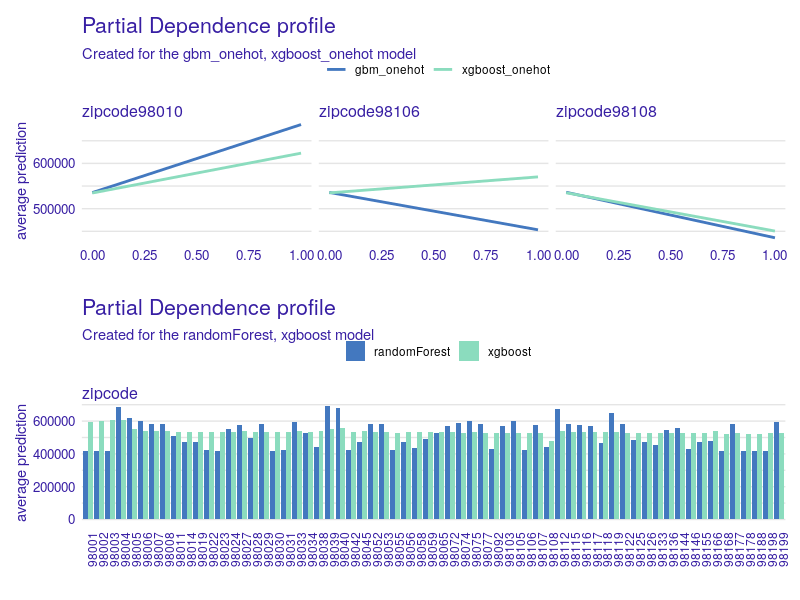
```

Let us continue with models that use one-hot encoding of the `zipcode` variable. We generated all PDP plots and looked at all of the pairs for `xgboost_onehot` and `gbm_onehot` for every `zipcode`. Since there are far too many of them to present, we decided to select only the interesting ones. It turns out that for most of the pairs we observe similar results, but not for all of them. As an example, let us take a look at zipcodes 98010, 98106, and 98018 in Figure \@ref(fig:pdp-zipcode) and \@ref(fig:map) -- we found them on the map.

```{r map, out.width="700", fig.align="center", echo=FALSE, fig.cap='On the map of Seattle, the zip codes for which PDP was drawn in Figure 2.12 are marked. As we can see, the first two areas are close to the city center, while the last area is far from the center.'}
knitr:::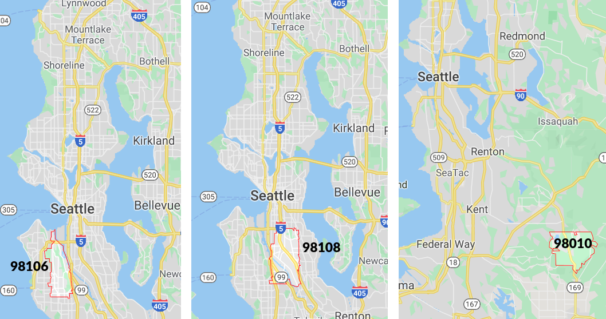
```

After a little bit of investigation, victims reveal: in area 98108 there is a loud airport. On the other hand 98010 is far from the city center, there is more space, so people build bigger houses. For instance, in 98010 one can easily find houses with a living area of more than 300m² which is not so common in zipcodes 98106 and 98108. Remember, we were modeling (log of) the price of the whole house, not the price of 1m².

There are more examples of variables for which their PDP plots fit our expectations. We can, however, see problems with such variables as `age`, `since_renovated` (how many years have passed since a building or last renovation, whichever is less). Figure \@ref(fig:age) shows comparison of PDP plots for these two variables. The right plot suggests that freshly renovated houses are more expensive, which is reasonable. However, we observe a strange behavior of the random forest model. The left plot may seem surprise: it suggests that the older a house is, the more it costs. This relation can be explained with the fact that older houses tend to be renovated. The rate of renovated houses starts to increase after houses reach 60 years. Half of a century might be a reason to do renovation for sure. To give some numbers: 11% of houses *over* 60 years old were renovated, and only 0.1% of houses *under* 40 years were renovated. What is more, `since_renovated` was more important for all of the models than age.


```{r age, out.width="700", fig.align="center", echo=FALSE, fig.cap='Partial Dependence profiles for the `age` variable on the left and for the variable `since_renovated` on the right. Each line corresponds to one of the four models. On the x-axis there are values of the age and since_renovated variables respectively, while on the y-axis there are values of the property price prediction.'}
knitr:::include_graphics('images/02-age.png')
```

For distance to the nearest bus stop PDP plots are shown at Figure \@ref(fig:stop). We trimmed x-axis to 2000 meters, since 92% of observations fulfill that condition. Interesting is, that the shorter distance indicates lower prediction. This is probably due to the fact that larger properties must be located away from public transport stops.


```{r stop, out.width="700", fig.align="center", echo=FALSE, fig.cap='Partial Dependency profiles for the `dist_stop` variable. Each line is for one of four models. All models behave similarly, the only exception is the random forest model for which PDP is smoother. For properties close to public transport stops (up to 250 meters), the price prediction is slightly lower than for properties at least 250 meters away. '}
knitr:::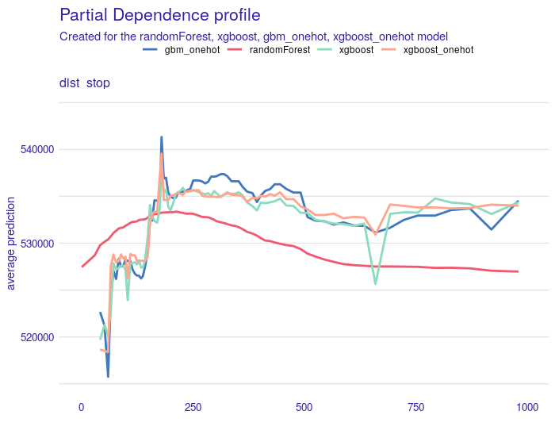
```

#### PDP summary

Most of the PDP plots match our expectations. But there are also variables, where random forest cracks, such as since_renovated, condition, m2_lot, m2_lot15 to mention a couple of them. We guessed that it put far too much attention on the zipcodes rather than other variables, which were incorrectly estimated. That would also explain the huge difference between RMSE on train and test data, Random Forest was overfitted. The other 3 models seem to agree with each other and with so-called common sense. [All models are wrong, but Many are usefull](http://www.jmlr.org/papers/v20/18-760.html), as statisticians say. If three other models agree on the variable effect, it is hard to believe that the other model, which is saying the opposite, is right. At this point, we drop Random Forest and we will not be examining this model from different perspectives.

At this point, we also compare two one-hot encoded models, XGBoost and GBM. Their plots are almost identical and they match the XGBoost model without one-hot encoding. So among all 3, we might choose the one with the best score, which is XGBoost.

So far we discussed the model-level explanations. The next subsection will focus more on instance-level contemplations.


### New possibilities with PDP

We went one step forward in the PDP analysis, we looked at the stability of the explanations and a comparison of two types of profiles for evaluating variables in the model.


#### Confidence interval for PDP

In the previous subsection, we base our explanations on PDP. A subset of observations is used to construct the PD profile (due to the calculation time). It was interesting for us whether the selection of a subset of observations influences the shape of the PDP. In order to check it, we tested a bootstrap sample size of equal to 100, based on sampling with 500 observations from the test set. Based on the PDP obtained in this way, we constructed a confidence interval, which we calculated as the mean value plus minus standard deviation. In the plots below the results obtained for the 5 variables indicated by the Feature Importance method for the xgboost model. Figure \@ref(fig:bs-100) shows 100 PDP profiles. As we can see, these profiles are mostly parallel to each other, but there are some values for which they are closer together.


```{r bs-100, out.width="700", fig.align="center", echo=FALSE, fig.cap=' The plot shows 100 PD profiles generated during the bootstrap sample. On the x-axis, we have values of variables and on the y-axis, we have values of prediction. Each line represents one PDP.'}
knitr:::include_graphics('images/02-bs-100-pdp.png')
```

Based on the PDP obtained, we calculated the confidence intervals. They are illustrated in the \@ref(fig:bs-ci). The blue line is the average of all PDP values at this point, and the grey area is determined, as an approximation of  standard deviation. We can now see more precisely that the ranges are not of a constant width for the whole curve.

```{r bs-ci, out.width="700", fig.align="center", echo=FALSE, fig.cap='The plot shows the average PD profile with the confidence interval. The blue line represents the average PDP, while the grey area is the confidence interval. For the x-axis, we have the value of a variable and on the y-axis, we have the value of a prediction.'}
knitr:::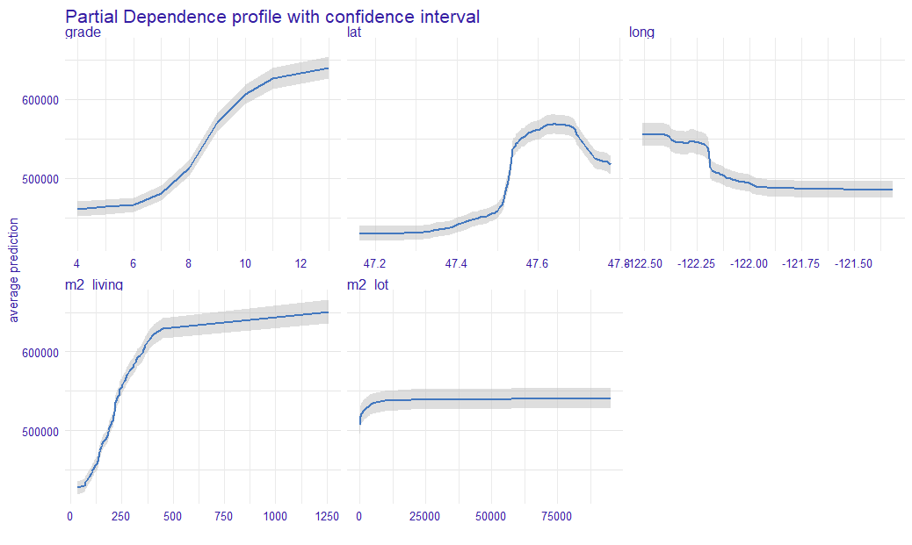
```

#### Comparison of Partial Dependence Profiles and  Accumulated Local Effects Profiles (ALE)

Below we show a list of PDP and ALE . The estimator for ALE profiles eliminates the effect of correlated variables. Since the plot below the PDP and ALE profiles for most of the variables are parallel to each other, it suggests that the model may be additive. To compare the “similarity” of the curves we can use the calculation of the importance of variables based on profile oscillations. For this, we used `vivo` R package [@vivo].

```{r pdp-ale, out.width="700", fig.align="center", echo=FALSE, fig.cap='The plots show PDP and ALE profiles for the 5 variables indicated by Feature Importance (Figure 2.9). On the x-axis, we have the values of variables and on the y-axis, we have the value of prediction. The color of the line represents the corresponding profile type.'}
knitr:::include_graphics('images/02-pdp-ale.png')
```

After calculating the importance of variables based on profiles in Figure \@ref(fig:pdp-ale), we obtained the following results (Figure \@ref(fig:vivo-pdp-ale)).


```{r vivo-pdp-ale, out.width="700", fig.align="center", echo=FALSE, fig.cap='A measure based on profile oscillations. The bars indicate the value of the measure and their color corresponds to the profile type. On the x-axis, we have values of the measure and on the y-axis we have variables for which this measure was calculated.'}
knitr:::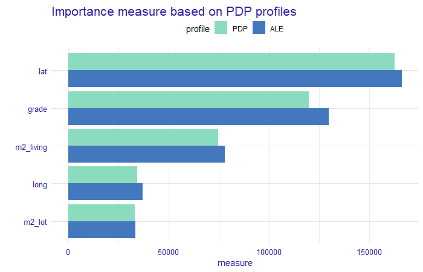
```

We can observe that the values for each variable and profile type do not differ significantly. There is a comparable difference for each variable. This confirms our assumption of no interactions between these variables in the model. An oscillation measure can be used as a variable importance measure for PDP profiles, but also for Ceteris Paribus (CP) profiles to determine the importance of variables for prediction for a single observation.


### Instance level explanations. 

This subsection focuses on explaining particular houses. It is definitely not clear which observations should be examined. In the previous subsection, we examined PDP plots to assess whether we can trust the model and it worked out well. Here we start by looking at:

* houses with high misprediction and
* houses with highest average price for 1 square meter.

Note, the error is measured linearly on the log-scale, so after the reverse transformation, we look for real estates that had high relative misprediction.
What is more, in an earlier analysis, among others we considered zipcodes 98010, a quiet area of Black Diamond with Lake Sawyer. To this list, we add zipcode 98039, which is Medina – mostly residential city. Villas there are vast: 56% of them have at least 300m². The reason is that we want to analyze significantly larger houses in their natural environment.
We present the most interesting observations in those zip codes also remembering to cover all of the items on our list above.
Let us begin with zipcode 98010. Here we present a property that was the second expensive one. We decided to examine this one, instead of the most expensive one because it had the greater error and the first one we could not locate on Google Street View. This house built 23 years ago is of high grade, has 300 square meters surface, and a large garden of 2000 square meters. Predicted value is 667 k\$, while the true value is 902.5 k\$. Break Down (BD) plot for this estate is presented in Figure \@ref(fig:h-98010).

```{r h-98010, out.width="700", fig.align="center", echo=FALSE, fig.cap=' Break Down created with R `iBreakDown` package for hugely mispredicted house. From the top, a vertical line represents the average response of the model, the green and red bars correspond to the contribution of the variable to the prediction. The green ones take positive values, i.e. increase the prediction value, while the red ones take negative values, i.e. decrease the prediction value. The violet bar corresponds to the prediction value for the observation. The numerical values next to the bars inform about the impact. On the x-axis we have model prediction value, on the y-axis we have variables and their values for the observation. It loses a lot of value because of its geographical position (far from Seattle), but gains a lot on grade and surface.'}
knitr:::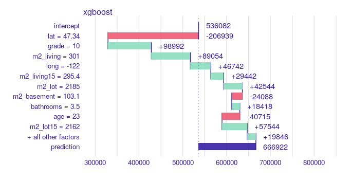
```
As we can find on a map, this particular property actually *has* access to the lake and should have been marked with `waterfront` = 1. If it was, the prediction would be 787325 k\$, according to the XGBoost model, and that halves the relative error. From the picture \@ref(fig:h-98010) we could also conclude, that houses with `waterfront` = 0 are not losing so much, but they would highly gain when `waterfront` would be equal to 1. Another conclusion is that there are mistakes in the data frame.

Next case is a house in Medina. We chose the one with the highest average price for 1 square meter of the building. In the Figure \@ref(fig:h-98039) we see Break Down plot for this house. All factors are in favor of this house. It is in a good location, top grade, living surface is enormous, it has a beautiful view, access to Lake Washington, and the neighborhood is wealthy. Predicted value is 3,961k\$, while the true value was 3,640k\$. Interesting and counterintuitive is that one variable has negative effect, and that is `floors.` This particular house has 2 levels. In the same picture we also plot Ceteris Paribus (CP) profile for this variable, which says that having two floors is actually the best choice for this observation. 


```{r h-98039, out.width="800", fig.align="center", echo=FALSE, fig.cap='On top Break Down plot for a villa in 98038 zipcode. All variables except floor have positive impact on the price prediction. The second plot represents Ceteris Paribus profile (cyan line) for floor. The dot indicates our observation. The shape of the profile implies that no greater prediction can be obtained for this variable value.'}
knitr:::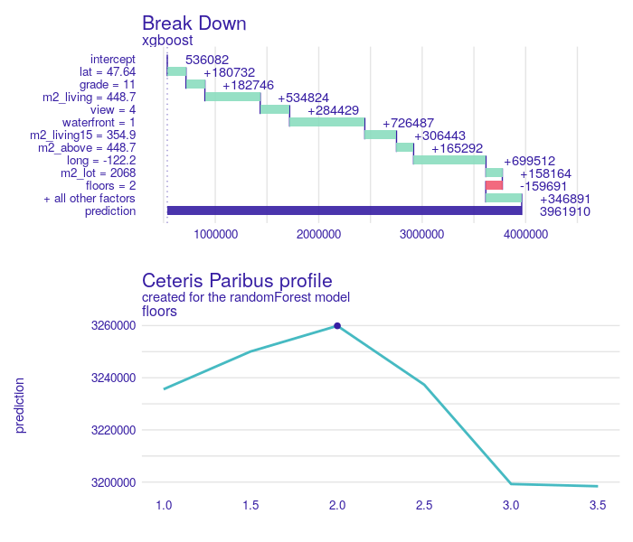
```


## Use case of the model

Having model trained, tested and explained, here comes the time for use cases.

First application might be someone who wants to buy a house and improve it to either sell with income, either move in and live in good standard. With model and support of XAI tools there are several ways one can benefit.

First approach is that one can study a BD Plot for a particular house and see the loss caused by low grade value. If the influence is highly negative, then we calculate a prediction for the same house, but after renovation: that means with replaced grade value and since_renovated set equal to 0 or 1. That might be very useful in case a buyer has already selected some area of interest and choice between houses is narrowed to a couple of them.

In case we only look for houses to renovate and resell with income and specific location is not an issue, then we present a second approach. Here PDP plot can be used. In the figure \@ref(fig:use-grade) PDP is monotonically increasing and the greatest change is between grade < 6 and grade > 8. So we can search for houses with such grade, calculate the prediction for modified data and then search for houses with top uplift. We also see that skipping grades 6-8 we also jump from “below average” to “above average”, what can be seen in the histogram attached.

```{r use-grade, out.width="800", fig.align="center", echo=FALSE, fig.cap='Partial Dependence Profile for grade for xgboost model on left. The blue line corresponds to PDP,  for the x-axis, we have the value of a variable and on the y-axis, we have the value of a prediction.  On the right histogram of grade, the x-axis indicates the value of the variable, the y-axis a count of observation in each value of grade. We clearly see that prices change drastically when grade goes up from below 6 to above 8.'}
knitr:::include_graphics('images/02-use-grade.png')
```

Here we present both approaches in a case study. Using the second method we found for an 85m² house in Kent, WA 98032: 105 year old building, never renovated. 3 bedrooms, 1 bathroom. Grade is 5. Prediction is quite accurate: true value is 176.5k\$ and prediction is 168k\$, so relative error is 5%. Modification described in the previous paragraph results in prediction for 272k\$, 100k\$ more. Of course this predicted change should be compared to renovation cost. In figure \@ref(fig:use-case) there are presented BD plots for this house before and after renovation.

“above average”, what can be seen in the histogram attached.

```{r use-case, out.width="800", fig.align="center", echo=FALSE, fig.cap='On top Break Down plot for a house potentially good for renovate-and-resell. The impact of the grade variable is negative, the price of the property is decreasing. The second plot, the grade variable have a greater value and since_renovated variable is equal 0. The impact of these variables is positive on prediction.'}
knitr:::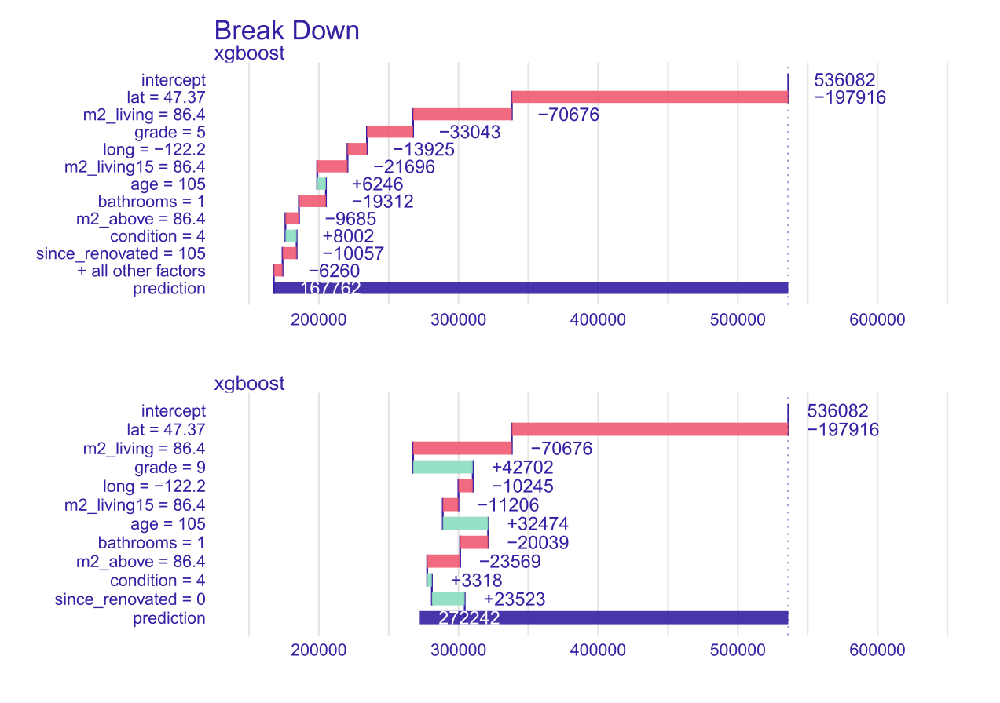
```

Break Down plot for a house potentially good for renovate-and-resell. When computing the second plot, the same order of variables was used as for the first picture for better comparison.
Note that using Ceteris Paribus profile is not exactly correct. Interpretation is that only grade is changed, but renovation also should trigger since_renovation to set to 0.
Another application of this model and XAI is at a portal with sell-buy announcements. Portal might be interested in what are the key features that determine the price (where Feature Importance plot can contribute). Then using those important variables, portal can improve searching tools (filters) on the website.
Another use for portal is to predict the value based on the features of the house. Then when an user enters an incorrect value (by mistake) it might warn them. Or, on the other hand, if they enter a price higher than predicted, then portal might offer them to promote the offer.


## Summary and conclusions 

XAI methods are very useful in the work of Data Scientists. They allow us to assess how black box models work. Thanks to this we can compare values obtained between interpreted and complex models. These methods can show what needs to be corrected or improved in the assessment of the global model. The main message from our analysis is the importance of the property's location and its usable area when setting the property price. It is also worth focusing on local explanations. This allows us to find out what influenced the decision for this particular observation (property). In case of selling the real estate, we can explain what characteristics of houses determine their valuation. Looking at the local explanations the seller can assess how much he can increase the price of his property after a small renovation (we show in our use case). Additionally, in our article we introduce confidence intervals for Partial Dependence profiles, it is a new branch of XAI, we did not encounter in the literature such an approach to check the stability of global explanations based on these profiles. Looking at the whole project in retrospect, the biggest challenge we faced during our work was planning the next steps of analysis, modelling and explanation. At the beginning, we spent a lot of our time on developing an action plan and planning the work. While working on this chapter, we certainly learned to have a business perspective on the analyses we prepared. We owe this knowledge to our mentors, Mateusz and Adam, thank you.


