# Story hotel booking: eXplainable predictions of booking cancellation and guests coming back {#story-hotel-booking}

*Authors: Domitrz Witalis (MIM), Seweryn Karolina (MiNI)*

*Mentors: Jakub Tyrek (Data Scientist), Aleksander Pernach (Consultant)*

## Introduction

The dataset is downloaded from the Kaggle competition website <https://www.kaggle.com/jessemostipak/hotel-booking-demand>.
This dataset contains booking information for a city hotel and a resort hotel in Portugal, and includes information such as when the booking was made, length of stay, the number of adults, children, babies, the number of available parking spaces, chosen meals, price etc. There are 119 390 observations and 32 features. Below you can find features which were used in modelling. Furthermore, feature `arrival_weekday` was added.

| Feature | Description |
|---|---|
| `hotel` | Resort hotel or city hotel |
| `is_canceled` | Value indicating if the booking was canceled (1) or not (0) |
| `lead_time` | Number of days that elapsed between the reservation and the arrival date |
| `arrival_date_month` | Month of arrival date |
| `arrival_date_week_number` | Week number of year for arrival date |
| `stays_in_weekend_nights` | Number of weekend nights (Saturday or Sunday) the guest stayed or booked to stay at the hotel |
| `stays_in_week_nights` | Number of week nights (Monday to Friday) the guest stayed or booked to stay at the hotel|
| `adults` | Number of adults |
| `children` | Number of children |
| `babies` | Number of babies |
| `meal` | Type of meal booked |
| `is_repeated_guest` | Value indicating if the booking name was from a repeated guest |
| `previous_cancellations` | Number of previous bookings that were cancelled by the customer prior to the current booking |
| `previous_bookings_not_canceled` | Number of previous bookings not cancelled by the customer prior to the current booking |
| `booking_changes` | Number of changes made to the booking |
| `deposit_type` | Indication on if the customer made a deposit to guarantee the booking. Three categories: No Deposit – no deposit was made; Non Refund – a deposit was made in the value of the total stay cost; Refundable – a deposit was made with a value under the total cost of stay |
| `days_in_waiting_list` | Number of days the booking was in the waiting list before it was confirmed to the customer |
| `adr` | Average Daily Rate as defined by dividing the sum of all lodging transactions by the total number of staying nights |
| `required_car_parking_spaces` | Number of car parking spaces required by the customer |
| `total_of_special_requests` | Number of special requests made by the customer (e.g. twin bed or high floor) |
| `market_segment` | Market segment designation. |
| `customer_type` | Contract - when the booking has an allotment or other type of contract associated to it; Group – when the booking is associated to a group; Transient – when the booking is not part of a group or contract, and is not associated to other transient booking; Transient-party – when the booking is transient, but is associated to at least other transient booking |
| `distribution_channel` | Booking distribution channel. |

The booking website has information about these reservation characteristics and building models can help this company in better offer management. The most important information could be

* the prediction of booking cancellation,
* the prediction if client comes back to the hotel,
* the prediction whether client orders additional services (eg. meals),
* customer segmentation.

In this project, we have decided to focus on two first issues.

## Booking Cancellation

The main aim of this chapter is to build model which predicts whether guest cancels reservation and use some explanation methods to analyze the reasons of customer behavior.

### Booking Cancellation: Model

In order to predict probability of booking cancellation XGBoost model has been fitted. Table below details the split of dataset.

| | Train | Test |
|---|---|---|
| **Number of observations** | 89542 | 29848 |
| **Number of events** | 33137 (37%) | 11087 (37%) |

Bayesian optimisation with [TPE tuner](<https://nni.readthedocs.io/en/latest/Tuner/HyperoptTuner.html>) has been applied in order to improve model performance. [Neural Network Intelligence (NNI)](https://github.com/microsoft/nni) package has been chosen for this task, because it provides user-friendly GUI with summary of experiments.

List of optimized hyperparameters and chosen values:

1. `max_depth` - the maximum depth of tree (`4`),
2. `n_esimators` - the number of trees (`499`),
3. `learning_rate` - boosting learning rate (`0.1`),
4. `colsample_bytree` - subsample ratio of columns when constructing each tree (`0.78`).

Figure \@ref(fig:roc-curve) below shows *ROC curve* of the chosen model. The essential advantages of the model are high *AUC* and the lack of overfitting.

```{r roc-curve, echo=FALSE, fig.cap='XGBoost: ROC curve', out.width = '50%', fig.align='center'}
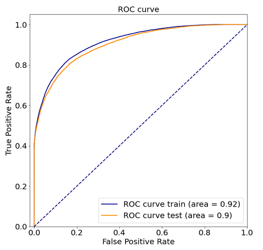
```

In order to compare blackbox model with an interpretable model a *decision tree classifier* was trained. It turned out that splits were made by features which are also important in the blackbox model (*XGBoost*). More details on this are given below.

```{r roc-curve-tree, echo=FALSE, fig.cap='Decision Tree: ROC curve', out.width = '50%', fig.align='center'}
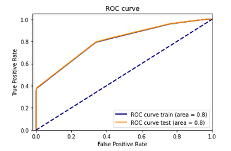
```

```{r decision-tree, echo=FALSE, fig.cap='"White box" model of booking cancellation: decision tree', out.width = '100%', fig.align='center'}
knitr::include_graphics("images/03-decision_tree.png")
```

Let's take one observation and analyze prediction of two models. We have chosen observation number `187` with features values shown in the table below. Both models predicts high probability of booking cancellation (*Decision Tree*: **0.9940**, *Xgboost*: **0.9982**). We will comment on the readability of the *decision tree* explanation by plotting the tree later.

| Feature | Value | Feature | Value |
|---|---|---|---|
| hotel | 0 | arrival_date_month | 9 |
| lead_time | 321 | arrival_date_week_number | 36|
| arrival_date_day_of_month | 3 | stays_in_weekend_nights | 0|
| adults | 2 | children | 0 |
| babies | 0 | meal | 0 |
| market_segment | 4 | distribution_chanel | 3 |
| is_repeated_guest | 1 | previous_cancellations | 1 |
| previous_booking_not_canceled | 0 | booking_changes | 0 |
| deposit_type | 0 | days_in_waiting_list | 0 |
| customer_type | 3 | adr | 62.8 |
| required_car_parking_spaces | 0 | total_of_special_requests | 0 |
| arrival_weekday | 2 | | |

```{r ex-breakdown, echo=FALSE, fig.cap='Break down plot explaining prediciton of chosen instance', out.width = '100%', fig.align='center'}
knitr::include_graphics("images/03-ex1.png")
```

```{r ex-lime, echo=FALSE, fig.cap='LIME plot explaining prediciton of chosen instance', out.width = '100%', fig.align='center'}
knitr::include_graphics("images/03-ex_lime.png")
```

We can see that explanation of *XGBoost* model says that features chosen in *decision tree* have also influence on prediction in *XGBoost* model. As illustrated in the figure \@ref(fig:ex-cp) if chosen client had not canceled reservation in the past, they would be less likely to cancel this reservation. What is more, if the client had booked hotel later, they would have known their plans better and it would decrease probability of cancellation. Maybe the client canceled booking because of big family event, accident or breaking up with partner (booking for 2 adults). It is impossible to predict those events in advance.

```{r ex-cp, echo=FALSE, fig.cap='Ceteris Paribus plot explaining prediciton of chosen instance', out.width = '85%', fig.align='center'}
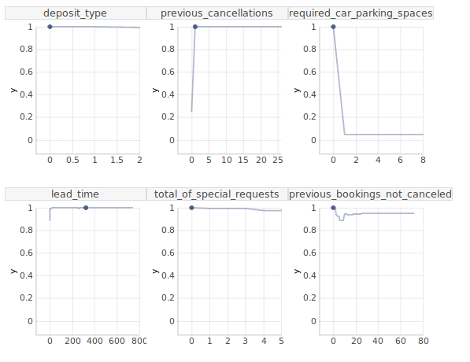
```

What is the lesson from this example? The performance of the *decision tree* is worse than *XGBoost*, so if the explanation of blackbox model is intuitive it is better to use model with higher *AUC*.

### Booking Cancellation: Explanation, dataset level

```{r 03-feat-imp, echo=FALSE, fig.cap='Feature importance of XGBoost model', out.width = '75%', fig.align='center'}
knitr::include_graphics("images/03-permutation_fe.png")
```

Figure \@ref(fig:03-feat-imp) presents the feature importance. The list of five most important features contains `deposit_type` and `previous_cancellations`. Intuition suggests that these are important variables in such a problem. There are also variables `required_car_parking_spaces`, `total_of_special_requests`, `market_segment` that will be analyzed later.

```{r shap-summary-plot, echo=FALSE, fig.cap='Summary of SHAP values of XGBoost model', out.width = '80%', fig.align='center'}
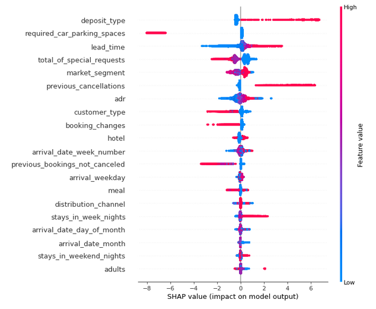
```

Figure above shows **SHAP values**. There are some interesting findings which are intuitive:

* Clients who canceled some reservations in the past are more likely to cancel another reservation.
* People who buy refundable option cancel reservations more often than others.
* A lot of days between reservation time and arrival time increases probability of cancelling booking.
* The longer trip, the higher probability of cancellation.

There are also less intuitive findings:

* Trip personalization (parking spaces, special requests) makes prediction of cancellation be lower.
* People without any special requests cancel reservation more often than others.
* If trip starts at the end of the week there is higher probability that customers change their minds.
* The higher number of adults, the higher probability of cancellation.
* The probability of cancellation is lower if it is hotel in the city instead of resort hotel.

### Booking Cancellation: Explanations, instance level

* The lowest prediction of cancellation probability

```{r 03-shap-min, echo=FALSE, fig.cap='SHAP values and break down plot of XGBoost model for instance with the lowest probability of booking cancellation', out.width = '100%', fig.align='center'}
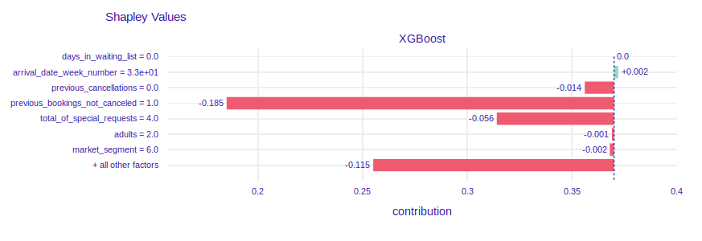
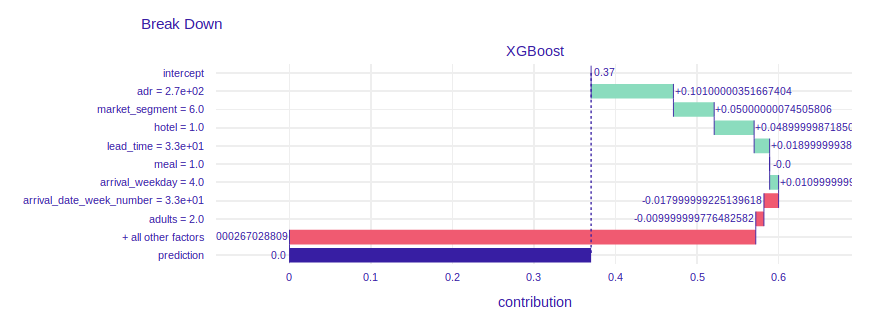
```

The prediction of probability of cancellation equals 0. The plot of **SHAP values** shows that client has booked `1` visit and has not canceled it. The values of features `previous_cancelations` and `previous_booking_not_canceled` (`0` and `1` respectively) make the probability of cancel be lower.

* The highest prediction of cancellation probability


```{r 03-shap-max, echo=FALSE, fig.cap='SHAP values and break down plot of XGBoost model for instance with the highest probability of booking cancellation', out.width = '100%', fig.align='center'}
knitr::include_graphics("images/03-shap_max.png")
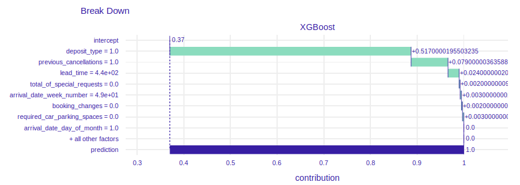
```

The prediction of probability of cancellation equals *1*. In the past client canceled one reservation so it is more likely to cancel another one. `440` days between reservation and arrival date makes the probability of resignation be higher. It is intuitive, because the client could have changed plans. Price per night reduces prediction. The value of `75` € per night is cheap compared to the prices in the dataset. We can guess that due to the low price, it may not be important for customers to cancel booking and wait for a refund.

## Repeated guests

The main goal of models and explanations in this section is to effectively predict whether the guest will come to the hotel once more, and better understand the factors affecting it.

### Repeated guests: Imbalanced dataset

The distribution of the answer for the second problem is noticeably imbalanced (the ratio between number of observations with given answer is around 3%).  We tested various methods, which are implemented in [imbalanced-learn](https://imbalanced-learn.readthedocs.io/en/stable/index.html) library, in different settings and found the `RandomUnderSampler` effective and sufficient for our needs as a data balancer for our main model in the second problem and `RandomOverSampler` as best balancer to use with simple `SGDClassifier`.

The figure below presents the distribution of `is_repeated_guest` in the dataset. The ratio of this distribution is approximately **30 : 1**.

```{r balance, echo=FALSE, fig.cap='The distribution of guests that are and are not repeated guest in the dataset', out.width = '80%', fig.align='center'}
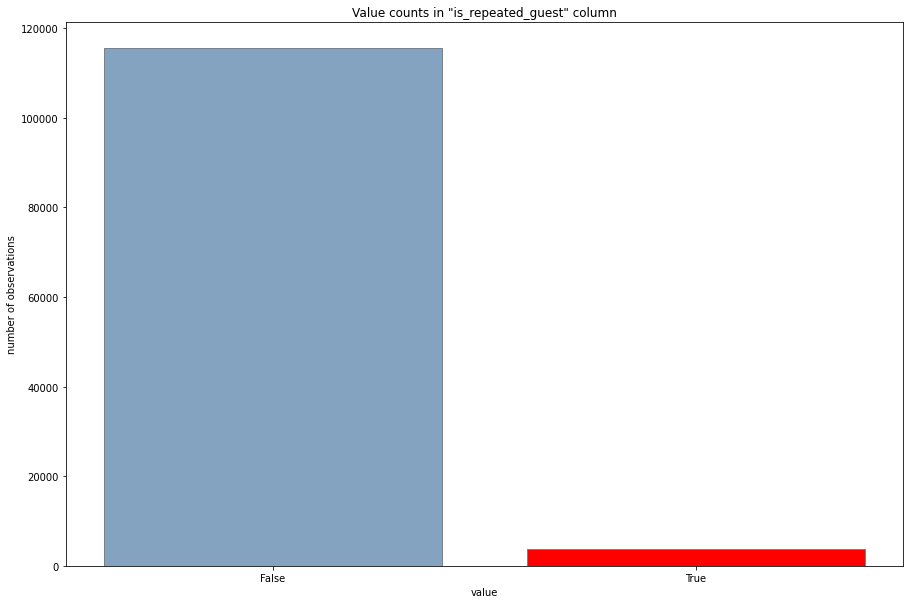
```

### Repeated guests: Model

This model is meant to predict if the given guest is a repeating guest or not. For this purpose as our main model we chose the *XGBClassifier* from `xgboost` package. As mentioned [above](#imbalanced-dataset) we have used *RandomUnderSampler* to balance the training dataset.

When explaining various instances with the **LIME** explainer (the figure below presents the **LIME** explanation for the best of our first models) for one of the first models we noticed that the model highly relies on `previous_bookings_not_canceled` and `previous_cancellations` parameters. We decided to train a model without using those two variables to let the model focus on the other variables. The best models trained without `previous_bookings_not_canceled` variable had noticeably worse *AUC* score of **0.9** in comparison to **0.967** *AUC* achieved by our best models. Because of high influence on the model we decided to keep both variables.

```{r ex-lime-2-1, echo=FALSE, fig.cap='LIME explanation for the best of the first models', out.width = '100%', fig.align='center'}
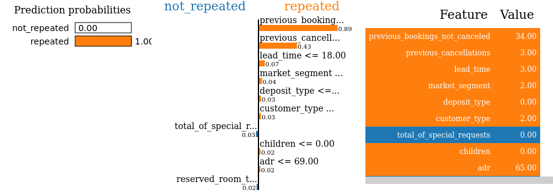
```

As a result of the hyper parameter search we have found the optimal set of hyper parameters including:

* `max_depth` - the maximum depth of tree (`6`),
* `n_esimators` - the number of trees (`100`),
* `learning_rate` - boosting learning rate (`0.33`).

```{r roc-2, echo=FALSE, fig.cap='ROC curve for the XGBClassifier', out.width = '50%', fig.align='center'}
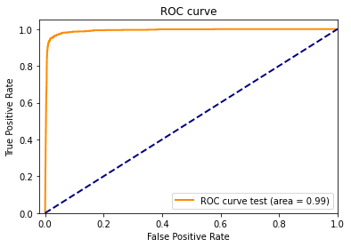
```

The model achieved **0.967** *AUC*, and the figure above presents its *ROC curve*.

We also trained two simpler models - *SGDClassifier* and *DecisionTreeClassifier*. While the *SGDClassifier* (which had the best performance with increased `max_iter` parameter and when using *RandomOverSampler* balancer) had significantly worse results than the *XGBClassifier*, the *DecisionTreeClassifier* achieved AUC score of **0.94** with the `depth` bounded by `4`. We will focus on the *XGBClassifier* later, but for the sake of explanation we present the `DecisionTreeClassifier` tree here.

```{r tree-2, echo=FALSE, fig.cap='Plot of the tree of the DecisionTreeClassifier model', out.width = '100%', fig.align='center'}
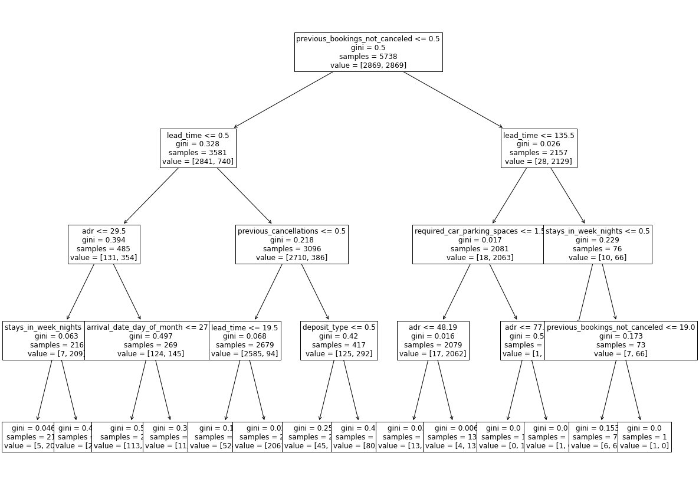
```

Unfortunately one can see that the "explainable by design" *decision tree* model in not easy to understand without usage of model specific methods. While we could use some *tree* specific explainers, the model agnostic explanations provide quite easy to understand and can be used with a wide range of complex, and often better performing models.

### Repeated guests: Explanations, instance level

We first inspected the **SHAP values** for two interesting instances with different correct answer. The first instance showed us that the model learned that guests coming to the hotel in October are less likely to come back and that the lack of booking changes also affects repeating negatively. This explanations are reasonable, because in contrast to the holiday guests, the non-vacation time guests probably are visiting the hotel because of some other, independent reason, that is not as repeatable as the annual vacations. The similar reasoning can be repeated for the changes in the booking and number of special requests - when one comes to some place to relax, they will probably care more about additional attractions provided by the hotel and people who visit a relaxing place, when it met their expectations, probably will come again. The second guest, that is an adult coming to the hotel regularly (`previous_booking_not_canceled`) for a weekend (`arrival_weekday` and `stays_in_week_nights`) probably will come again for one more weekend, for the same reasons as they came before.

```{r shap-2-1, echo=FALSE, fig.cap='Shapley values for a non-repeating customer', out.width = '80%', fig.align='center'}
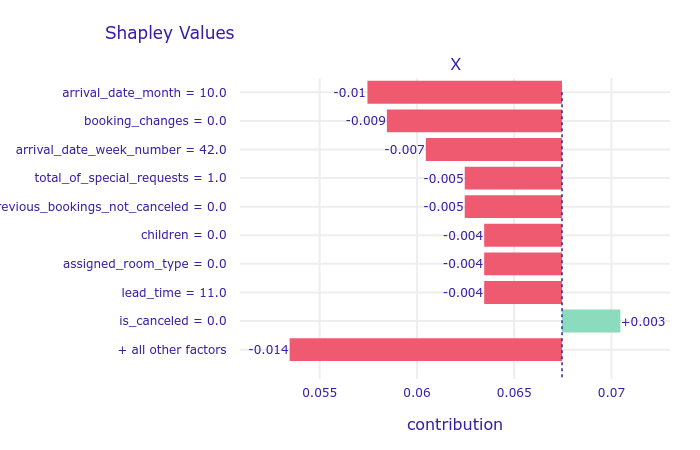
```

```{r shap-2-2, echo=FALSE, fig.cap='Shapley values for a repeating customer', out.width = '80%', fig.align='center'}
knitr::include_graphics("images/03-shap_2_2.png")
```

#### **Ceteris Paribus** plot the same repeating guest

From the **Ceteris Paribus** plot of `lead_time` variables for the same repeating guest as before we might get even more insight of the model's reasoning. It clearly shows that the reservation made a year before the visit is an indicator that the guest will more likely come back. It might be a thing that this particular guest has some independent reason to visit the hotel regularly and they knows about it in advance, so because that reason probably is repeating, than they will probably visit the hotel once more.

```{r cp-2-2, echo=FALSE, fig.cap='Ceteris Paribus plot of lead_time for a repeating customer', out.width = '85%', fig.align='center'}
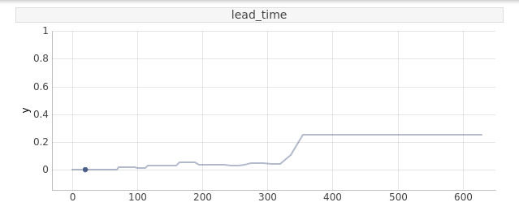
```

The nonlinearity of the **Ceteris Paribus** profile of `lead_time` might be a clue why we were not able to achieve better results with a simple linear model. This result along with more similar ones may lead to effective feature engendering when focusing on creating less complex models.

### Repeated guests: Explanations, dataset level

The attempt to understand how important are particular variables for the trained model on the dataset level by calculating **Permutational Variable Imporatance** gave us a clear insight that the `previous_booking_not_canceled` variable is clearly the most important one, which is very reasonable, because the guest that have visited the hotel before will probably do it once more, in the future.

```{r pci-2, echo=FALSE, fig.cap='Permutational variable importance of most important variables for XGBClassifier', out.width = '100%', fig.align='center'}
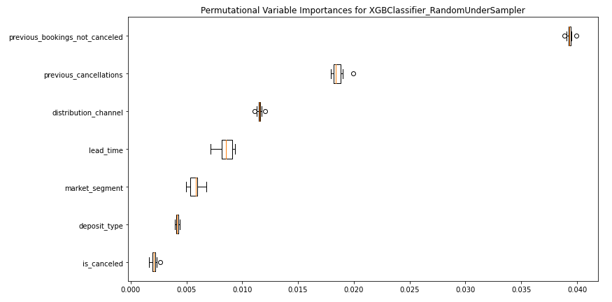
```

## Summary and conclusions

Using XAI methods to examine trained models were useful to understand how the trained models work, and see that the explanations are reasonable enough to use the models, along with the explanations, as a great tool for the experts to give them some interesting insights about their customers behaviours.

Moreover, even when explaining the complicated models we can get explanations that are easier to read and interpret than easier models, like a single *decision tree*.

Last, but not least, when examining the models we were able to find a dependencies, that might be a partial reason for lower performance of other very simple, but easy to understand, linear model.
