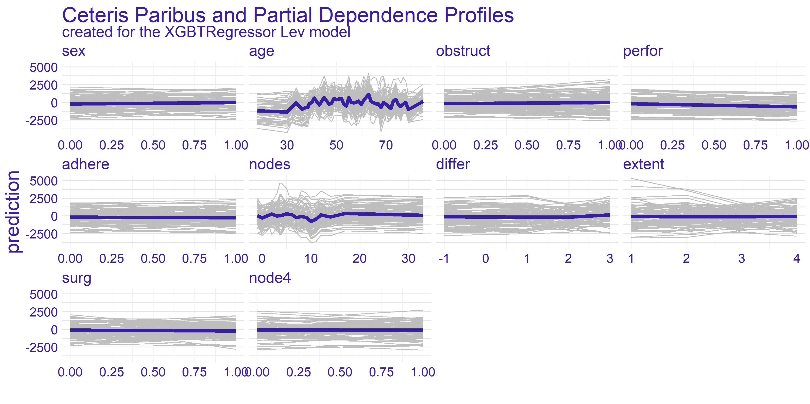
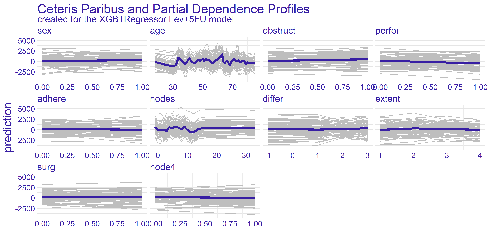
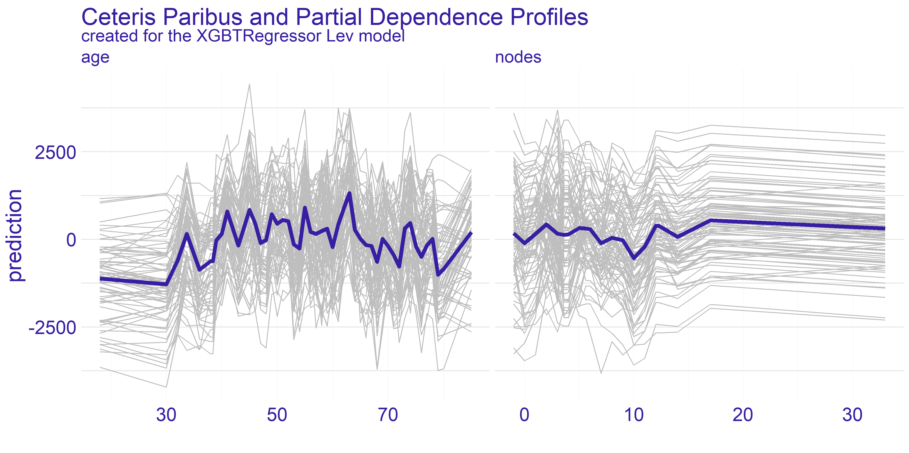
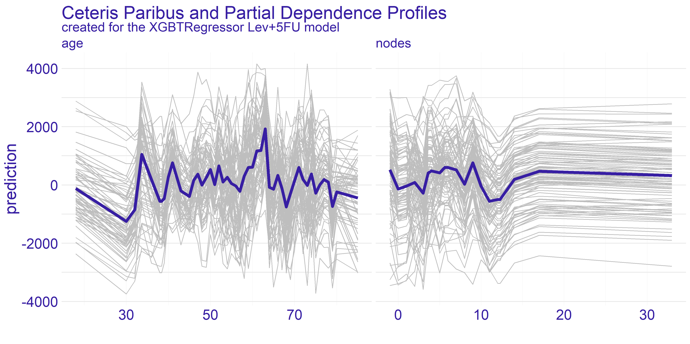
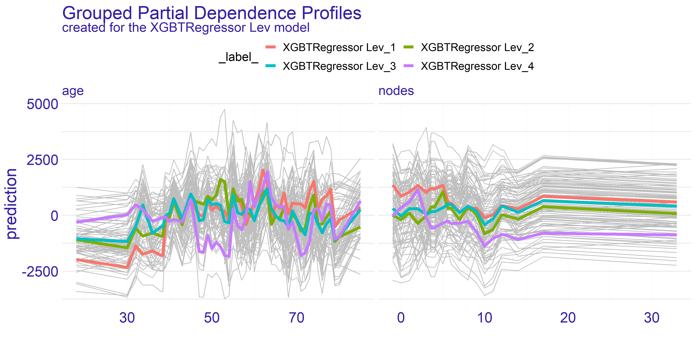
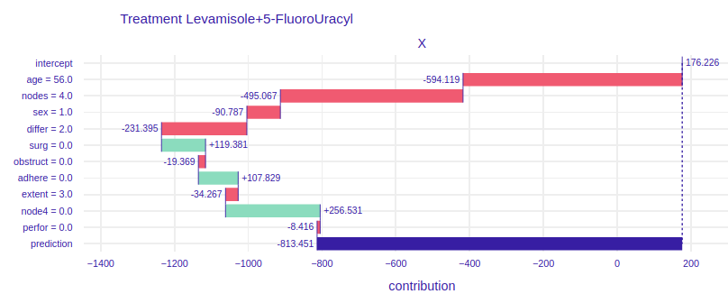

# Story Uplift Modelling: eXplaining colon cancer survival rate after treatment {#story-uplift-modelling}

*Authors: Aleksandra Łuczak (Warsaw University of Technology), Tymoteusz Makowski (Warsaw University of Technology), Kateryna Shulikova (Warsaw School of Economics)*

*Mentors: Miłosz Dobersztyn (McKinsey), Armin Reinert (McKinsey)*

```{r, echo = FALSE}
# Function used to set columns' widths in HTML knitr::kable tables.
# Source of the function: https://github.com/rstudio/bookdown/issues/122#issuecomment-221101375
html_table_width <- function(kable_output, width){
  width_html <- paste0(paste0('<col width="', width, '">'), collapse = "\n")
  sub('<table>', paste0('<table class="table">\n', width_html), kable_output)
}
```

## Introduction 
In this chapter we will present a model for predicting the time remaining for patients after a diagnosis of colon cancer of medium stage (B/C). We have used the uplift  method and a number of explanatory methods such as Feature Importance, Ceteris Paribus and Partial Dependence Profiles, Break Down plots and LIME.

We will use data about **Chemotherapy for Stage B/C colon cancer** from `survival` package in R. The documentation can be found [here](https://stat.ethz.ch/R-manual/R-devel/library/survival/html/colon.html), the package can be installed with `install.packages("survival")` command in R console. After the installation dataset can be accessed via `survival::colon` command.

### What is Uplift Modelling?

For classical algorithms in machine learning it is hard to predict causal impact of the event because they are more suited for predicting the results after an action. In some cases, such as a marketing campaign or medical treatment, that causal impact might be extremely important. Due to the possibility of using two training sets (treatment and control groups) by uplift modeling this problem was solved. 

Uplift modeling is one of the techniques or a branch of machine learning that tries to forecast class probability differences between group exposed to some action or therapy and control group (without that action or therapy).

This technique also allows to discover in research those groups of patients for which treatment was most beneficial, so it is commonly used not only in marketing campaigns or medical treatments but also in other customer services.

References:

 * Uplift modeling with survival data [@04_jaroszewicz_uplift],
 * Uplift modeling for clinical trial data [@04_jaskowski_uplift],
 * Uplift Modeling for Multiple Treatments with Cost Optimization [@04_zhao_uplift],
 * Linear regression for uplift modeling [@04_jaroszewicz_linear],
 * Ensemble methods for uplift modeling [@04_soltys_ensemble].


### Dataset Description
We use data from one of the first successful trials of adjuvant chemotherapy for colon cancer. There are two type of treatment:

 - *Levamisole* is a low-toxicity compound previously used to treat worm infestations in animals and its effects on the treatment of colon cancer have been noted; 
 - *5-FluoroUracyl(FU)* is a moderately toxic (as these things go) chemotherapy agent. This is the "strongest" one treatment. 

Both of these medications are given after the cancer excision, it's adjutant chemistry, that means "extra post-operative".

There are two records per person, one for recurrence and one for death. Dataset contains 1858 observations and 16 features which are described in the \@ref(tab:04-variables-description) table.

```{r, echo = FALSE}
html_table_width(
    knitr::kable(
        data.frame(
            Variable = c(
                "id",
                "study",
                "rx",
                "sex",
                "age",
                "obstruct",
                "perfor",
                "adhere",
                "nodes",
                "time",
                "status",
                "differ",
                "extent",
                "surg",
                "node4",
                "etype"
            ),
            Type = c(
                "categorical",
                "categorical",
                "categorical",
                "categorical",
                "continuous",
                "binary",
                "binary",
                "binary",
                "continuous",
                "continuous",
                "binary",
                "categorical",
                "categorical",
                "categorical",
                "binary",
                "categorical"
            ),
            Description = c(
                "An id.",
                "1 for all patients.",
                "Treatment: Observation, Levamisole or Levamisole+5-FluoroUracyl.",
                "Patient's sex: Male or Female.",
                "Patient's age in years.",
                "Stenosis of the colon by the cancer, which is blockage by the tumor.",
                "Perforation of colon - a flag whether there was a hole in the colon.",
                "Adherence to the surrounding organs (e.g. bladder).",
                "Number of lymph nodes with detectable cancer i.e. during the operation the lymph nodes that were attacked by the cancer are cut out. For the operation to be successful there should be at least 12 lymph nodes.",
                "Days until event or censoring. The time of receiving the treatment is considered to be time = 0, the time that passed in the variable time is the time until death or relapse from receiving the treatment.",
                "Censoring status.",
                "Differentiation of tumour cell (1=well, 2=moderate, 3=poor). The more the better because it is more like colon cells.",
                "Extent of local spread, what cells did he reach (1=submucosa, 2=muscle, 3=serosa, 4=contiguous structures). The less the better.",
                "Time from surgery to registration (0=short, 1=long).",
                "More than 4 positive lymph nodes.",
                "Event type: 1=recurrence, 2=death."
            )
        ),
        "html",
        caption = "Description of variables found in the dataset with values types from data exploration.",
        label = "04-variables-description"
    ),
    c("20%", "20%", "75%")
)
```

Typically, the survival data includes two variables: the observed survival time (`time` variable in our dataset) and a binary censoring status variable (`status` variable in our dataset). The `status` variable indicates whether the event has been observed (typically denoted by `status = 1`). However, if the event has not been observed (`status = 0`) then the true survival time has ben censored, i.e. it is only known that the true survival time is at least equal to `time` [@04_jaroszewicz_uplift].


#### Important remark {-}
Please note that this dataset contains censored data. This means that the `time` variable does not provide exact information on survival `time` and rather a lower limit for survived time. Therefore the problem should be converted into a classification whether a patient survived more than given time $\tau$ threshold, i.e. modelling $\mathbb{P}(t \geq \tau)$. However, we did not know how to work with censored data at the time of modelling and we stuck with modelling it as a typical regression problem.

Therefore **this chapter should not be treated as an example of modelling** and rather as an example of creating explainations for uplift regression problem.


### Ideas
There are many ways to use this data:

- prediction of the patient's life expectancy depending on whether they received  treatment or not,
- prediction whether the treatment is effective or not,
- prediction of the life expectancy depending on the medicine administered.

We have decided to focus on the last mentioned approach. There are two approaches for modelling this approach. One of them being classification whether the patient will live longer than given threshold [@04_jaroszewicz_uplift] and the second one, on whom we will focus, regression which will yield result by how much the treatment will change the life expectancy.


### Why is it worth the hassle?
When a patient learns about the colon cancer disease they usually ask *"How much more time do I have left he has left?"*. And now what? What is the treatment? The doctor may indicate a number of therapies that may be effective, but still be unable to tell how much time there is left or what's the patient's expectancy to live.

The aim of this model is helping to provide more accurate data and answer the patient's question and how the treatment is going to change their life expectancy.


## Data Preprocessing
We removed columns:

- `id`,
- `study`,
- `etype`,
- `study` - due to the intent of regression approach to the problem.

The dataset has been divided into:

- X - all features (without time and rx),
- y - target variable (time),
- treatment - `rx` variable.

Distribution of the variable `rx` is as shown in the \@ref(tab:04-rx-distribution) table. This feature has been categorised.

Table: (\#tab:04-rx-distribution) Number of observations with given treatment type.

| Levamisole | Levamisole + 5-FU | Observation |
|:----------:|:-----------------:|:-----------:|
| 620        | 608               | 630         |


## Model 
To predict model we used algorithms from the package [causalml](https://github.com/uber/causalml) in Python 3.
To optimize hyper parameters we used algorithms from the package [hyperopt](https://github.com/hyperopt/hyperopt) also in Python 3.
All notebooks and codes can be found on [GitHub](https://github.com/aleksandramiesiac/UpliftModelling_Iml_team4).

The final model is `XGBTRegressor` with parameters summarised in the \@ref(tab:04-model-params) table.

```{r, echo = FALSE}
sub(
    "<table>",
    '<table style="width: 60%; margin-right: 25%; margin-left: 25%;">',
    knitr::kable(
        data.frame(
            Parameter = c(
                "colsample_bytree",
                "gamma",
                "learning_rate",
                "max_depth",
                "min_child_weight",
                "n_estimators"
            ),
            Value = c(
                "0.8336948571372381",
                "0.5564260515876811",
                "0.9327196556867555",
                "6",
                "0.45533158266464746",
                "200"
            )
        ),
        "html",
        caption = "Final set of parameters used in our model.",
        label = "04-model-params",
        align = "rl"
    )
)
```


This gives as Average Treatment(Lev) Effect $74.38$ and Average Treatment(Lev+5-FU) Effect $185.69$.

The average treatment effect (ATE) is a measure used to compare treatments in randomized experiments, evaluation of medical trials. The ATE measures the difference in mean  outcomes between units assigned to the treatment and units assigned to the control. In a randomized trial the average treatment effect can be estimated from a sample using a comparison in mean outcomes for treated and untreated units. 
The treatment effect for individual $i$ is given by $y_{1}(i)-y_{0}(i)=\beta(i)$. In the general case, there is no reason to expect this effect to be constant across individuals. The average treatment effect is given by the equation \@ref(eq:04-ate).

\begin{equation} 
    ATE = \frac{1}{N}\sum_{i}y_{1}(i)-y_{0}(i)
    (\#eq:04-ate)
\end{equation}

Where the sum in the \@ref(eq:04-ate) equation performed over all $N$ individuals in the population. 


## Explanations
The model we have used created a submodel for each type of treatment. In our case we have gotten two models - one for *Lev* treatment and the other for *Lev+5FU* treatment. Therefore we are creating explainations two separate sets of explainations with the methods known to us. Additionally, we will try to show how particular explainations could be used by different users of the models.

To start of this chapter we have selected feature importance which seems like a natural choice - checking which variables appear to be bear the biggest contribution to the model's prediction.


### Feature Importance
The feature importance plot shown on figure \@ref(fig:04-VI) represents shows the possible loss of permuting values of given variable. This is an indicator of how important is given variable as the bigger drop-out loss is the more information was lost due to fiddling with the variable. The loss is measured with root mean square. For interpreting the importance we have chosen few subjectively interesting variables.

```{r, 04-VI, echo=FALSE, out.width="100%", fig.cap="Feature Importance calculated for both types of treatment. The variables are sorted by the mean drop-out loss across the treatments. The loss function is root mean square.", fig.show='hold', fig.align='center'}
knitr::include_graphics('images/04-UL-VI.png')
```

The trait which is shared between the two models presented on figure \@ref(fig:04-VI) is the age being quite important variable. The plot shows that permuting the age column yields big loss. This can be a suggestion for the doctor using model to select the best treatment to take patients age into account when selecting the treatment. On the other hand the companies developing drugs for cancer treatment can look into the age groups and aim for creating drug treating an age group which possibly lacks such treatment or currently used treatments are ineffective.

The second important information we can get from this plot is from looking at the `node4` variable. This is a binary value whether the number of nodes is greater than 4. According to our domain knowledge the number of nodes positively affects survivability after the surgery treating cancer. As we can see the drop-out of this variable for the stronger treatment (*Lev+5FU*) is biggest amongst all the variables. This proves that the information about patient's sickness history is crucial for selecting correct treatment as high enough number of nodes gives us information about treatment's efficiency.

The last observation we would like to make is how the average dropout in the model depicting *Levamisole* treatment is higher by about $3.5\%$. Its hard to reason this trend. One of the ideas that we came up is that the stronger treatment has overall better effect thus it values less particular variables.


### Ceteris Paribus and Partial Dependence Profiles
The Ceteris Paribus profiles and the average Partial Dependence Profile has been plotted for both of our models on figure \@ref(fig:04-PDP-Full). As we can the those subplots for every variable for the most part don't get too exciting. That is due to large number of binary variables in the dataset. With this in mind we have decided to focus on the two variables which appear to have the most interesting plots at a first glance. These variables are `age` and `nodes`. To get clearer picture of the chosen variables we present the plots just for them on the figure \@ref(fig:04-PDP-Avg).

```{r, 04-PDP-Full, echo=FALSE, out.width="100%", fig.cap="Ceteris Paribus and Partial Dependence Profiles for every variable in the dataset with regard to models representing different treatments.", fig.show='hold', fig.align='center'}


```

The `nodes` variable's plots on the enlarged figure \@ref(fig:04-PDP-Avg) appear to be more stable compared to the `age`. For both treatment types we can observe the flat-out for large values of `nodes`. The flat-out most likely appears due to the redundancy of too big number of nodes. There is a notable increase in prediction value starting at around value of 10. This aligns with our domain knowledge which states that 12 nodes are really decent amount which increases the chances of successful treatment. Therefore if the 12 nodes are good enough then any more than that neither do contribute to the survivability nor to the model's prediction.

```{r, 04-PDP-Avg, echo=FALSE, out.width="100%", fig.cap=sprintf("Enlarged plots from the figure %s of the variables chosen for detailed analysis (`age` and `nodes`) with regard to applied treatment.", ifelse(knitr:::is_latex_output(), "\\ref{fig:04-PDP-Full}", "\\@ref(fig:04-PDP-Full)")), fig.show='hold', fig.align='center'}


```

For the `age` variable the spiked tendency appears to span across all the Ceteris Paribus profiles plotted on figure \@ref(fig:04-PDP-Avg). This might be due to the fact that the treatment does not rely on the patient's age or that the age is highly affected by some other variable. From our analysis we are keen on making the assumption that the first statement in previous sentence is true. With that in mind there are two noticeable spikes - one approximately for 35 and the other for 65. This observation can be interesting from various points of view.

The first one is from our - the analysts - perspective. Theses spikes can indicate that certain age groups have higher uplift effect. This can be a crucial information for the doctor which is overseeing the patient. If the patient's age falls into the age group which copes well with one of the treatments then it can make the choice easier. On the other hand if the patient's age does not overlap with the spikes then it might be a suggestion to look for different type of treatment than the two we have available here. Finally, this information can be used by pharmacy consortiums. Clearly, there are only two age groups for which the treatment appears to be working better than average. This can give a clear direction which age groups' treatment should be prioritized during development of new drugs and treatments.


#### Grouped Partial Dependence Profiles {-}
To perform more detailed analysis on both doctor's and consortium's points of view we have decided to group the profiles by the `extent` variable. This variable gives information about how far has the patient's disease progressed.

As we can see on figure \@ref(fig:04-PDP-Grouped) the overall shape of subplots for both variables did not change too much between the different groups. This tendency is kept across the two models we have for the treatments. When it comes to the `nodes` variable there is a quite distinctive difference between the two treatments - it is the fourth group (`XGBTRegressor Lev_4` and `XGBTRegressor Lev+5FU_4`). The stronger treatment (*Lev+5FU*) does not stand out from the other groups whereas the weaker treatment falls behind the other groups. This leads to following conclusions: for the patients with highly developed cancer and a metastasis the weaker treatment is simply put - too weak - no matter ho much nodes the patient did have. It is not sufficient to treat this advanced stage of disease with the Levamisole. This is the conclusion the doctors would want to see before making a final choice for treatment. Without this information the assigned treatment might have insufficient effect.

```{r, 04-PDP-Grouped, echo=FALSE, out.width="100%", fig.cap="Partial Dependence Profiles of variables `age` and `nodes` grouped by the `extent` variable and shown for both types of treatment represented by two different models.", fig.show='hold', fig.align='center'}

knitr::include_graphics('images/04-UL-PDP-Grouped-Lev5FU.png')
```

On the contrary the `age` variable does not show such a single strong trend. However, as we have pointed out before, there are two spikes for ages 35 and 65. What the grouped PDP plot shows is that the spike for `age = 35` mostly consists of patients with `extent = 3` whereas the `age = 65` spike appears to span across all levels of `extent` variable. This is an insight which couldn't be given by the average partial dependence profiles. From the data scientists perspective it is an important lesson that the correlation between variables do happen and should be examined thoroughly. For the doctor this information can change the decision to supply given treatment. If the patient falls into `age = 35` group but does not have the specific `extent` which appears to be treated well then it can be a suggestion to turn to some other treatment. On the other hand for the pharmacy it can be a clear sign to analyse why given treatment works for such a specific group. This research can then be used for developing new treatments and improving the life expectancy of cancer patients.

Overall the partial dependence profiles give a valuable insight into the entirety of the dataset. We believe that in this particular case, which is regression task measuring treatment, both the average and grouped partial dependence profiles give valuable information on how the treatments work for different target groups. In our case, with the colon cancer data, the best use-cases appear to be the doctors office for selecting right treatment and the research condoned by the pharmacy consortiums for targeting groups which don't have satisfactory response to treatment.


### Instance Level Explainations
For the instance level explainations we have decided to focus on a limited number of observations.
These observations are taken from set which seemed to provide interesting results during the data exploration process.

The two observations which we have selected can be found in the \@ref(tab:04-selected-obs) table.

```{r, echo = FALSE}
{
    colNames <- c("sex", "age", "obstruct", "perfor", "adhere", "nodes", "differ", "extent", "surg", "node4")

    knitr::kable(
        setNames(
            as.data.frame(
                t(
                    data.frame(
                        "865" = c(0, 68, 0, 0, 1, 2, 1, 3, 0, 0),
                        "983" = c(1, 56, 0, 0, 0, 4, 2, 3, 0, 0),
                        check.names = FALSE
                    )
                )
            ),
            colNames
        ),
        "html",
        caption = "The two observations selected from the dataset for instance level explainations.",
        label = "04-selected-obs",
        align = rep("c", length(colNames))
    )
}
```

Both patients have the same severity of the cancer which is denoted by the `extent` variable. One of them is a female and the other is male. The older patient's (`age = 68`) cancer is adhered to surrounding organs whilst the other's cancer is not --- this is denoted by the `adhere` variable. Finally, the last difference is in `differ` variable which is difference between colon cells and cancer cells.

To summarize, we have a 68-year-old woman whose tumor adheres to the surrounding organs, but it's medium advanced because the cell differentiation is small and only 2 lymph nodes with detectable cancer have been found. Let's call her Mrs. Basia for clarification and article. We also have a 56 year old man whose cancer is quite advanced because he has highly differentiated cancer cells and a large number of lymph nodes.  For the purposes of explanations and the article, let us call him Mr. Peter.

The Explanations plots have been created for both patients Mr. Peter and Mrs. Basia. For each of the patients there are two different plots. The reason for two different plots is the fact that `XGBTRegressor` model underneath creates a model for every treatment. Hence we have got one plot for every treatment type there is -- in our case *Levamisole(Lev)* and *Levamisole+5-FluoroUracyl(Lev+5FU)* -- as seen on figures below.


#### Break Down
The Break Down charts show how the given values of variables influence the model result, i.e. which value influences positively (negatively) and how much positively (negatively). This allows us to examine which aspects of a given patient are crucial in a given treatment or which may disqualify him/her from a given treatment. Understanding these aspects may help the doctor who selects the treatment for the patient, but it may also help to outline the situation in which the patient finds himself, so that he has more knowledge and understanding. 
In addition, in our case we see a comparison between the two types of treatment, this can also help the decision making process of treatment, and it could be used by pharmaceutical companies when introducing a new drug to the market - by comparing the 'old' and 'new' drug. Thus, modern treatments could be applied to more patients. 

```{r 04-BD865, echo=FALSE,out.width="45%", out.height="40%",fig.cap="Break Down plots for Mrs. Basia. The left plot represents model using *Levamisole* treatment and the right one represents model using *Levamisole+5-FluoroUracyl* treatment. ",fig.show='hold',fig.align='center'}
knitr::include_graphics('images/04-UL-865BD1.png')
knitr::include_graphics('images/04-UL-865BD2.png')
```
On the figure \@ref(fig:04-BD865) For the treatment of levamisole (left) we can see that age, gender and the fact that Mrs. Basia's cancer comes to the surrounding organs has a very negative impact on the prognosis. However, a small number of lymph nodes with detectable cancer and the fact that Mrs. Basia wants to start treatment immediately after the operation has a very positive effect. Finally, we can see that if Mrs. Basia decided to treat Levamisole, it would unfortunately harm her, perhaps it would be because the medicine is too weak and would not harm the cancer, but Mrs. Barbara's general health.
To the right of the figure \@ref(fig:04-BD865). we have predictions assuming Levamisole + 5-FluoroUracyl treatment here we see that the variables that negatively influence the result are also age and adhesion to the surrounding organs, but note that here gender and tumor differentiation have a positive influence on the prediction. Besides, the final result is higher than the Levamisole treatment. We can see that using a stronger medication here would have better results. 
Such an accurate picture can help the doctor to decide which medicine to choose and why. Besides, in conversations with the patient, specific numbers, data and graphs would have a calming effect and the patient would feel more confident and, as we know, mental health is as important as physical health.


```{r 04-BD983, echo=FALSE,out.width="45%", out.height="40%",fig.cap="Break Down plots for Mr. Peter. The left plot represents model using *Levamisole* treatment and the right one represents model using *Levamisole+5-FluoroUracyl* treatment.",fig.show='hold',fig.align='center'}
knitr::include_graphics('images/04-UL-983BD1.png')

```

On the figure \@ref(fig:04-BD983) for the treatment of Levamisole (left) we can see that Mr. Peter's condition is very serious, because all the variables except for the fact that the tumor does not adhere to the surrounding organs cause such low prediction. From the general description of Mr. Peter's condition we do not see that he reacts so badly to treatment. The doctor treating the patient, seeing such a chart, immediately knows that Levamisole treatment must be excluded. It also says about it a very poor result of prediction, over 1500 lost days, if the doctor and the patient would decide to treat Levamisole. Now let's look at the graph on the right, it talks about how the individual attributes of Peter influence the prediction of whether his condition will improve. Seeing the prediction, i.e. more than 800 lost days, we know that this treatment is also not worth using for Mr. Peter. Let's take a closer look at this chart. Unlike the previous treatment, the influence of age is much more visible, more than 200 times worse will Mr. Peter react to stronger treatment than to weaker one.  The fact that Peter's tumor has not spread to the surrounding organs has a positive effect in both treatments. The positive effect in the treatment of Levamisole+5-FluoroUracyl is the fact that immediately after the operation Mr. Peter came to the treatment and the fact that during the operation at least 4 lymph nodes with detectable cancer were excised. None of the proposed treatments are satisfactory in Mr. Peter's case.


## Summary and Conclusions 
Explanation methods help to understand not only the operation of the models that can be used by the data analyst (Feature Importance, PDP, Cateris Paribus), but also indicate which variables influence the result and why they are important (Cateris Paribus, Break Down). The second aspect can be used by the doctors guiding the patient in the treatment, but also by pharmacists launching a new drug on the market, or researchers in clinical trials. These are people who need clear and transparent graphs to understand the essence of prediction and the impact of a specific variable on the model, and the XAI methods provide this possibility.

In the Uplifts problem, the model architecture plays an important role. It should be remembered that there are two predictions in one model, and at the end they are subtracted from each other, to know how much we will improve our result if we use a given drug compared to not getting any drug.
It is not easy to show the results of such a model and there are many limitations. For example, using the LIME method would not be advisable here, because this method is not additive. Subtraction of the factors returned by LIME would not give any information.

It is not enough to use whatever explanations you want, you have to choose the right methods for the problem. In uplift, only the additive methods will bring some value. In this chapter we have dealt with a few selected methods (FI, PDP, CP,BD), but there are still many methods that could be examined, including SHAP values.
