# Story Meps: eXplainable predictions for healthcare expenditures

*Authors:  Anna Kozioł (Warsaw University of Technology), Katarzyna Lorenc (Warsaw University of Technology), Piotr Podolski (University of Warsaw)*

*Mentors:  Maciej Andrzejak (Affiliation 2), Alicja Jośko (Affiliation 1)*

## Introduction 

Perhaps the most urgent problem with the current health care system in the United States is its high cost.
According to the  [Centers for Disease Control and Prevention](https://www.cdc.gov/nchs/fastats/health-expenditures.html), during 2017 health care spending per capita averaged nearly $11,000 and total spending was $3.2 trillion, or 17.9% of GDP.
This raises the natural question of the causality of high expenses and the estimation of them for a particular person.

One of the objectives of this chapter is to forecast annual spending on the health care of individuals in the United States.

There is no doubt that these forecasts are of interest to people directly related to medical expenditure, for example, insurance companies, employers, government. 

How to deal with a situation when the model works well but is a so-called black box and we do not know what affects a specific result? 
What if the proposed models return non-intuitive results and we want to know why they are wrong?

The next and main purpose of this chapter is to address these concerns using [Explanatory Model Analysis](https://pbiecek.github.io/ema/).  
We will try to identify not only which features are most predictable for the results, but also the nature of the relationship (e.g. its direction and shape).
We will focus on understanding the behavior of the model as a whole, as well as in a specific instant level (for specific person).  


The data set comes from a study called Medical Expenditure Panel Survey (MEPS), which is sponsored by the Healthcare Quality and Research Agency.
About 15,000 households are selected as a new panel of surveyed units, regularly since 1996.

Data set used for analysis is available for free on the [MEPS](https://meps.ahrq.gov/mepsweb/data_stats/downlAIoad_data_files.jsp) website.
The MEPS contains a representative sample of the population from the United States with two major components: the Household Component and the Insurance Component. 

Household Component collects data about demographic characteristics, health conditions, health status, medical history,  fees and sources of payment, access to care, satisfaction with care, health insurance coverage, income, and employment for each person surveyed. 
 
The second component - insurance - collects data about the health insurance from private and public sector employers.
The data include the number and types of private insurance schemes offered, premiums, employers' and employees' health insurance contributions, benefits associated with these schemes, and employer characteristics.

The data processing and analysis were carried out in Python 3.7.3 and R 3.6.1. 

## Model

### Data
Agency of Healthcare Research and Quality provides an extensive database of medical expenses. Consequently, dataset selection on which we will make further analysis was an important first step. We decided to choose the two latest panels. Expenditures for treatment that we will examine in the following chapter apply to the years 2015/2016 and 2016/2017. The selected dataset contains information on over 32,000 patients, and each of them is described by 3,700 variables. We attached great importance to choosing features that would be appropriate for the prediction. The most important criterion adopted is that the variable cannot relate to expenditure associated with any treatment. For this purpose, we looked through several hundred of them and selected 387 most suitable.

As a part of the preprocessing, we removed records that were marked as *Inapplicable* in the expenditure column.  The number of people who didn't incur expenses is 5504, while the number of patients with "inapplicable" is 407, the percentage respectively are 17% and 1%. The following figures show the distribution of the explained variable.


```{r, cache=FALSE, out.width = "1400",fig.cap = "Distribution of medical expenses ", fig.align="center",echo=FALSE}
knitr::include_graphics('images/05-y_val.png')
```
    


### Model
Among the models we have trained, the best results were achieved by Gradient Boosting. Due to the characteristics of the explained variable, we decided to check the behavior of the model after applying the logarithmic transformation to expenses. We also checked whether the not inclusion of people without medical expenses would affect the model. Model hyperparameters have been tuned using [NNI](https://pypi.org/project/nni/) toolkit. To choose the best model, we compared the determination coefficient values. 

The table below shows the results of the experiments. To calculate the determination coefficient in column  *$R^2$ (logarithmically transformed expenses)*, we transformed logarithmically the values of expenses, and after training the model we returned to the original scale. 


| Patients without expenses | Model | $R^2$ | $R^2$ (logarithmically transformed expenses) | 
|----------------|-----------------------------------------------------------------------|------------------------------------------|--------------------------------------------------------|
| included | Gradient Boosting | 0.50 | - |
| included | Tuned Gradient Boosting | **0.55** | - |
|not included | Gradient Boosting | 0.42 | 0.40 |
|not included| Tuned Gradient Boosting | 0.49 | 0.49 |
Table: Values of the determination coefficient.

The best fit relying on the determination coefficient was demonstrated by a Gradient Boosting, which included patients who did not incur treatment expenses. Then, as a compromise between the size of the model and its quality, we chose the 7 most important variables. For this purpose, we ranked the significance of the variables in the model and extracted those with the highest coefficient. 

```{r, cache=FALSE, out.width = "400", fig.align="center",echo=FALSE}
knitr::include_graphics('images/05-r2_no_features.png')
```

Obtained variables mainly concern the number of visits to specialists.  For a more diverse and interesting analysis, we have also taken into account demographic variables such as age, gender, educational background, and race, as well as some disease units. 


```{r, cache=FALSE, out.width = "700", fig.align="center",fig.cap = "Scheme of conduct with a specification of origin of variables",echo=FALSE}
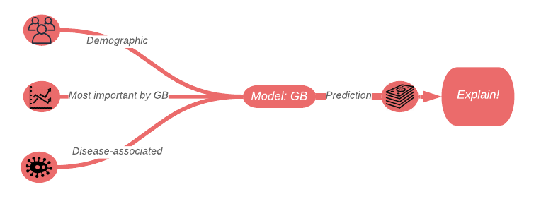
```

| Variable | Description |
|--------------|--------------|
| *IPNGTDY1*| number of nights associated with hospital discharges | 
| *OBDRVY1*| number of office-based physician visits | 
| *HHAGDY1*| agency home health provider days| 
| *DSFTNV5*|indicate whether the respondent reported having his or her feet checked for sores or irritations | 
| *OBOTHVY1*| office-based non-physican visits | 
| *PSTATS2*| person disposition status|  
| *OPOTHVY1*| outpatient dept non-dr visits |
|*AGE2X*| age of patient|
|*RACEV2X*| race of patient|
|*SEX*| patient's gender|
|*HIDEG*| the highest degree of education attained at the time the individual entered MEPS|
|*diab_disease*| indicates whether the patient suffered from a diabetes disease |
|*art_disease* | indicates whether the patient suffered from a arthritis disease |
|*ast_disease*| indicates whether the patient suffered from a asthma disease |
|*press_disease* |  indicates whether the patient suffered from a high pressure disease|
|*heart_disease*|  indicates whether the patient suffered from a heart disease|
Table: A review of selected variables

In the following section we will explain the Gradient Boosting model based on 16 variables presented in the table above. The coefficient of determination of the final model is 0.5

TODO: zaktualizowac wartosci R^2

## Explanations 


### Model Level Explainations

In order to find out about the influence of individual variables on the prediction for each patient, we present a Permutation Variable Importances graph.

```{r, cache=FALSE, out.width = "600", fig.align="center",fig.cap = "Permutation Variable Importances for Gradient Boosting Regressor",echo=FALSE}
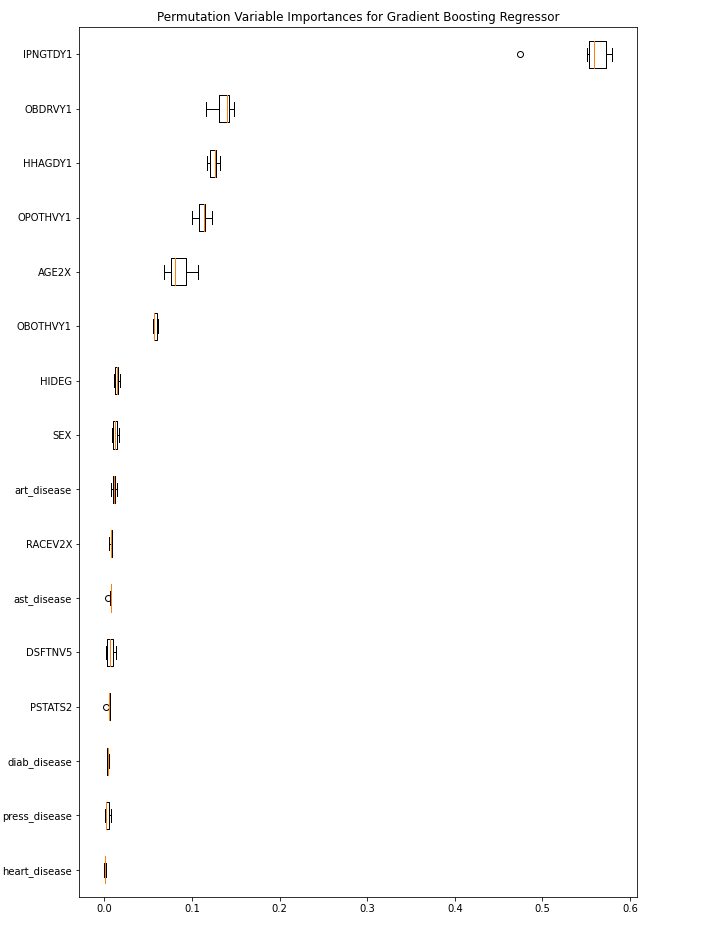
```

Undoubtedly, the most important is the variable that indicates the number of nights spent in the hospital by the patient. An interesting observation seems to us that the demographic variable - AGE, which initially did not have a significant impact on the prediction, on the reduced model is in the top five most important variables. The remaining demographic variables, as well as those relating to diseases, do not show a gain in relevance in a model reduced to several variables.

Based on previous analyzes, the number of nights spent in the hospital turned out to be the most important variable. To understand the nature of its impact on prediction in our model, it's worth looking at the Partial Dependence Profiles. Below we present the PD plots broken down by gender.


```{r, cache=FALSE, out.width = "600", fig.align="center",fig.cap = "Partial Dependence Profiles for number of nights spent in the hospital broken down by gender ",echo=FALSE}
knitr::include_graphics('images/05-pdp_hosp.png')
```
Among patients who spent a few nights in the hospital, gender is not important for the amount of prediction. This rule begins to change after exceeding 30 nights. 
The PD profile for men has significantly higher values compared to the women's profile, despite the similar curve behavior. After exceeding  70 nights in the hospital, this variable does not affect the result returned by the model on average.

###  Instance Level Explainations - business approach


In this subsection we will try to show the application of explanatory methods in the business approach. Selected observations are:
1) the person with the best estimated cost among people with results greater than 3000,
2) the person for whom the model predicted the highest cost of all. Finding the value of characteristics that increase or decrease the final result, diagnostics of the direction of changes or oscillations of the result in case of change of characteristics describing a person may be valuable information for insurance companies or other payers for medical services.
Such conclusions may also be useful for the patients themselves, who have decided to pay for medical care themselves.

#### XIA for the best prediction

Prediction of medical costs for first observation is 3882\$ and is differed from the real value by 4.8\$.

####   XIA for the best prediction using Break Down Plots

Break-down plots show how the contribution of individual variables change the average model prediction to the prediction for observation.


```{r, cache=FALSE, out.width = "1400",fig.cap = "Brake down plot ", fig.align="center",echo=FALSE}
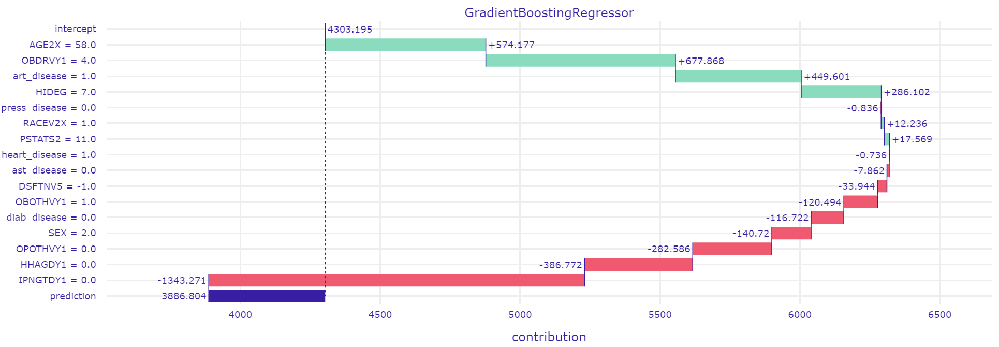
```

The patient has 58 age,  which alone increase average total cost by 4303.195 \$ and the gender is female which decreases average total cost by 140. 72 \$.
Her total number of office-based visits is 4, which increase average total cost by 574.177 \$.
She suffers from arthritis what increase average total cost by 677.868 \$  but she is not diagnose to diabets, astma or high blood preasure which decrease final result.
Her status of education is unknown, what increase total cost.
 The fact that she didn't spend any night in the hospital decrease average total cost by 1343.271$. And also, she didn't benefit from home medical services decrease average total cost by 386.772 \$. 


####  XIA for the best prediction using Shapley Values

To remove the influence of the random ordering of the variables in brake down results we can compute an average value of the contributions.

```{r, cache=FALSE, out.width = "1400",fig.cap = "Shapley values plot ", fig.align="center",echo=FALSE}
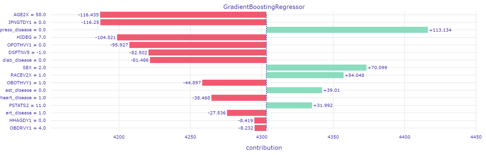
```

The plot shows that the most important variables, from the point of view of selected observation is age, number of night spending in the hospital and diagnose high blood preasure.

For this obserwation having age equals 58 decrease average total cost by 116.435 \$. Similar impact (decrease result by 116.25 \$ ) have the fact that she didn't spend any night in the hospital. Her status of education is unknown, what decrease average total cost by 104.521 \$.
She is not diagnose the high blood preasure which increase average response by 113.134 \$.
For this obserwation being a women increase  average total cost by 70.099 \$. 


####  XIA for the best prediction using LIME
TODO: poprawic wykresy lime

 The key idea behind this method is to locally approximate a black-box Gradient-Boosting  model by a K-lasso interpretable model.


```{r, cache=FALSE, out.width = "1400",fig.cap = "LIME plot ", fig.align="center",echo=FALSE}
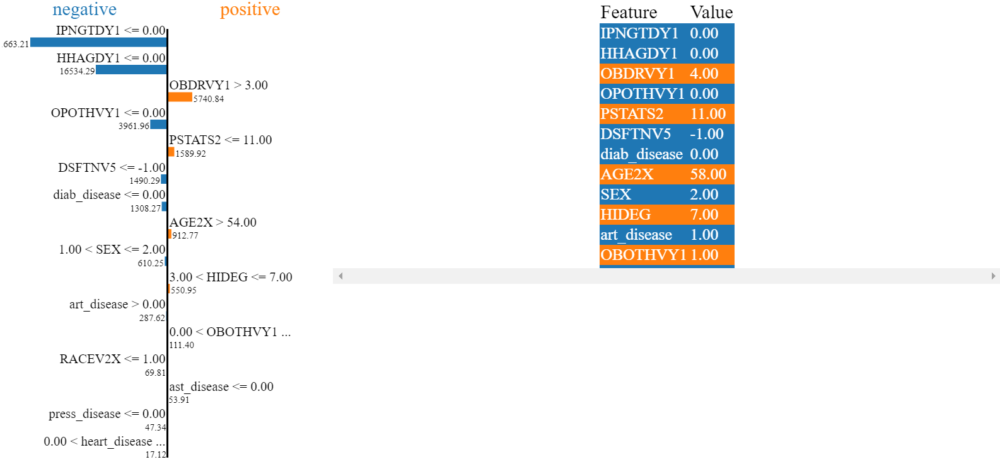
```

According to the LIME method, the plot suggests that spending any night in hospital reduces the estimated cost by $663. Much greater, also the negative impact has a variable which telling that that patient didn't benefit from home medical services, which  total cost by 16534.29 \$.
Patient analysed is not diagnose the high blood preasure which decrease response by 1308.27 \$.

Variables that increase the cost of medical services are the total number of office-based visits greater than 3 and the age of the analyzed person greater than 54.


#### XIA for for the best prediction

Prediction of medical costs for second observation is 147178.5 \$ and is differed from the real value by 3721.5\$.

####   XIA for the prediction with the largest cost using Break Down Plots


```{r, cache=FALSE, out.width = "1400",fig.cap = "LIME plot ", fig.align="center",echo=FALSE}
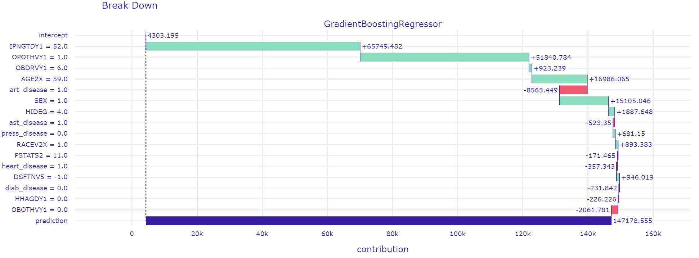
```


The patient spending 52 nights in hospital, which increase average total cost by 4304.195 \$. 
Having 59 age, increase average total cost by 16986 \$ and the fact that gender is male increase average total cost by 15105 \$.
His status of education is bechelor degree, what increase total cost 1887 \$.
Despite he is not diagnose to diabets and high blood preasure which decrease final result, he suffers from heart disease which also decrese avarage response.


####   XIA for the prediction with the largest cost using Shapley Values

```{r, cache=FALSE, out.width = "1400",fig.cap = "Shapley Values plot ", fig.align="center",echo=FALSE}
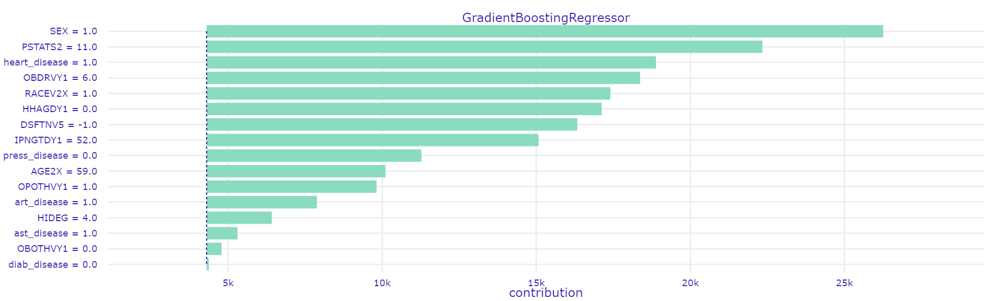
```


As we expected, for the observation that generated the highest predictions, most of the variables have an additive effect on the final result. 
The graph shows that the greatest influence on the final value of the average prediction was in being male.

Living in a household increases the average prediction by 18031\$. The fact of having heart disease, spending 52 nights in hospital and the total number of office-based visits equal to 6 also had a big positive impact on the result.


####   XIA for the prediction with the largest cost using LIME


```{r, cache=FALSE, out.width = "1400",fig.cap = "LIME plot ", fig.align="center",echo=FALSE}
knitr::include_graphics('images/05-lime_highest_predict.PNG')
```

The LIME method also returns a positive influence on the final prediction for most variables. 
The chart shows that spending 52 nights in hospital increases treatment costs by 32360 \$. The total number of office-based visits greater than 3 also has a positive impact, increasing the prediction by 6074.66 \$. The age of a patient over 54 also significantly increases medical costs. Among the variables reducing treatment costs ,was the total number of days in home health care equal to 0.

####   XIA for both predictions using Ceteris Paribus Profiles

Here we will denote the patient with the largest cost predicted as Patient 2, and the patient with the best prediction as Patient 1.

```{r, cache=FALSE, out.width = "1400",fig.cap = "Ceters Paribus plot for selected 6 features  ", fig.align="center",echo=FALSE}
knitr::include_graphics('images/05-ct-buss-all.png')
```

In the plot above we have selected features that behave differently between those two patients. In later subsections we will dive more into those differences.

#####  Comparing differences between patients based on Sex.


```{r, cache=FALSE, out.width = "1400",fig.cap = "Ceters Paribus plot for SEX  ", fig.align="center",echo=FALSE}
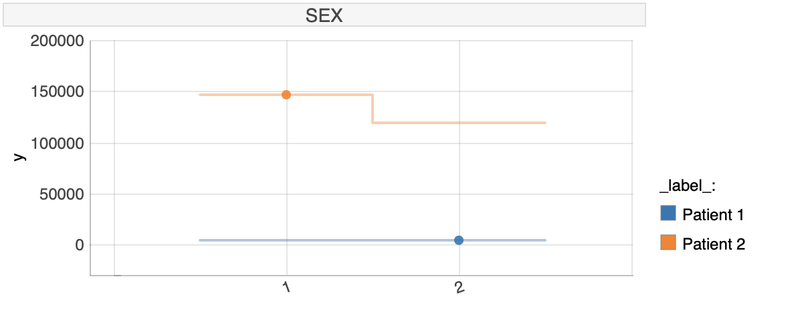
```


As we can see, our explanation model tries to predict what would have happened if the patient would have a different sex And for the patient 1 there would be no difference in predicted value, but for patient 2 the change of sex implicates lowering or increase in predicted costs.

#####  Comparing differences between patients based on age.


```{r, cache=FALSE, out.width = "1400",fig.cap = "Ceters Paribus plot for AGE  ", fig.align="center",echo=FALSE}
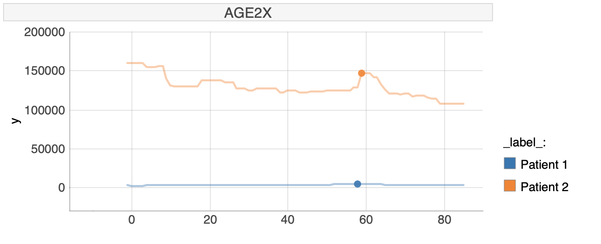
```

In this section we will investigate age. For patient 1 there is no influence on age on the expenses, but for patient 2 there is an influence of this variable. For patient 2 being around age of 60 and below age of 10 implicates a rise in predicted costs.

#####  Comparing differences between patients based on number of nights associated with hospital discharges.


```{r, cache=FALSE, out.width = "1400",fig.cap = "Ceters Paribus plot for IPNGTDY1  ", fig.align="center",echo=FALSE}
knitr::include_graphics('images/05-ct-buss-IPN.png')
```

Here both patients behave similary, but with different sensitivity. Patient 2, because of higher costs is more sensitive in changes of the number of nights associated with hospital discharges.

###  Instance Level Explainations - instance specific approach

Here I will try to show the results of explanatory analysis methods for selected instances of data, that is for specifically selected different people with different background, race, age and sex.

| Variable | Patient 1 | Patient 2 |
|--------------|--------------|--------------|
| *IPNGTDY1*| 0 | 3 |
| *OBDRVY1*| 12 | 8 |
| *HHAGDY1*| 0 | 0 |
| *DSFTNV5*| 2 | -1 |
| *OBOTHVY1*| 0 | 6 |
| *PSTATS2*| 11 | 11 |
| *OPOTHVY1*| 0 | 3 |
|*AGE2X*| 71 | 34 |
|*RACEV2X*| 2 | 1 |
|*SEX*| 1 | 2 |
|*HIDEG*| 1 | 1 |
|*diab_disease*| 1 | 0 |
|*art_disease* | 1 | 0 |
|*ast_disease*| 0 | 0 |
|*press_disease* | 1 | 0 |
|*heart_disease*| 1 | 0 |
|*real expenses*| 2263 | 16268 |
|*prediction*| 8779 | 24373 |
Table: A review of selected variables

So as in table above we will investigate 2 patients, where one is of age 71 and with several illnesses, where the second one is of age of 34, different sex and without illnesses.

####  XIA for Patient 1 using Break Down Plots

Here we will be showing explanations using Break-down plots and explain the contribution of individual variables on the prediction,

```{r, echo=FALSE, fig.cap = "Break-Down plot for Patient 1", fig.align="center", out.width = "1400"}
htmltools::includeHTML("./images/05-bd_1.html")
```

The first patient is of age 71, which in comparison to previous explanations should have significant impact on the prediction but not in this case. Here the biggest influence on the prediction has variable OBDRVY1, which is the number of office-based physician visits. Also diabetes and indicator whether the respondent reported having his or her feet checked for sores or irritations have positive influence on the predicted expenses. But variables IPNGTDY1, OBOTHVY1 and HIDEG have most significantly negative influence on the prediction.

####  XIA for Patient 1 using Shapley Values

```{r, echo=FALSE, fig.cap = "Shapley values for Patient 2", fig.align="center", out.width = "1400"}
htmltools::includeHTML("./images/05-shap_1.html")
```

We can run explanatory analysis using shaplay values for those patients. For Patient 1, all observations apart from age have positive influence on the predicted value.

####  XIA for Patient 1 using LIME

TODO: poprawic wykresy lime

####  XIA for Patient 2 using Break Down Plots

```{r, echo=FALSE, fig.cap = "Break-Down plot for Patient 2", fig.align="center", out.width = "1400"}
htmltools::includeHTML("./images/05-bd_2.html")
```

The second patient is of age 34. In this case the most significant influences on the prediciton have variables IPNGTDY1 and OPOTHVY1 which are responsible for almost 17k of expenses. Other variables that also influence the prediction are OBDRVY1 and OBOTHVY1. Other variables have very small or small but negative influence on the prediciton.
####  XIA for Patient 2 using Shapley Values

```{r, echo=FALSE, fig.cap = "Shapley values for Patient 2", fig.align="center", out.width = "1400"}
htmltools::includeHTML("./images/05-shap_2.html")
```

We can run explanatory analysis using shaplay values for those patients. For Patient 1, all observations apart have positive influence on the predicted value.

####  XIA for Patient 2 using LIME

TODO: poprawic wykresy lime

####  XIA for Patient 1 and Patient 2 using Ceteris Paribus Profiles

In this chapter we will use Ceteris-paribus profiles for instance level explanations.
Ceteris-paribus profiles show how the model response would change if a single variable is changed. So here we will be checking how would the model prediction change, if we change only one property of the patient and how it influences our model

#####  Comparing differences between model predictions for Patient 1 and 2 for diffenret properties

Here we present a plot, on which we list all variables that are different between patients and we will try to investigate, how the model behavior changes for each patient, when their properties change.

```{r, cache=FALSE, out.width = "1400",fig.cap = "Ceters Paribus plot for six variables ", fig.align="center",echo=FALSE}
knitr::include_graphics('images/05-ct_paribus_1_2.PNG')
```

As shown on the plot above, each value of the patient property influences a bit differently the outcome of our model. Patient 2, who has higher expenses is more sensitive on changes of the values of his properties.

######  Comparing differences between patients for number of nights associated with hospital discharges

```{r, cache=FALSE, out.width = "1400",fig.cap = "Ceters Paribus plot for IPNGTDY1 ", fig.align="center",echo=FALSE}
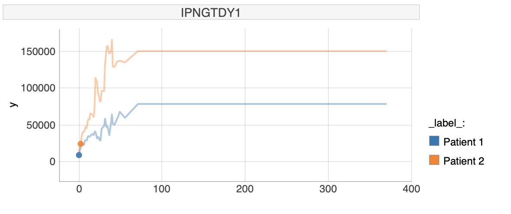
```

For this property of our patients, we would like to show how the model responds, when values of the number of nights associated with hospital discharges influences the predicted costs. The number of nights influences costs for patient 1 and 2 similary, but with different size. Patient 2, due to having higher prediction of expenses is being influenced more, than patient 1, but with the same dynamic.

######  Comparing differences between patients for variable if feet was checked for sores or irritations

```{r, cache=FALSE, out.width = "1400",fig.cap = "Ceters Paribus plot for DSFTNV5 ", fig.align="center",echo=FALSE}
knitr::include_graphics('images/05-ct_DSFTNV5.PNG')
```

For the variable if of the feet of the patients was checked for sores or irritations only patient 2 shows some responce for any change of the property.

######  Comparing differences between patients for variable  of number of office-based physician visits.

```{r, cache=FALSE, out.width = "1400",fig.cap = "Ceters Paribus plot for OBDRVY1  ", fig.align="center",echo=FALSE}
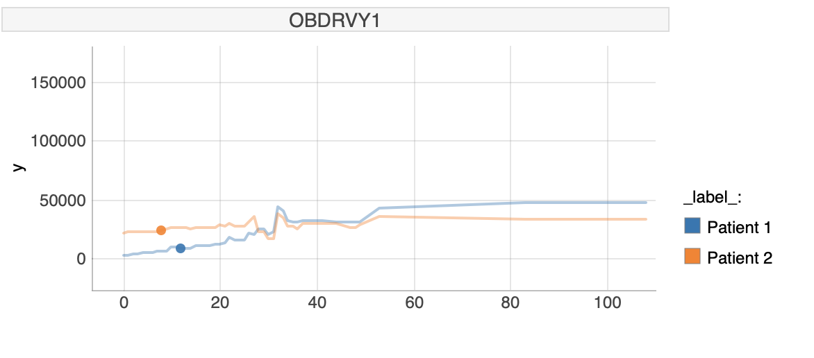
```

In this case we can notice an interesting influence of the variable OBDRVY1. For patient 1 the higher the number of office-based physician visits the higher would be the predicted outcome of our model. This is different for patient 2, for whom the predicted value is not changing, sometimes it is even declining.

## Summary and conclusions 
All key information about the final model we will put in this section.
Scripts and list of selected variables are available at: [meps_story github](https://github.com/lorenckat/meps_story).