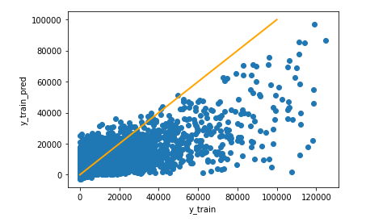
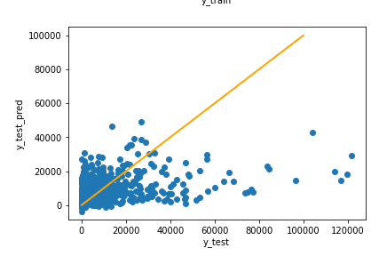

# Story Meps: regression

*Authors:  Anna Kozioł (Warsaw University of Technology), Katarzyna Lorenc (Warsaw University of Technology), Piotr Podolski (University of Warsaw)*

*Mentors:  Maciej Andrzejak (Affiliation 2), Alicja Jośko (Affiliation 1)*

## Introduction 

The aim of the project is to predict medical expenses based on demographic and socio-economic variables.

The Medical Expenditure Panel Survey provides data on health care as well as related costs. Data for the MEPS project has been collected regularly since 1996.
Each year, approximately 15,000 households are selected as a new panel of surveyed units.


## Model

We are testing models and trying to improve their quality.
Right now, the best model we developed is Gradient Boosting Regressor.
The figures below present the prediction values on training and test set.

```{r, cache=FALSE, out.width="500", fig.align="center",echo=FALSE}


```

```{r, cache=FALSE, out.width="500", fig.align="center",echo=FALSE}



```

All key information about the final model we will put in this section.

## Explanations


## Summary and conclusions 

