# Story Uplift Modeling: eXplainable predictions for optimized marketing campaigns {#story-uplift-marketing1}

*Authors: Jan Ludziejewski (Warsaw University), Paulina Tomaszewska (Warsaw University of Technology), Andżelika Zalewska (Warsaw University of Technology)*

*Mentors: Łukasz Frydrych (McKinsey), Łukasz Pająk (McKinsey)*


**Key points**:

* uplift models thanks to linear definition give wide range of possibilities while using XAI  
* SHAP values can be used to explain model both in local and global aspects - they can be generalized in order to estimate Variable Importance and Dependence Plots  

* in the case of analysed dataset, marketing campaign should be sent two months after last purchase to be the most effective

* XAI analysis can help in creating personalized marketing campaigns

## Introduction 

Running a business is a challenge. It involves making a lot of decisions to maximize profits and cut down costs - finding the tradeoff is not a straightforward task.
Here come Machine Learning and uplift models that can help in optimizing marketing costs.

It is widely believed that it is a good idea to send marketing offer to all company's customers. From one point of view, we think the probability that the customer will buy our product is higher - in fact it is not always the case (the matter will be described in details later). On the other hand, making a large-scale campaign is costly. Therefore, it is important to consider in decision-making what is the Return on Investment (ROI).


Is it true that by sending the marketing offer we only increase the chance for the customer to buy our product and therefore extend our profit? The issue was already investigated [@book_uplift] and it was pointed out that customers of any company can be divided into 4 groups (Figure: \@ref(fig:4groups)). 

```{r 4groups, echo=FALSE, fig.cap='Customer types taking into consideration their response to treatment [@4groups_chart]', out.width = '50%', fig.align='center'}
knitr::include_graphics("images/09_e45e2d97-confmatrix_alt.png")
```

The matrix (Figure: \@ref(fig:4groups)) was created based on customer decision to buy a product depending on the fact that they were addressed by a marketing campaign or not. The action used for triggering in customers the particular behaviour is called treatment. In the 4 groups we distinguish:

* <span style="color:darkgreen">**'persuadables'***</span>: the customers that without being exposed to marketing campaign would not buy a product 
* <span style="color:grey">***'sure things'***</span>: the customers that irrespective of the fact that they experienced treatment or not are going to buy a product
* <span style="color:grey">***'lost causes'***</span>: the customers that irrespective of the fact that they experienced treatment or not are **NOT** going to buy a product 
* <span style="color:darkred"> ***'sleeping dogs'***</span>: the customers that without being exposed to marketing campaign would buy a product but in case they receive a marketing offer they resign 

It can be then observed that in case of *'lost causes'* and *'sure things'*, sending a marketing offer makes no impact therefore it doesn't make sense to spend money on targeting these customers. As the company, we should however pay more attention to the groups *'persuadables'* and *'sleeping dogs'*. In the case of the first group, bearing the costs of the marketing campaign will bring benefits. In the case of the latter, we not only spend money on targeting them but as a result, we will also discourage them from buying the product therefore as a company we loose twice. The case of *'sleeping dogs'* may seem irrealistic, therefore we present an example. 

> *Let's imagine there is a customer that subscribed to our paid newsletter. He forgot that he pays each month fixed fee. He would continue paying unless a company sends him a discount offer. At this moment, the customer realizes that he doesn't need the product and unsubscribes.*

By understanding the structure of the customers, company can target its offer more effectively.


### Approaches towards uplift modeling

In [@uplift_stanford] it was pointed out that the problem of deciding whether it is profitable to send an offer to a particular customer, can be tackled from two different perspectives:  

* predictive response modeling (it is common classification task where model assigns a probability to each of the classes)  
* uplift modeling (where the 'incremental' probability of purchase is modeled)  

The latter is tailored to this particular task and is more challenging.
**Uplift modeling is a technique that helps to determine probability gain that the customer by getting the marketing materials will buy a product.**
The field is relatively new. The two most common approaches are [@uplift_approaches]:  

* **Two Model**  
In this method two classifiers are built. The one is trained on observations that received treatment (called *model_T1*) and the second is trained on observations that didn't receive treatment (called *model_T0*). Later, the uplift for particular observations is calculated. If the observation experienced treatment then it is an input to the *model_T1* and the probability that the customer will buy a product is predicted. Next, it is investigated what could happen if the customer didn't receive treatment. In that case, the treatment indicator in observation's feature is changed to 'zero'. This kind of modified record is an input to the *model_T0* that predicts the probability that particular customer will buy a product. The uplift is calculated as the difference between the outputs of the *model_T1* and *model_T0*. The higher the difference, the more profitable it is to address marketing campaign to a particular customer. Analogically, uplift is computed for the people that didn't experienced treatment. 

* **One Model**  
This approach is similar conceptually to the *Two Model* method with such a difference that instead of building two classifiers only one is used. Therefore, every observation is an input to the model that generates prediction. Later, the indicator in the treatment column is changed into the negation and such a vector is used as input to the model that once again outputs probability that the customer buys a product. The uplift is the difference between the two predicted probabilities. 

```{r approches, echo=FALSE, fig.cap='Two Model vs One Model approach (own elaboration), where `P1=P(purchase|T=1)` and `P0=P(purchase|T=0)`', out.width = '100%', fig.align='center'}
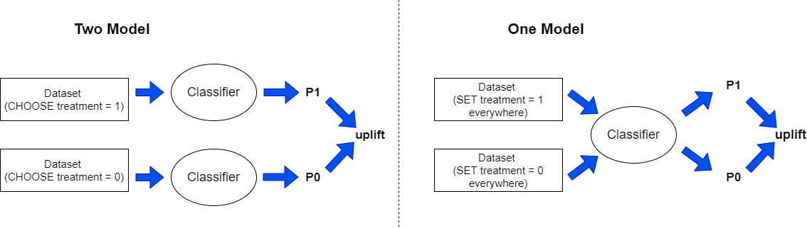
```

As uplift modeling is an emerging field there isn't a clear evidence what method is better to use. 


## Dataset

There is a scarcity of well-documented datasets dedicated to uplift modeling. Therefore, in [@uplift_dataset_modification] in order to extract information about treatment, artificial modifications to available datasets were proposed. As the purpose of this story is to investigate XAI techniques in the domain of uplift modeling, we decided to use real-life dataset. 
We chose Kevin Hillstrom's dataset from E-Mail Analytics And Data Mining Challenge [@uplift_dataset_marketing]. The dataset consists of 64000 records reflecting customers that last purchased within 12 months. As a treatment, an e-mail campaign was addressed:

* 1/3 of customers were randomly chosen to receive an e-mail campaign featuring Men's merchandise
* 1/3 were randomly chosen to receive an e-mail campaign featuring Women's merchandise
* 1/3 were randomly chosen to not receive any e-mail campaign *('control group')*  

The following actions were determined as an expected behavior: 

* visit the company's website within 2 weeks after sending to the customers a marketing campaign 
* purchase a product from the website within 2 weeks after sending to the customers a marketing campaign 

In the challenge, the task was to determine whether the men's or women's e-mail campaign was successful. In order to simplify the problem, we reformulated the task - we have focused on answering the question of whether any e-mail campaign persuaded customers to buy a product.

The features about customers in the dataset are specified in Figure \@ref(fig:dataset):

```{r dataset, echo=FALSE, fig.cap='Customer features in the dataset (own elaboration)', out.width = '100%', fig.align='center'}
knitr::include_graphics("images/09_xai_customer.jpg")
```

In the dataset, there is also information about customer activity in the two weeks following delivery of the e-mail campaign (these can be interpreted as labels):

* *Visit*: 1/0 indicator, 1 = Customer visited website in the following two weeks
* *Conversion*: 1/0 indicator, 1 = Customer purchased merchandise in the following two weeks
* *Spent*: Actual dollars spent in the following two weeks


### Explanatory Data Analysis
First, we decided to investigate variables that have more than 3 unique values. At the same time, these variables (*recency* and *history*) intuitively seem to be the most important while predicting whether someone will buy a product or not.
```{r histogram, echo=FALSE, fig.cap='Histograms of *recency* (left) and *history* (right)', out.width = '40%', fig.align='center', fig.show="hold"}
knitr::include_graphics("images/09_recency.png")
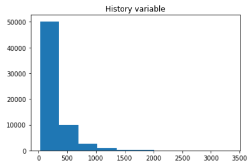
```
It can be seen that *history* variable has heavy-tailed distribution therefore it may be reasonable to use Box-Cox transformation. However, we decided to keep the variable without any preprocessing for easier interpretation.

```{r countplots, echo=FALSE, fig.cap='Count plots', out.width = '100%', fig.align='center'}
knitr::include_graphics("images/09_count_plot.png")
```
In the case of *mens*, *womens* and *newbie* variables the proportion of 0's to 1's is almost equal. There is much fewer records of people living in the countryside than in urban or suburban areas. Most of the company customers buy via phone or web. It is rare that someone uses a mulitchannel option. In the dataset, most of the customers received treatment in the form of marketing E-mail.

### Feature engineering

The dataset is largely imbalanced - there are only about 15% of positive cases in column *Visit* and 9% in column *Conversion*.
In such a situation, we decided to use column *Visit* as a target for the classifier.
As the number of columns is small, therefore, we decided to use one-hot encoding for transforming categorical variables instead of target encoding. 

## Model exploration and metrics
There are not many packages dedicated to uplift modeling in python. We investigated the two: pylift [@pylift] and pyuplift [@pyuplift]. The latter enables usage of 4 types of models - one of those is the Two Model approach. In the pylift package there is the TransformedOutcome class that generates predictions. However, the model itself is not well described and uses XGBRegressor underneath that is not intuitive. Fortunately, the package offers also the class UpliftEval that allows uplift metrics visualization. 
In the scene, we decided to create own classifier (as in the One Model approach) and use UpliftEval class from the pylift package for metric evaluation.
In our project, we used XGBoost classifier. In order to optimize its parameters, we applied the area under the cumulative gain chart (described below) as score function. In the Figure \@ref(fig:upliftRES), we show the cumulative gain chart for train and test sets. 


```{r upliftRES, echo=FALSE, fig.cap='Cumulative gain chart: (left) train set, (right) test set', out.width = '50%', fig.align='center', fig.show="hold"}
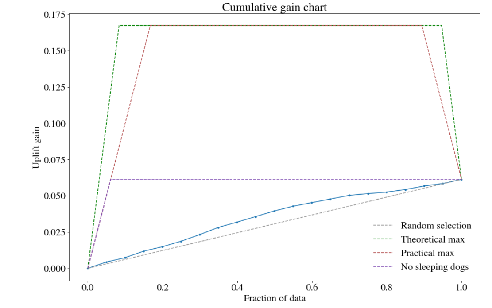
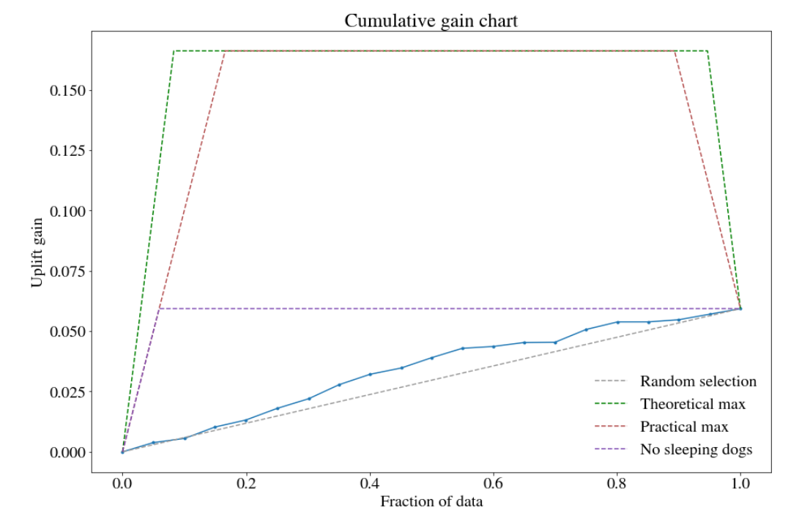
```
The Qini curve is not suggested for performance evaluation of uplift models as it is vulnerable to overfitting to the treatment label. Therefore, the Cumulative gain chart is used. It is the least biased estimate of the uplift. In the pylift package, it is implemented based on the formula:
$Cumulative\ gain(\phi) = (\frac {n_{t,1}(\phi)}{n_{t,1}}-\frac {n_{c,1}(\phi)}{n_{c,1}})(\frac{n_t(\phi)+n_c(\phi)}{N_t+N_c})$   
where  
$n_{t,1} (\phi)$ is the number of observations in the treatment group at cutoff level $\phi$ with label 1  
$n_{c,1} (\phi)$ is the number of observations in the control group at cutoff level $\phi$ with label 1  
$n_{t,1}$ is the total number of observations in the treatment group with label 1 (analogically $n_{c,1}$)  
$N_t$ is the total number of observations in treatment group (analogically $N_c$)  

The theoretical plot is created according to the following scheme:  
First, the customers are sorted in descending order based on predicted uplift. Later, some fraction of data is taken for the analysis (e.g. 10% of the people with the highest score). This cutoff is represented as $\phi$ in the formula. Next, the uplift gain is verified for the subset. At the beginning of the curve, the gain is the biggest as it refers to the *'persuadables'* group. Later, the curve stabilizes as it depicts the groups: *'lost causes'* and *'sure things'*. At the end the curve decreases as there are *'sleeping dogs'* with negative uplift.

### Model

It can be seen that our model is better than random choice but much worse than the practical/theoretical maximum possible. It is also worse than the case without *'sleeping dogs'*. 
Comparing to uplift modeling in different domains, i. e. medical applications, treatment in marketing has generally smaller impact on individual, therefore dataset itself is more noisy and cumulative gains are smaller. It is also worth noting, that due to small number of features, there are multiple cases in the dataset where two observations with same features have different answers. This kind of noise in data also tremendously impacts the score and requires caution when training models. Also, since uplift itself is an interaction, our model do have to take them into consideration.

Considering previous observations, model was found using so called local search procedure, which means that we choose some meta-parameters of the model and iteratively, for every meta-parameter approximate derivative by sampling the local neighborhood of current value and follow the ascending gradient. Local search stops naturally, when in previous iteration, we did not change any parameter, hence we hit one of the local minima. To be clear, if meta-parameter is discrete, by approximating local neighborhood we mean just checking close values. For our score function, we've chosen cross-validation on cumulative gains. This kind of procedure should seek for highly robust models. Therefore, it is worth noticing that our model didn't experience any overfitting as its quality on the train and test sets is similar. The resulting major parameters were: maximum depth of 5, high learning rate of 0.7 and only 12 estimators.

### Comparing metrics

We tried to employ the same local search procedure (as described in Model section) using accuracy as score function. However, it failed to converge with any decent quality, because this metric is much less informative in case of largely imbalanced dataset. Since only a small number of customers actually made a purchase, it's hard to correctly predict a positive case using non-overfitted model. Therefore within the local search with accuracy function, starting local neighborhood was always flat. This might be because in the dataset there is more noise than positive cases. But fortunately, only important factor, from our perspective is probability of the purchase, since uplift is an increase of purchase probability after treatment, and it directly transfers into money gain.
To visualize it in a straightforward manner, we present a table comparing our current robust XGBoost model with overfitted one (deep trees, 100 estimators).
```{r overfitTable, echo=FALSE} 
table <- data.frame(
  "Model" = c("Overfitted XGBoost","Robust XGBoost"),
  "Train accuracy" = c(0.87554, 0.85322),
  "Valid accuracy" = c(0.84734, 0.85320),
  "Train cummulative gain" = c(0.71904, 0.0398),
  "Valid cummulative gain" = c(0.02037, 0.0425),
  check.names = FALSE)
knitr::kable(table, caption='Metrics comparison' )
```


As we can see (Table \@ref(tab:overfitTable)) for the overfitted model, cumulative gain drops by 97% while the overfit gap in accuracy scores is only around 2%. 

## Explanations
The Cumulative gain chart (Figure \@ref(fig:upliftRES)) shows that the proposed model brings additional value as its performance is always above random system. Here comes the question of whether the model is reliable. Does it make the decision based on the features that are important from an expert perspective? Such judgment can be done using XAI tools.
We decided to investigate model interpretability from instance-level and dataset-level perspective.

### Instance-level

In order to explain model output for a particular customer, we employed SHAP (SHapley Additive exPlanations) values [@feature_importance_shap]. 

Before we move to the investigation of SHAP values, let's get to know customers that got the highest and the lowest uplift prediction. In this section, we will analyse the reliability of predictions for these particular instances. In the table \@ref(tab:personalTABLE), there is all the information provided to the system about the customers.

```{r personalTABLE, echo=FALSE}
tab=read.csv2("data/09_personal.info.csv", sep=',',check.names=FALSE)
knitr::kable(tab, caption='Customer with the highest and the lowest uplift - features' )
```

As can be seen (Table \@ref(tab:personalTABLE)) the customers spent almost the same amount of money during the last 12 months on our company's products.
The person with the highest uplift did last shopping 2 months ago whereas the person with the lowest uplift did it 5 months ago. In the dataset, some people purchased the product for the last time even 12 months ago so the person with the lowest uplift is not the edge case in that sense. Apart from many other differences among the two customers, the key is that the person with the highest uplift received treatment whereas the second customer didn't.


Below we present SHAP values for the customer described in Table \@ref(tab:personalTABLE). The values were computed directly on uplift model \@ref(fig:upliftSHAP).
```{r upliftSHAP, echo=FALSE, fig.cap='SHAP values: (left) customer with the lowest uplift, (right) customer with the highest uplift', out.width = '50%', fig.align='default', fig.show="hold"}
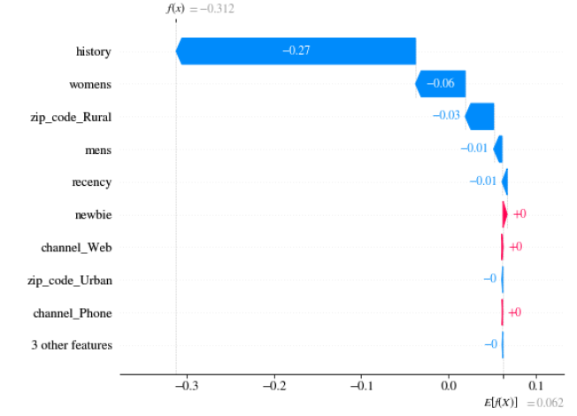
knitr::include_graphics("images/09_shap_max_uplift_pred.png")
```

In can be seen that in both cases, big contribution to the final result has information about customer history (about 235 USD) and the fact that the customer bought products from women's collection. What is interesting, is the fact that the customers have almost the same values of these two attributes but opposite sign of its contribution (SHAP value). 

### Difference - approach
**We can benefit from additive feature attribution property of SHAP values to model the uplift:**

$uplift=P(purchase|\ T=1) - P(purchase|\ T=0))$ 
$SHAP(uplift)= SHAP(P(purchase|\ T=1)) - SHAP(P(purchase|\ T=0))$ 

This property gives us a great opportunity to evaluate these two vectors of SHAP values independently. For example, if we use any tree-based model, we can make use of tree-based kernel for SHAP value estimation (faster and better convergent) instead of modeling it directly as a black-box (uplift) model.

In a table \@ref(tab:upliftTABLE) there is a comparison of SHAP values obtained using two methods for the customer with the lowest uplift.

```{r upliftTABLE, echo=FALSE}
tab=read.csv2("data/09_shap_diff.csv", sep=',',check.names=FALSE)
options(digits=4)
knitr::kable(tab, caption = 'SHAP values obtained using two methods')
```

Experimental results proved that these two ways of calculating SHAP values provide similar estimations with precision to numerical errors. There are few features, that depending on the method, have a small positive or negative value. This is caused by the fact that for the estimation of SHAP values directly using uplift model the KernelExplainer was used. The source of randomness is the fact that we took subset of records instead of whole dataset as such behavior is recommended in documentation due to algorithm's complexity. Also, KernelExplainer is by nature less precise. Nevertheless, we proved that in the case of our example the two methods lead to similar values.


The specificity of uplift models in terms of the possibility to analyse them through additivity of SHAP values gives room for another valuable inspection. 
Below we present how SHAP values differ depending on the fact that the customer was or wasn't addressed by treatment. On *x* axis, there are SHAP values in case T=0 and on *y* axis in case T=1. In each chart, there is SHAP value referring to one variable. In situation when the SHAP values are the same irrespective of the presence or absence of treatment, they would lie on identity line. Moreover, there is color used as third dimension indicating the group that the particular customer belongs to. We decided to merge two groups (*'sure things'* and *'lost causes'*) as they have uplift almost equal to zero, therefore now we can distinguish 3 groups: *'sleeping dogs'*, *'persuadables'* and *'sure things and lost causes'*. The division was based on the predicted uplift. *'Sleeping dogs'* have considerable negative uplift, *'sure things and lost causes'* have uplift in $[-0.01,0.01]$ and *'persuadables'* have uplift greater than 0.01. The group *'sure things and lost causes'* should have zero uplift, but due to numerical issues we decided to set $\epsilon$ equal to 0.01. As almost all customers were categorized to *'persuadables'*, we decided to show on the plot only 1000 records from this group to maintain chart readability.

```{r recencySHAP, echo=FALSE, fig.cap='SHAP values on variable recency in case T=0 and T=1', out.width = '50%', fig.align='center'}
knitr::include_graphics("images/09_shap_recency.png")
```

It can be seen that *'persuadables'* are slightly above and below identity line. 
```{r historySHAP, echo=FALSE, fig.cap='SHAP values on variable history in case T=0 and T=1', out.width = '50%', fig.align='center'}
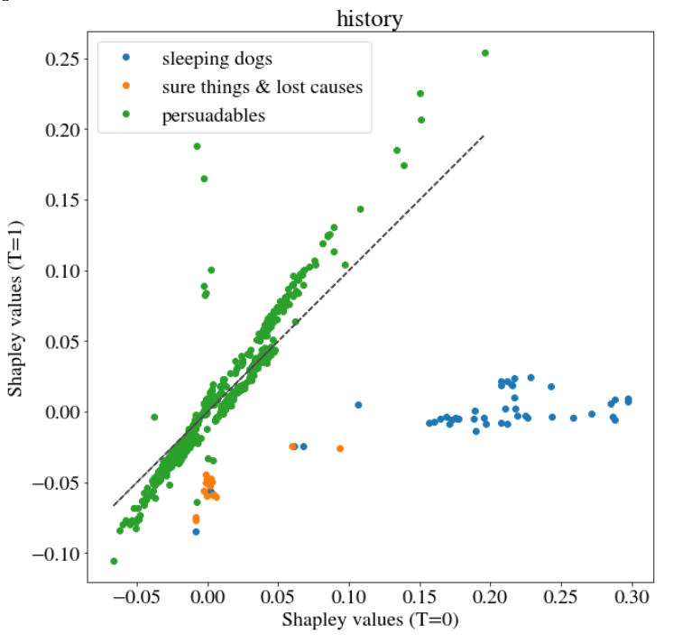
```
In Figure \@ref(fig:historySHAP) the three customer groups are distinctive. It would be interesting whether the result of clustering methods would be similar.

We also investigated binary variables. Most of them looked similar as Figure \@ref(fig:historySHAP) but there was one exception - variable *womens*. 
```{r womensSHAP, echo=FALSE, fig.cap='SHAP values on variable womens in case T=0 and T=1', out.width = '50%', fig.align='center'}
knitr::include_graphics("images/09_shap_womens.png")
```
The customer groups on Figure \@ref(fig:womensSHAP) are overlapping. They constitute very homogeneous groups.


Note:  
In the case of our model, there is no need to apply LIME as its main advantages - sparsity - is not important when there are only few variables.


### Dataset- (subset-) level
In order to compute Variable Importance, most of the time the Permutation Feature Importance method is used.
Unfortunately, it's impossible to use this approach directly in our case, because of the previously mentioned problem with lack of full information. We don't know if the client would purchase product after treatment or he would buy without treatment as well. Because of having in disposal only historical data (not an oracle), we have only one of these two pieces of information. However, we can make use of the previously computed SHAP values of uplift to calculate the same value of permutational feature importance as an average of local SHAP importance (defined in a permutational way itself, however, calculated more smartly [@feature_importance_shap]).

We decided to evaluate feature importance not from the well-known dataset-level but from the subset-level perspective. As the subsets we mean 3 customer groups: *'sleeping dogs'*, *'sure things and lost causes'* and *'persuadables'*.

Below we present the Variable Importance plots. The correlations between SHAP values of particular variable and variable itself were highlighted in colors. The red color means a positive correlation whereas blue means negative correlation.


```{r sleepingDOGS, echo=FALSE, fig.cap='Variable Importance - *\'sleeping dogs\'*', out.width = '60%', fig.align='center'}
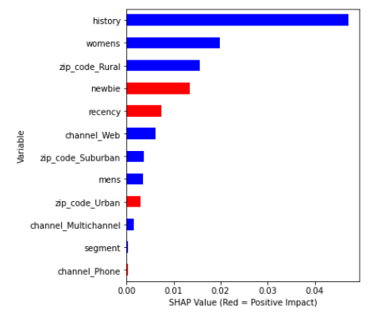
```


```{r noIMPACT, echo=FALSE, fig.cap='Variable Importance - *\'sure things and lost causes\'*', out.width = '60%', fig.align='center'}
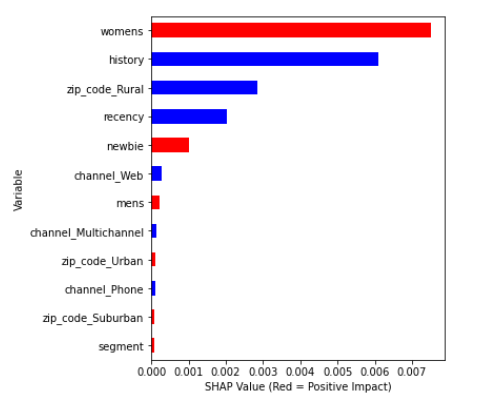
```


```{r persuadables, echo=FALSE, fig.cap='Variable Importance - *\'persuadables\'*', out.width = '60%', fig.align='center'}
knitr::include_graphics("images/09_persuadables_feature_importance_correlations.png")
```

Conclusions:  
Regardless of the customer groups, always *history* and *womens* are among three most important features. For observations with considerable negative uplift (*'sleeping dogs'*) both *history* and *womens* have negative correlation with their SHAP values. In the case of *'sure things and lost causes'*, *womens* has positive correlation whereas *history* has negative. The same variables among *'persuadables'* (considerable positive uplift) have positive correlation with SHAP values. *Correlation changes gradually with uplift value.* What is interesting is the fact that regarding *zip code* only the information whether someone is from rural area is important. Note that this category of dwelling place was the least popular among customers. Information about purchase channel in general has relatively small predictive power.


#### Dependence plots
 
Another tool to investigate model are the dependence plots. There are two options. The most common method is the Partial Dependence Plot (PDP)/ Accumulated Local Effects (ALE) and the other one is the SHAP dependence plot. The Partial Dependence Plot shows the marginal effect that one or two features have on the predicted outcome of a machine learning model [@pdp]. It tells whether the relationship between the target and a feature is linear, monotonic or more complex. In the SHAP dependence plot, we can show how a feature value (*x* axis) impacted the prediction (*y* axis) of every sample (each dot) in a dataset [@shap_dependence_plot]. This provides richer information than the traditional Partial Dependence Plot, because we have at least two additional information: density and variance of observations.

The Partial Dependence Plots reflect the expected output of the model if only one feature value is changed and the rest stays the same. In contrast, the SHAP value for a feature represents how much that feature impacted the prediction for single sample, accounting for interaction effects. So while in general you would expect to see similar shapes in a SHAP dependence plot and a Partial Dependence Plot, they will be different if your model has multi-variable interaction effects (like AND or OR). A PDP has no vertical dispersion and so no indication of how much interaction effects are driving the models predictions [@shap_dependence_plot_explained].

We generated the Partial Dependence Plot for all features and the SHAP dependence plot based on 1000 observations only for *history* and *recency* features due to large processing time. 

```{r PDPhistory, echo=FALSE, fig.cap='History (left) Partial Dependence Plot / Accumulated Local Effects plot, (right) The SHAP Dependence Plot based on 1000 observations', out.width = '50%', fig.align='default',fig.show="hold"}
knitr::include_graphics("images/09_history_PDP_ALE.png")
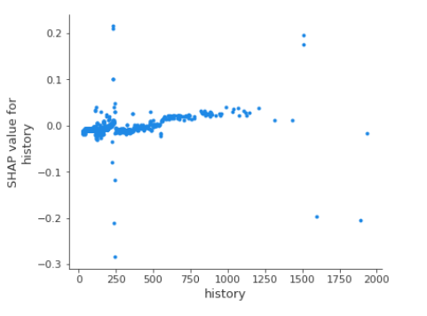
```

For our model the SHAP Dependence Plot reflects the shape of the Partial Dependence Plot. Contribution of *history* to the final uplift prediction differs among people with the same value of *history*. It can be seen that there is a considerable peak on the chart for *history* value of about 230 USD. However, people that spent such amount of money have various SHAP values - some positive, some negative. This observation is not contradictory to PDP as in case of PDP, we compute the average. Note that on SHAP dependence plot we displayed a sample of size 1000. 

```{r PDPrecency, echo=FALSE, fig.cap='Recency (left) Partial Dependence Plot / Accumulated Local Effects plot, (right) The SHAP Dependence Plot based on 1k observations', out.width = '50%', fig.align='default',fig.show="hold"}
knitr::include_graphics("images/09_recency_PDP_ALE.png")
knitr::include_graphics("images/09_recency_shap_dependence_plot.png")
```

Due to the fact that *recency* can have only one of 12 values, only 12 'clusters' can be seen on the SHAP Dependence Plot. Dispersion within the 'clusters' shows how much the observations in our dataset differ.

```{r PDPmenswomens, echo=FALSE, fig.cap='Gender PDP', out.width = '100%', fig.align='center'}
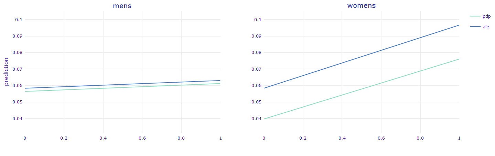
```

It is surprising that the disproportion between the results shown in Figure \@ref(fig:PDPmenswomens) is so significant. In the PDP of *mens* feature, the lines are almost flat meaning that regardless of the fact whether someone bought or not a product from mens collection the uplift prediction stays the same.

```{r PDPnewbie, echo=FALSE, fig.cap='Newbie PDP', out.width = '50%', fig.align='center'}
knitr::include_graphics("images/09_newbie_PDP_ALE.png")
```

According to the Figure \@ref(fig:PDPnewbie), if a person is a *newbie*, it is harder to encourage him/her to buy a product through marketing campaign. 

```{r PDPzip, echo=FALSE, fig.cap='Dwelling place PDP', out.width = '100%', fig.align='center'}
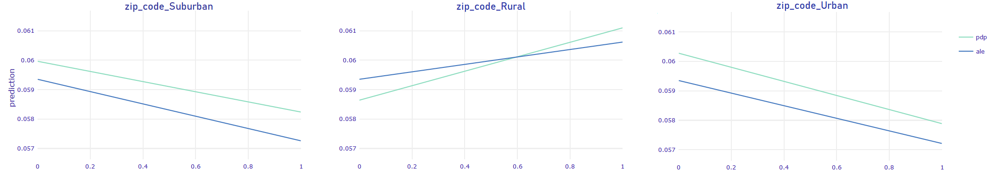
```

It can be seen that PDP of *zip_code_Suburban* and *zip_code_Urban* look very similar. They both have decreasing trend, whereas PDP of *zip_code_Rural* has increasing trend. In this case, it can be seen that ALE and PDP crosses. As they aren't parallel, it means there is a slight interaction in model.

```{r PDPchannel, echo=FALSE, fig.cap='Channel PDP', out.width = '100%', fig.align='center'}
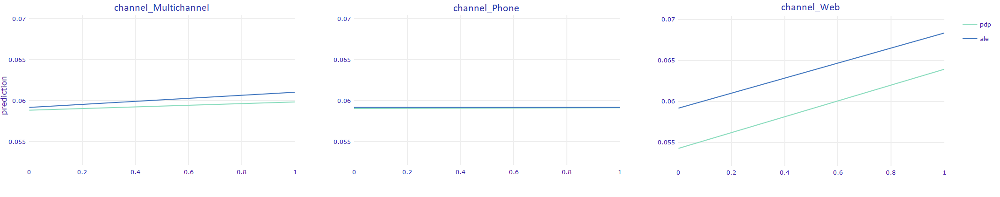
```

The biggest gain in terms of uplift can be seen in case when the person uses Web channel. The PDP of *Phone_channel* is flat.

## Conclusions

Since Partial Dependence Plots are generally parallel to Accumulated Local Effects, we can safely assume that our model does not have (major) interactions. However, this does not mean that we can use some classifier without interactions, because here we model directly the uplift, which is the difference between predictions and it is an interaction itself.


### Sweet-spot
The most important observation here, should be that while at first glance we can only manipulate the treatment variable, dependence plots also give us the opportunity to *choose best time to contact the customer*. Intuitively, *recency* function should be concave, aiming to find some 'sweet-spot' between time when customer 'just went out from the shop' and 'forgot about this'. The Figure \@ref(fig:PDPrecency) is indeed concave but only for *recency* values between 1 and 4. For larger *recency* there is sinusoidal noise observed. These fluctuations can be interpreted as small overfitting. The key message is that the sweet-spot appears to be two months after the last purchase.


### Bigger influence
Based on Figure \@ref(fig:PDPmenswomens), bigger influence can be made on customers who bought women's products than the ones who bought products from men's collections. Initially we removed from the dataset information about treatment type (Woman's/Man's e-mail). But based on Variable Importance analysis (Figures: \@ref(fig:sleepingDOGS), \@ref(fig:noIMPACT), \@ref(fig:persuadables)), we can reason about the type of e-mail that maximizes uplift for particular person. Considering how important is *womens* variable, we propose a following policy: in the case when someone buys from men's and women's collections we should send e-mails dedicated to women.

### Influence from other factors
Other PDPs can be used for better understanding of the customer persuadability. Since the only variable considerably reducing estimated uplift is *newbie*, we can safely conclude, that marketing campaigns have better impact on regular customers, which is quite an intuitive conclusion. Analysing other factors, one-hot encoded area of living (*zip_code_Rural*, *zip_code_Suburban*, *zip_code_Urban*) do not have influence bigger than statistical error maybe except *zip_code_Rural*. Customers living on the countryside are more likely to be persuaded. Surprisingly it is the only factor that may have some interactions. Referring to the purchase channel, it is best to target customers who bought only by web in past months. It may be connected to the fact that our treatment is conducted via e-mail. We suspect that in some cases the following situation can happen: someone buys via phone as he doesn't use the internet often. In such cases e-mail campaigns will not be effective. 


## Summary 
Using XAI for uplift modeling helps to understand its complex models better. The analysis goes beyond just assessing whether the model is reliable. 

### Individual perspective 

In the case of our task, individual perspective doesn't seem to be vital. The situation when a customer writes an e-mail to the company asking why he didn't receive an e-mail with marketing campaign is highly unlikely. Even if he does, he wouldn't change his feature like the dwelling area only in order to get the e-mail. The things that the customer can rather easily change are his value of *recency* or *history* variable. 

### Data scientist's perspective 

From the data scientist's perspective the most important thing to check is whether the model is overfitted. The tool that can help in verifying model sensitivity is the Partial Dependence Plot. In the case of our model it can be seen that the model is slightly overfitted as there is a peak on PDP of *history*.

### Executive perspective 

XAI techniques can help the executives to understand better the company's customers behavior without paying for some extra surveys to investigate their attitude towards the company. Key findings:

* The campaign e-mail should be sent two months after last purchase in order to be more effective. 
* The most important variables in the model seem to be reasonable, e.g. *history* and *recency* (Figures: \@ref(fig:sleepingDOGS), \@ref(fig:noIMPACT), \@ref(fig:persuadables)). The only surprising thing is the high importance of *zip_code_Rural* feature. 
* In the case when someone buys from men's and women's collections we should send e-mails dedicated to women.
* In the case of bigger number of treatment variants, it would be possible to create personalized marketing campaign.

A vital part of our work was adjusting XAI techniques for the particularities of uplift modeling. We found out that thanks to its additivity, SHAP values are well suited for uplift modeling - we showed two methods of using it. We identified limitations of well-known Permutation Feature Importance in terms of explaining uplift models. It is caused by the fact that unlike the other supervised models, here we do not have exactly labels. Therefore. we used the generalization of SHAP values that converge to Permutation Feature Importance. Also, we analysed the SHAP Dependence Plots as an alternative to PDP. We employed the analysis for the three groups of customers based on the corresponding uplift.

## Future works
During initial feature engineering, we simplified our problem by merging women's treatment and men's treatment into one. By analysing PDP, we were able to propose a policy for choosing the optimal treatment type. However, it is not the only possible approach. We can try going beyond standard uplift modeling and model directly uplift with 2 possible outcomes i.e. create purchase prediction, and then check if sending women's or men's e-mail is more profitable, resulting in the following equation:

$uplift=max{(P(purchase\ |\ w\_T=1) - P(purchase\ |\ w\_T=0,m\_T=0), \\
P(purchase\ |\ m\_T=1) - P(purchase\ |\ w\_T=0,m\_T=0))}$

where:  

* w_T is treatment dedicated to women
* m_T is treatment dedicated to men

However, this leaves us with several open-ended questions i.e.: can we now implicitly calculate SHAP values, using the previously presented efficient technique (based on additivity)? Surely the max function breaks the additivity of uplift function, but maybe it is possible using some other method? 
