# Story MEPS: Healthcare expenditures of individuals

*Authors: Dominika Bankiewicz (University of Warsaw), Jakub Białek (Warsaw University of Technology), Agata Pładyn (Warsaw University of Technology)  *

*Mentors:  *

## TODOS
1. Opisy wszystkich zmiennych do appendixa (tabela?) 
2. Rozkład/percentyle Y, przed i po transformacji (wtedy łatwiej ocenić wyniki absolutne) do wstępu.
3. Podrozdzział z wynikami każdego z modeli?
4. W rozdziale modele - krótki wstęp, tam napisać, o transformacji y i o tym, że korzystaliśmy z tego samego train/test splitu.

## Introduction

 
In this part, models that predict annual healthcare expenditure of individuals will be developed and analyzed using XAI methods.

The data set analyzed is called MEPS (Medical Expenditure Panel Survey) and it is freely accessible at [ref1]. The data comes from large-scale surveys of families, individuals, medical providers and employers from the United States of America. Each observation of the data set contains total expenditures of an individual as well as number of other variables describing his or her demographic and socio-economic status. This allows to create models predicting the expenditure based on other factors. For this reason it is particularly interesting from the point of view of the subject that is financially responsible for the healthcare cost – insurance company, government, healthcare provider or individuals. It is important to mention, that for all of these subjects, accurate model is only a part of the success – the other part are the relations between input parameters and predictions of the model. Having that we can provide an answer not only for how much? but also for why? Hopefully, this can be achieved with available XAI methods.

The data analyzed in the following sections was not downloaded directly from MEPS website. Instead, it was obtained through IBM’s AIX360 [ref2]. Therefore it is initially preprocessed – race is restricted to black and white and ethnicity to non-Hispanic, records with special values (negative integers) are removed for some of the variables, variables are initially selected. The dataset provides 18350 observations and it contains variables that describe:

* demographics (age, gender, marital status),

* socio-economics (education, income, insurance coverage),

* self-reported health status (self-evaluation of physical and mental health status),

* diagnoses (stroke, cancer, heart disease, diabetes),
* health limitations (cognitive, activity, sensory).

The following section describes the development of three different models for predicting the transformed total health expenditure of an individual. Once developed, these models are compared in terms of their quality and of them is selected and analyzed using XAI methods. Explanations provided by different methods are discussed.

The baseline for this discussion was provided by the authors of IBM’s AIX360 [ref3].

## Models

 
In the following subchapters the development of three different models is briefly described. Full details on the implementation together with the code itself can be found [here](https://github.com/rabitwhte/IML_2020_MEPS_g6).

First of all, since the distribution of the predicted variable is strongly skewed, it was transformed with logarithm base 3. Typically in such cases, natural logarithm is chosen, but having in mind that impact of input variables on the prediction will be analyzed, the decision was made to use base 3 instead (when we see that some input variable affected the prediction increasing it by one, then we can say that it increased the total expenditures by the factor of three, not factor of Euler number).

In order to ensure that results from all three models can be directly compared, models are trained and evaluated on the same, arbitrarily chosen, test and validation subsets. These can also be found at [repo]. The evaluation metrics are RMSE, MAE and R^2 [ref to the table with results]. 

### Model 1: Linear

 
Linear model was created with sklearn package. 

Following operations were performed to prepare the data:

* logarithm change of the explainable variable (as described before)

* min and max scaling of variables RTHLTH31, MNHLTH31, POVCAT15. This variables describe the state of general health, mental health and poverty status in values (decoded to: poor, fair, good, very good, excellent). 

* addition of a new column which counts for how many diseases/health issues patient was tested positive. 
The ridge regression was performed with GridSearchCV. This allowed to perform 5-fold cross-validation with a range of different regularization parameters in order to find the optimal value of alpha parameter.

The final results of the ridge regression model are shown in a table (values rounded to 2 decimal points):

|       | RMSE | MAE  | R^2  |
|-------|------|------|------|
| Train | 2.27 | 1.72 | 0.33 |
| Test  | 2.25 | 1.7  | 0.3  |

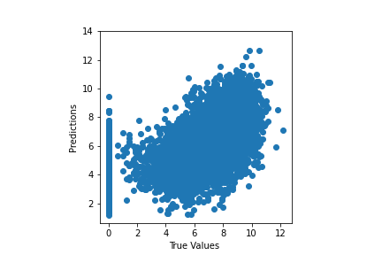

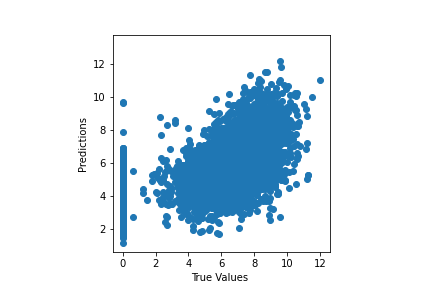

### Model 2: ANN

 
The second model evaluated was a multilayer perceptron. The input data was preprocessed with use of scikit-learn [ref to sklearn] tools:

* numerical features were standardized

* categorical features were one-hot encoded

The data was fed into ANN with 4 hidden, fully-connected layers. The ANN model itself was created with Keras [ref to Keras]. Alltogether, the preprocessing steps and the model, was wrapped into scikit-learn pipeline so it can be easily use with XAI methods. The results are shown in the table below:

|       | RMSE | MAE  | R^2  |
|-------|------|------|------|
| Train | 2.04 | 1.51 | 0.45 |
| Test  | 2.17 | 1.61 | 0.37 |

### Model 3: XGB

 
XGB model was developed using scikit-learn package [@XGB_documentation]. For this model, data was prepared in the following way:

* as was mentioned in Introduction, target variable was transformed with logarithm base 3,

* categorical features (i.e. features with 10 or less unique values, except variables "POVCAT15", "RTHLTH31", "MNHLTH31" which can be treated as continuous) were transformed with OneHotEncoder [@OneHotEncoder_documentation],

* numerical features were transformed with StandardScaler [@StandardScaler_documentation].

Hiperparameters tuning was done with GridSearchCV [@GridSearchCV_documentation]. Following parameters were optimized:

* **n_esimators** - the number of trees,

* **max_depth** - the maximum depth of tree,

* **min_samples_split** - the minimum number of samples required to split an internal node,

* **min_samples_leaf** - the minimum number of samples required to be at a leaf node.

Results for best hyperparameters shows below table.

|       | RMSE | MAE  | R^2  |
|-------|------|------|------|
| Train | 2.04 | 1.51 | 0.45 |
| Test  | 2.17 | 1.61 | 0.37 |

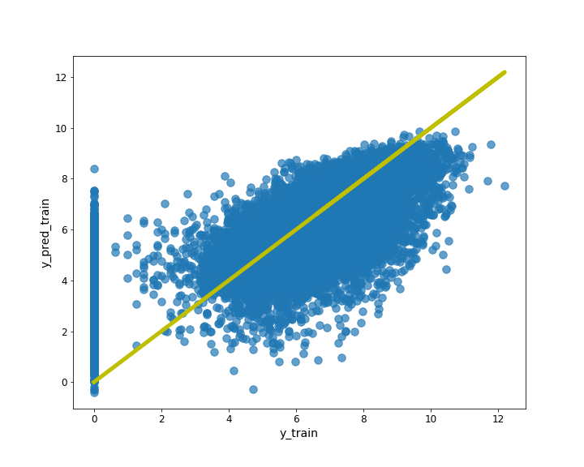

Finally, for XAI methods analysis, model was wrapped in pipeline.

### Results

 
Table below presents results for all developed models.

|     | RMSE (train) | MAE (train) | R^2 (train) | RMSE (test) | MAE (test) | R^2 (test) |
|-----|--------------|-------------|-------------|-------------|------------|------------|
| LR  | 2.27         | 1.72        | 0.33        | 2.25        | 1.70       | 0.30       |
| ANN | 2.14         | 1.59        | 0.40        | 2.17        | 1.61       | 0.37       |
| XGB | 2.04         | 1.51        | 0.45        | 2.17        | 1.61       | 0.37       |

## Explanations

### Instance level

#### Observation with the best prediction

#### Observation with the worst prediction

 

This patient it's a 76 years old woman. She is a widow and has a GED or high school degree. She complains about poor health status and fair mental health status. She has ever been diagnosed with high blood pressure, coronary heart disease, emphysema, chronic bronchitis, high cholesterol, cancer, rheumatoid arthritis and joint pain last 12 months. She has social and cognitive limitation and limitation in physical functioning. She doesn't smoke and has serious difficulty see or wears glasses. Her health insurance coverage indicator is public only. 

Total health expenditure of this woman is equal to zero but model predicted that it is equal to about 12005.68 (3 to the power of 8.55).

Picture below shows Shapley Values for this observation. As we can see, the largest impact on total health expenditure of this woman is the fact that she has been diagnosed with cancer, high blood pressure and how old she is.

Three plots below show the Ceteris Paribus profiles for this observation. They say how total health expenditure of this woman would change if a variable had a different value with the other variables unchanged. They complete the chart with Shapley Values. As you can see, the fact that this woman was diagnosed with cancer increases her spending by about 3 to the power of 0.5 times, while the fact that she was diagnosed with high blood pressure increases her expenditure by about 3 to the power of 0.3 times. If she were younger by at least about 10 years, expenses would be smaller, and their would be the smallest if she were about 35-50 years old.

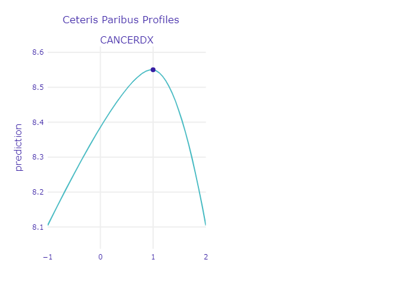

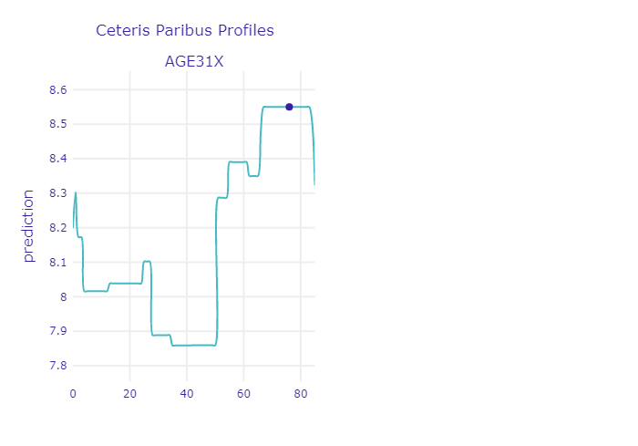

#### Observation with high prediction

 

The patient with high expected health expenses value is a 66 years old women. She is married and have a bachelor degree. Her health expenses are equal to 36 295 (9.557 to the power of 3) and the models prediction is equal to 34 658 (3 to the power of 9.515). 

The patient suffers from many conditions including cancer, high blood pressure, angina, heart disease (had heart attack), high cholesterol, diabetes, joint pains. 
She has social and physical functioning limitations. She has a private insurance.

Break Down explanations indicates that the patient's diseases have significant positive impact on the prediction. 

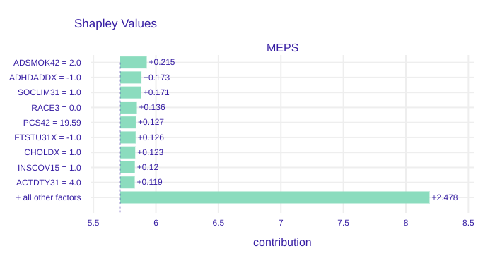

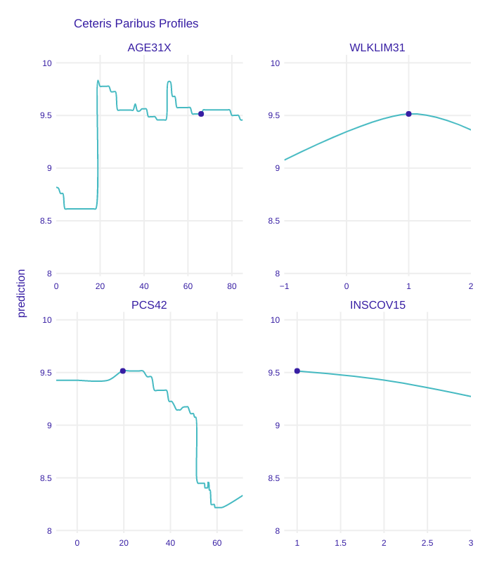

When investigated changes in the patients descriptions variables there are some additional interesting results. Despite patient positive diagnosis for many diseases, the health expenses would be lower if the patient age (Ceteris Paribus  plot of the variable AGE31X) would be much more younger (20 years old or less). Patients walking limitations (Ceteris Paribus  plot of the variable WLKLIM31) increases the prediction up to 1.73 (3 to the power of 0.5) times. Her low result in physical component summary (Ceteris Paribus plot for the variable PCS42) also increases the expenses cost (by up to 3 to the power of 1.5 times). Ceteris Paribus plot of the variable INSCOV15 shows the relation between type of insurance and the prediction. The patient has the private insurance (value 1) and if she had changed to public or opted for none she would have lower prediction. 

#### Observation with low prediction

 

The patient is a 21 years old man. He has never been married. He has only graduated from high school. He is poor. He has not have any insurance. He perceives his health as at excellent state. He smokes but he has not been diagnosed with any diseases. 

His health expenses are equal to  0.0. Model's prediction is equal to 3 to the power of 0.004. 

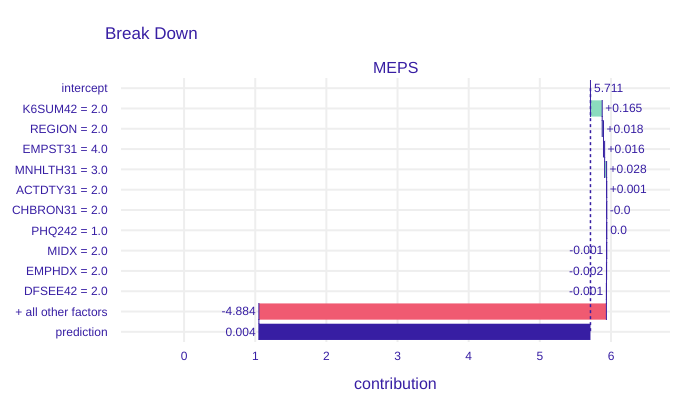

The Break Down explanations indicates his overall ratings of feeling may increase the prediction but after considering all the other factors the model prediction is equal almost to 0. 

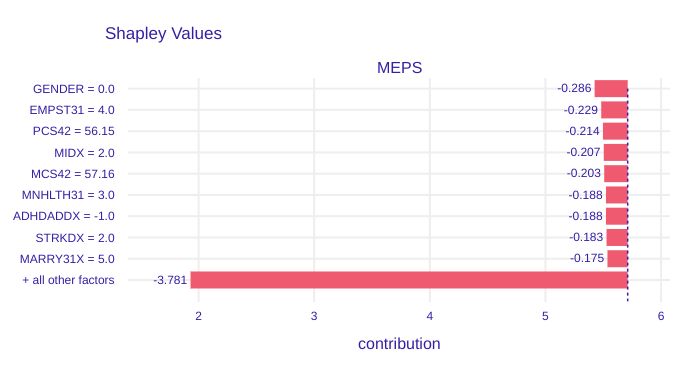

Shap explanations shows that his not student status lowers the prediction by 3 to the power of 0.26 times. His good eyesight, no walking limitations and lack of heart diseases lowers the prediction 3 time to the power of around 0.2 times. Generally his lack of diseases lowers the predictions. 

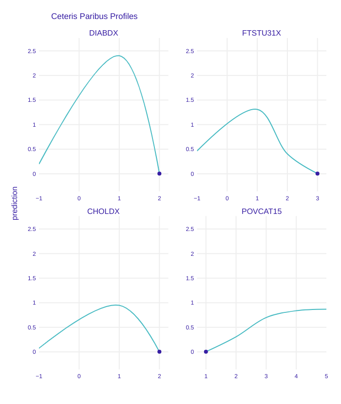

If the patient had been diagnosed with diabetes his health expenses would be 3 to the power of 2.5 times higher (plot of the variable DIABDX). Positive diagnoses for high cholesterol would also increase by 3 times the health expenses prediction. What is more, he is not a student, what results in lower prediction by up to 3 to the power 1.3 times (plot of the variable FTSTU31X). His poverty status decreases the prediction by almost 3 times. 

### Dataset level

 

In this part the focus is put on model-level explanations. Variables that are interesting, intuitive or simply important from the model perspective will be investigated.

#### Variable importance

 

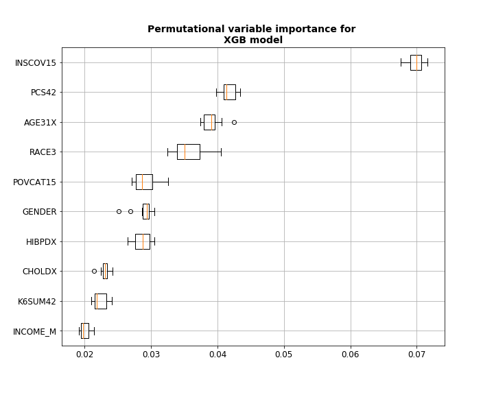

#### Age variable

 

Intuitively, the age of the patient should be a very good predictor. Even non-experts can tell that usually the older the person is, the more issues with health it has and thus - the more money will be spend on healthcare. Lets have a look at PDP and ALE profiles of this variable in our model:

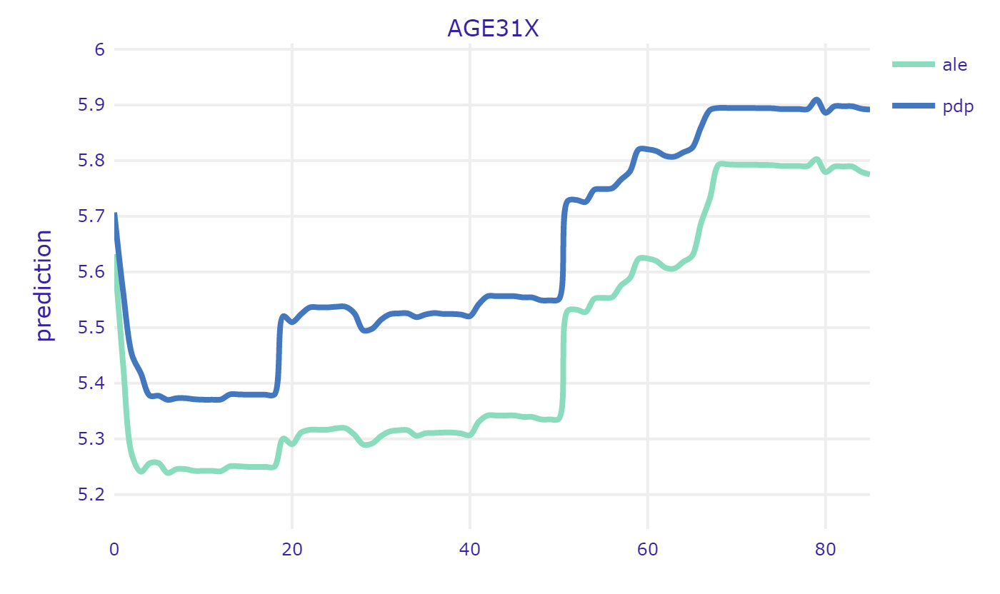

Both profiles follow similar trends and in general they show the expected behaviour. Some people are born with health issues already, so they generate high costs at the very beginning of their lives. Then, the ones who manage to overcome these initial issues are generally healthy. Usually teenagers are in a good shape - a lot of physical activity, careful parents, regular eating at schools etc. Once they become adults (16-18) their life becomes riskier (driving license, alcohol). Some of them also start to earn their own money. All of this sums up to sharp increase in medical expenditures of this group. Then there's another plateau and another sharp increase at the age of about 50 years. This the age when a lot of disease are getting more probable thus people are taking clinical tests, diagnose and start to cure. This is also the age when menopause happens to women which usually worsens their health status. From now on, health status becomes worse and health expenditures are usually getting higher every year.

From the model developer perspective - this relation seems to be a little raged. One would expect to be more smooth and monotonic. For example, there is no particular reason why medical expenditures should decrease at once we turn 60, but the plot shows otherwise. This suggests that it might be a good idea to discretize the age variable into number of groups. While there is very small probability that your health status will get worse next year, it is highly likely that it will get worse 10 years from now. It is worth investigation whether this transformation of the variable will improve the results.

From the perspective of the medical provider and patient itself - we can clearly see that there are some points at which the expenditures sharply increase. It might be good idea for a patient to buy additional insurance once he or she approach that age. On the other hand, insurance provider should take that into account while preparing his offer. If the agreement time is couple of years and it includes that specific time when health sharply worsens, this should be included in price.

#### Evaluation of health status

 

Evaluation of one's health status seems to be an obvious indicator of what can we expect in terms of health expenditure. One should be cautious though - the methodology of this measurement is crucial here. Let's have a look at profiles of variables PCS42 and RTHLTH31 - both are self-evaluation of ones health.

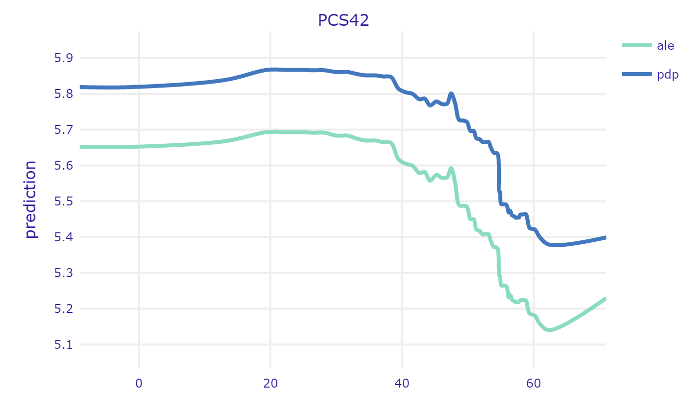

PCS42 was created based on set of concrete questions about specific pain, limitations in activities etc. The higher the value, the better the health. On the other hand, RTHLTH31 just describes the overall health condition in one word, corresponding to the scale from 1 to 5 ("excellent", "very good" "good" "fair" and "poor"). In this case, the higher the value, the worse the health. Both plots show the expected behaviour of the model. It is interesting to see though, that there is not much difference between "excellent" and "very good". Similarly - the difference is very small between "fair" and "poor". This is primarily caused by the subjective matter of these answers. First of all the understanding of the words their selves - something which is very good for one person, might be just good for other. Second thing is that we usually compare our current health to the recent past. If one feels tired every day, he might say that his health is fair. But if he feels a little tired every day but he just recovered from flu, he will say he feels very good, or excellent (in comparison to how he felt a week ago). Finally, people tend to get used to their diseases. It is proven, that people feel very bad at the beginning - when they are diagnosed, but when the time goes by they care less and less - they just get used to living with a disease. Nevertheless, it is important to say that insurance provideres should be very careful while pricing their services partially basing on surveys. It is crucial to ask specific questions that cannot be biased by subjective feelings of the respondent. 

## Summary and conclusions

