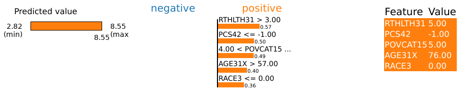
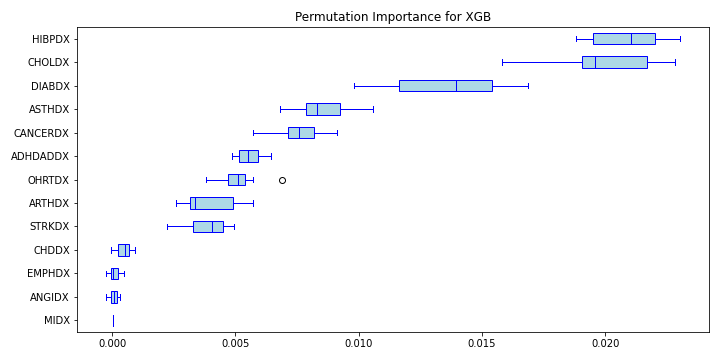
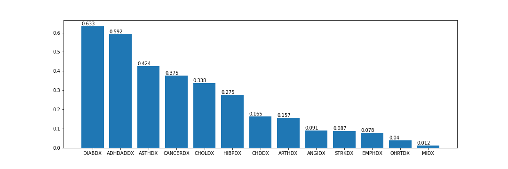
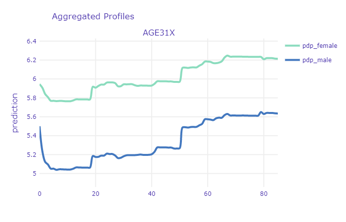

\documentclass{article}
\usepackage[utf8]{inputenc}
\usepackage{markdown}

\begin{document}

\begin{markdown}

# Story MEPS: Healthcare expenditures of individuals

*Authors: Dominika Bankiewicz (University of Warsaw), Jakub Białek (Warsaw University of Technology), Agata Pałdyna (Warsaw University of Technology)  *

*Mentors:  Michał Borowik  (McKinsey & Company), Tomasz Kaczmarczyk  (McKinsey & Company)*

## Introduction

This chapter provides an analysis of models predicting annual healthcare expenditure of individuals based on result from large-scale surveys prepared by MEPS (see *Data set* below). Selected XAI algorithms were employed in order to perform model diagnostics and improve understanding of relationship between healthcare expenditures of an individual and set of factors describing demographics and socio-economics factors as well as self-reported health status. While the model performance is mainly important from data scientist perspective, the above-mentioned relationship is particularly interesting from the point of view of the subject that is financially responsible for the healthcare cost – insurance company, government, healthcare provider or individuals. With respect to all the stakeholders mentioned, following observations were made:

* Healthcare expenditures of about 14 % of respondents is equal to 0. However, survey answers provided by some of these respondents (e.g. diagnosed cancer) suggest otherwise. This may indicate errors in the data collection.

* Self-reported health status data may be misleading. The methodology of gathering and evaluation of such data should be therefore carefully designed.

* While for most of the time the relationship between age and health expenditures is monotonously growing, there are some specific points (corresponding to patient's age) at which the growth is rapid. This might be particularly interesting for insurance companies.

* Applying SHAP to complex model can be a way of encoding and grouping categorical variables. Transformed variables can be then successfully fed into simpler (e.g. linear) models. While reducing dimensionality, it can improve model performance, stability and interpretability.

## Data set

The data set analyzed is called MEPS (Medical Expenditure Panel Survey) and it is freely accessible at [their website](https://www.meps.ahrq.gov/mepsweb/). The data comes from large-scale surveys of families, individuals, medical providers and employers from the United States of America. Each observation of the data set contains total expenditures of an individual as well as number of other variables describing his or her demographic and socio-economic status. This allows to create models predicting the expenditure based on other factors. For this reason it is particularly interesting for every subject that is financially responsible for the healthcare cost – insurance company, government, healthcare provider or individuals. 

The data analyzed in the following sections was not downloaded directly from MEPS website. Instead, it was obtained through [IBM’s AIX360](https://github.com/IBM/AIX360/blob/master/aix360/datasets/meps_dataset.py). The dataset provides 18350 observations and it contains variables that describe:

* demographics (age, gender, marital status),

* socio-economics (education, income, insurance coverage),

* self-reported health status (self-evaluation of physical and mental health status),

* diagnoses (stroke, cancer, heart disease, diabetes),
* health limitations (cognitive, activity, sensory).

The following section describes the development of three different models for predicting the transformed total health expenditure of an individual. Once developed, these models are compared in terms of their quality and one of them is selected and analyzed using XAI methods. Explanations provided by different methods are discussed.

## Models

In the following subchapters the development of three different models is briefly described. Full details on the implementation together with the code itself can be found on [github repository](https://github.com/rabitwhte/IML_2020_MEPS_g6).

First of all, since the distribution of the predicted variable is strongly skewed, it was transformed with logarithm base 3 (see Figure below). Typically in such cases, natural logarithm is chosen, but having in mind that impact of input variables on the prediction will be analyzed, the decision was made to use base 3 instead (when we see that some input variable affected the prediction increasing it by one, then we can say that it increased the total expenditures by the factor of three, not factor of Euler number).

In order to ensure that results from all three models can be directly compared, models are trained and evaluated on the same, arbitrarily chosen, test and validation subsets. These can also be found [github repository](https://github.com/rabitwhte/IML_2020_MEPS_g6). The evaluation metrics are RMSE, MAE and R^2. 

### Model 1: Ridge regression
Ridge regression model was created with sklearn package. 

Following operations were performed to prepare the data:

* logarithm change of the explainable variable (as described before)

* min and max scaling of variables RTHLTH31, MNHLTH31, POVCAT15. This variables describe the state of general health, mental health and poverty status in values (decoded to: poor, fair, good, very good, excellent). 

* addition of a new column which counts for how many diseases/health issues patient was tested positive. 
The ridge regression was performed with GridSearchCV. This allowed to perform 5-fold cross-validation with a range of different regularization parameters in order to find the optimal value of alpha parameter.

The final results of the ridge regression model are shown in the *Results* section.

### Model 2: Artificial Neural Network
The second model evaluated was a multilayer perceptron. The input data was preprocessed with use of scikit-learn [@scikit_learn] tools:

* numerical features were standardized

* categorical features were one-hot encoded

The data was fed into ANN with 4 hidden, fully-connected layers. The ANN model itself was created with Keras [@Keras]. Alltogether, the preprocessing steps and the model, was wrapped into scikit-learn pipeline so it can be easily use with XAI methods. The results are shown in the *Results* section.

### Model 3: Gradient Boosting
Gradient Boosting regression model was developed using scikit-learn package [@XGB_documentation]. For this model, data was prepared in the following way:

* as was mentioned in Introduction, target variable was transformed with logarithm base 3,

* categorical features (i.e. features with 10 or less unique values, except variables "POVCAT15", "RTHLTH31", "MNHLTH31" which can be treated as continuous) were transformed with OneHotEncoder [@OneHotEncoder_documentation],

* numerical features were transformed with StandardScaler [@StandardScaler_documentation].

Hiperparameters tuning was done with GridSearchCV [@GridSearchCV_documentation]. Following parameters were optimized:

* **n_esimators** - the number of trees,

* **max_depth** - the maximum depth of tree,

* **min_samples_split** - the minimum number of samples required to split an internal node,

* **min_samples_leaf** - the minimum number of samples required to be at a leaf node.

The results for best hyperparameters are shown in the *Results* section.

### Results

Table below presents results for all developed models.

|     | RMSE (train) | MAE (train) | R^2 (train) | RMSE (test) | MAE (test) | R^2 (test) |
|-----|--------------|-------------|-------------|-------------|------------|------------|
| RR  | 2.27         | 1.72        | 0.33        | 2.25        | 1.70       | 0.30       |
| ANN | 2.14         | 1.59        | 0.40        | 2.17        | 1.61       | 0.37       |
| XGB | 2.04         | 1.51        | 0.45        | 2.17        | 1.61       | 0.37       |

Due to its recent popularity and complexity, XGB model was selected for further analysis. Let's have a look at scatter plots of predicted and true values for both - training and testing subsets.

We can clearly see a non negligible contribution to the error of observations for which the true value is equal to zero while the predicted one is higher than that. This will be investigated in the following section.

## Analysis with XAI methods

### Analysis of patients with zero expenditures

As it was mentioned above, a part of the error are observations for which true value is zero but model predict values larger than zero. Let's have a look at an observation like that.

Selected observation is a 76 years old woman. She is a widow and has a GED or high school degree. She complains about poor health status and fair mental health status. She has ever been diagnosed with high blood pressure, coronary heart disease, emphysema, chronic bronchitis, high cholesterol, cancer, rheumatoid arthritis and joint pain last 12 months. She has social and cognitive limitation and limitation in physical functioning. She doesn't smoke and has serious difficulty see or wears glasses. Her health insurance coverage indicator is public only. Total health expenditure of this woman is equal to zero but model predicted that it is equal to about 12005.68 (3 to the power of 8.55). The question is why model predicted such value. Let's have a look at Figure presenting Shapley values for our observation (see Figure below).

From data scientist point of view, it seems to be weird that differences between successive contributions are very small and contribution for 'all other factors' is about 6 times bigger than for the first feature, so it can be hard to tell which factors have the biggest impact on that prediction. Therefore, in order to find out which variables have the most significant influence, we can use LIME (see Figure below). 

As we can see, the biggest impact for this prediction have the following factors:

* poor perceived health status (RTHLTH31 = 5),

* self-evaluation of health - inapplicable (PCS42 = -1),

* high family income (POVCAT15 = 5),

* 76 years old (AGE31X = 76),

* white race (RACE3 = 0).

Let's check distributions of these features for observations for which true value of total health expenditure is zero but model predict values larger than zero.

As we can see, the values of the variables RTHLTH31, PCS42 and AGE31X for this observation constitute a definite minority. According to results of LIME and above distributions, let's check distribution of target values for observations at age greater than 57 with perceived health status fair or poor, high family income and white race. As can be seen in the Figure below, there is only one observation with total health expenditure equal to zero and the mean value is about 8, so we can assume that the model behaved correctly.

Let's get back to our patient. Out of all the diagnoses of diseases that appear in these data (13), 6 diagnoses are positive for this woman. Let's take a look then at how it looks like for other patients with zero expenditures. As we can see in the Figure below, patients with zero expenditure who have ever been diagnosed with more than 2 diseases are a definite minority.

### Interpretation of self-reported health status and survey questions design

Evaluation of one's health status seems to be an obvious indicator of what can we expect in terms of health expenditure. One should be cautious though - the methodology of this measurement is crucial here. Let's have a look at profiles of variables PCS42 and RTHLTH31 - both are self-evaluation of ones health.

PCS42 was created based on set of concrete questions about specific pain, limitations in activities etc. The higher the value, the better the health. On the other hand, RTHLTH31 just describes the overall health condition in one word, corresponding to the scale from 1 to 5 ("excellent", "very good" "good" "fair" and "poor"). In this case, the higher the value, the worse the health. Both plots show the expected behaviour of the model. It is interesting to see though, that there is not much difference between "excellent" and "very good". Similarly - the difference is very small between "fair" and "poor". This is primarily caused by the subjective matter of these answers. First of all the understanding of the words their selves - something which is very good for one person, might be just good for other. Second thing is that we usually compare our current health to the recent past. If one feels tired every day, he might say that his health is fair. But if he feels a little tired every day but he just recovered from flu, he will say he feels very good, or excellent (in comparison to how he felt a week ago). Finally, people tend to get used to their diseases. It is proven, that people feel very bad at the beginning - when they are diagnosed, but when the time goes by they care less and less - they just get used to living with a disease. Nevertheless, it is important to say that insurance providers should be very careful while pricing their services partially basing on surveys. It is crucial to ask specific questions that cannot be biased by subjective feelings of the respondent. 

One more interesting example of counter-intuitive results caused by wrong design of the survey is question regarding smoking status. Similarly to previous _yes or no_ questions, following answers may be chosen:

* 1 - currently smoking, 
* 2 - currently not smoking, 
* -1 - NA.

It is widely known that smoking has substantial, negative impact on our health and thus. Yet it seems, that the model says otherwise. The reason for that may be the fact that question that is being asked considers only current status. If someone has any kind of health problems due to smoking - he or she is most likely not smoking anymore (so not smoking currently). In order to obtain full information, additional question should be asked, e.g. - _Have you been smoking in the past_?

### The relationship between age and health expenditure

Intuitively, the age of the patient should be a very good predictor. Even non-experts can tell that usually the older the person is, the more issues with health it has and thus - the more money will be spend on healthcare. Let's have a look at PDP and ALE profile for age in our XGB model:

The first interesting thing that can be noted in here is the relatively high starting point for newborns. The ANN model, which is more regularized, seems to confirm the general U-shaped relationship:

This is most likely caused by early childhood health issues as well as large expenses on hygiene products (diapers etc.) Another important point to mention is the sharp increase at the age between 17-19 years. It is clearly noticeable in PDP, but it is insignificant in the ALE plot. This puts in question the relevance of trusting PDP plots here. There are several periods in ones life that are characterized by different needs in terms of healthcare. Simplest division include three groups - newborns and children,  youth and young adults, mid-aged and elderly people. The last group dominates the others in terms of both - age scope and number of observations. Since, PDP are simply averaged Ceteris Paribus curves, thus the shape of the curve at the age of 17 is more affected by the model outputs for people at age of 30-80 (with only age variable changed) than for people at age 10-30. Since age is non-linearly correlated with other variables (like probability of diagnosing diabetes), one should be cautious with inferring from PDP in this case. Unlike the first sharp increase, the other one at the age of about 50 years, seems to be more credible - it is noticeable in both plots. At this age a lot of diseases are getting more probable thus people are taking part in screening programs, diagnose and start to cure. From now on, health status becomes worse and health expenditures are usually getting higher every year.

From the model developer perspective - this relation seems to be a little raged. One would expect to be more smooth and monotonic. For example, there is no particular reason why medical expenditures should decrease at once we turn 60, but the plot shows otherwise. This suggests that it might be a good idea to discretize the age variable into number of groups. While there is very small probability that your health status will get worse next year, it is highly likely that it will get worse 10 years from now. It is worth investigation whether this transformation of the variable will improve the results.

From the perspective of the medical provider and patient itself - we can clearly see that there is a point at which the expenditures sharply increase. It might be good idea for a patient to buy additional insurance once he or she approach that age. On the other hand, insurance provider should take that into account while preparing his offer. If the agreement time is couple of years and it includes that specific time when health sharply worsens, this should be included in price. This increase may be also interesting from another perspective - if it does indeed come from national screening initiatives, then it can provide some kind of measure of relevancy of these screening programs at particular age of a patient. If the rate of positive diagnoses is too high, maybe the screening programs should be recommended at the age of 45, rather then 50.

### Using SHAP for encoding and grouping of categorical variables

In this part, the explanations obtained with SHAP were used to encode and group variables.

The XGB model is composed of 43 variables where 13 of them indicate if the patient was diagnosed with a given disease. In order to reduce the input size and improve the stability, the 13 was aggregated into one variable. Because different diseases had a different impact on explanatory variables (‘HEALTHEXP’) the weights were assigned to them.

As shown on a figure above, the average permutation feature importance of variables describing disease differs. The most important is the variable ‘HIBPDX’ (high blood pressure diagnosis) and ‘CHDDX’ (coronary heart disease diagnosis).

The weights were calculated with the help of Shapley additive explanations values. Due to long computation time, 50 random positive tested patients were chosen for each disease. Then the patient's SHAP value was calculated. To obtain the weight of a given disease the mean effect of the SHAP results was calculated.

Figure above shows rounded up to 3 decimal points mean SHAP values for variables describing diseases. These values based only on positive tested patients are higher for diseases such as ‘DIABDX’ (diabetes diagnosis), ‘ADHDADDX’ (ADHDADD diagnosis) and ‘ASTHDX’ (asthma diagnosis). They are long-term diseases that require constant treatment. Patients who suffer from diabetes must apply insulin treatment. Asthmatics must carry the inhalers all time around them in case of a sudden attack. ADHD requires medications or behavior therapy. On the other hand, the heart diseases had a low value – variables ‘CHDDX’ (coronary heart diagnosis), ‘OHRTDX’ (other heart diseases) and ‘MIDX’ (heart attack).

For each patients in dataset the weighted sum of disease variables impact was assigned to the new variable called “POSVT” (from POSitiVe Tested). Then new XGB model was trained on the modified variables. The results obtained were better than on a previously developed XGB model. Table below presents rounded up to the 2 decimal points results for the previously described original XGB model (called in a table full XGB) and new aggregated model (called in a table aggregated XGB).

| | RMSE (train) | MAE (train) | R^2 (train) | RMSE (test) | MAE (test) | R^2 (test) |
|-----|--------------|-------------|-------------|-------------|------------|------------|
| full XGB | 2.04 | 1.51 | 0.45 | 2.17 | 1.61 | 0.37 |
| aggregated XGB | 2.02 | 1.50 | 0.46 | 2.16 | 1.6 | 0.38 |

New modified variables were also applied to the simpler model - ridge regression model. Results were almost the same as in ridge regression model without aggregation of disease variables. The biggest difference is between the R^2 score on the test and the training set. Test set had a better score in an aggregate model. The table below shows rounded up to 2 decimal points results for ridge regression models: 

| | RMSE (train) | MAE (train) | R^2 (train) | RMSE (test) | MAE (test) | R^2 (test) |
|-----|--------------|-------------|-------------|-------------|------------|------------|
| full RR | 2.27 | 1.72 | 0.33 | 2.25 | 1.70 | 0.30 |
| aggregated RR | 2.27 | 1.72 | 0.32 | 2.25 | 1.70 | 0.33 |

The figure below shows the variables coefficients in the aggregated ridge regression model  only for variables whose coefficient was greater than 0.1. The aggregated  variable (‘POSVT’) had the biggest positive value. 

## Conclusion

While some of the conclusions drawn in the analysis seem to be expressed with high level of certainty, in fact it is really  difficult to judge whether the knowledge revealed with XAI methods is actually there, or maybe that's just an artifact in a model or data, especially when model performance is not very high. To take that into account, the final conclusions are more generalized. The performed analysis has shown that:

* XAI methods can be particularly useful in identifying outliers in the data set that may affect the performance of the model. In this particular case, reported healthcare expenditures of about 14 % of patients was equal to 0, which is in many cases questionable.

* Model analysis with PDP and ALE can help to reveal insights that may be counterintuitive at first, but seem to be reasonable when thought through. At the beginning it seems obvious that people who smoke should have worse health status and therefore higher expenditures. However, if someone has any kind of health problems due to smoking - he or she is most likely not smoking anymore. Therefore, question about smoking history seems to be much more informative in this case.

* XAI algorithms can be useful to transform non-linear relationships derived from complex models into simpler, self-interpretable models. Using shap for encoding and grouping diseases based on XGB model allowed to improve performance of Ridge Regression model. Compution time might be sometimes limiting though.

What the analysis did not show however, is the fact that trying to explain instances and models will not always provide you with correct answers. Yet, in most cases, it will provide you with the right questions.

## Appendix

### Additionall plots

### Variables descriptions

|Name     |Meaning                                 |Values                     |Values meaning                                                                                                                                                                                                                    |
|---------|----------------------------------------|---------------------------|----------------------------------------------------------------------------------------------------------------------------------------------------------------------------------------------------------------------------------|
|PANEL    |PANEL NUMBER                            |19  20                     |Panel 19  Panel 20                                                                                                                                                                                                                |
|REGION   |CENSUS REGION                           |-1  1  2  3  4             |INAPPLICABLE NORTHEAST MIDWEST  SOUTH  WEST                                                                                                                                                                                       |
|AGE31X   |AGE - R3/1                              |0 - 85                     |Patient age                                                                                                                                                                                                                       |
|GENDER   |GENDER                                  |0  1                       |MALE FEMALE                                                                                                                                                                                                                       |
|RACE3    |RACE                                    |0  1                       |                                                                                                                                                                                                                                  |
|MARRY31X |MARITAL STATUS                          |1  2 3  4  5  6  7 8  9  10|MARRIED  WIDOWED DIVORCED SEPARATED  NEVER MARRIED  UNDER 16 - INAPPLICABLE  MARRIED IN ROUND WIDOWED IN ROUND DIVORCED IN ROUND SEPARATED IN ROUND                                                                               |
|EDRECODE |EDUCATION RECODE                        |-1  1  2 13  14  15  16    |INAPPLICABLE OR UNDER 5 LESS THAN/EQUAL TO 8TH GRADE 9 - 12TH GRADE, NO HS DIPLOMA OR GED GED OR HS GRAD BEYOND HS,COLLEGE(NO 4YR DEG),ASSOC DEG 4-YEAR COLLEGE DEGREE, BACHELOR'S DEGREE MASTER'S, DOCTORATE, OR PROFESSIONAL DEG|
|FTSTU31X |STUDENT STATUS IF AGES 17-23            |-1  1  2  3                |INAPPLICABLE FULL-TIME PART-TIME NOT A STUDENT                                                                                                                                                                                    |
|ACTDTY31 |MILITARY FULL-TIME ACTIVE DUTY          |1  2  3  4                 |YES - ACTIVE DUTY NO - NOT FT ACTIVE DUTY UNDER 16 - INAPPLICABLE OVER 59 - INAPPLICABLE                                                                                                                                          |
|HONRDC31 |HONORABLY DISCHARGED FROM MILITARY      |1  2  3  4                 |YES -  HONORABLY DISCHARGED NO - NOT HONORABLY DISCHARGED 16 OR YOUNGER - INAPPLICABLE NOW ACTIVE DUTY                                                                                                                            |
|RTHLTH31 |PERCEIVED HEALTH STATUS                 |-1  1  2  3  4  5          |INAPPLICABLE EXCELLENT VERY GOOD GOOD FAIR    POOR                                                                                                                                                                                |
|MNHLTH31 |PERCEIVED MENTAL HEALTH STATUS          |-1  1  2  3  4  5          |INAPPLICABLE EXCELLENT VERY GOOD GOOD FAIR    POOR                                                                                                                                                                                |
|HIBPDX   |HIGH BLOOD PRESSURE DIAG (>17)          |-1  1  2                   |INAPPLICABLE YES  NO                                                                                                                                                                                                              |
|CHDDX    |CORONARY HRT DISEASE DIAG (>17)         |-1  1  2                   |INAPPLICABLE YES  NO                                                                                                                                                                                                              |
|ANGIDX   |ANGINA DIAGNOSIS (>17)                  |-1  1  2                   |INAPPLICABLE YES  NO                                                                                                                                                                                                              |
|MIDX     |HEART ATTACK (MI) DIAG (>17)            |-1  1  2                   |INAPPLICABLE YES  NO                                                                                                                                                                                                              |
|OHRTDX   |OTHER HEART DISEASE DIAG (>17)          |-1  1  2                   |INAPPLICABLE YES  NO                                                                                                                                                                                                              |
|STRKDX   |STROKE DIAGNOSIS (>17)                  |-1  1  2                   |INAPPLICABLE YES  NO                                                                                                                                                                                                              |
|EMPHDX   |EMPHYSEMA DIAGNOSIS (>17)               |-1  1  2                   |INAPPLICABLE YES  NO                                                                                                                                                                                                              |
|CHBRON31 |CHRONC BRONCHITS LAST 12 MTHS (>17)-R3/1|-1  1  2                   |INAPPLICABLE YES  NO                                                                                                                                                                                                              |
|CHOLDX   |HIGH CHOLESTEROL DIAGNOSIS (>17)        |-1  1  2                   |INAPPLICABLE YES  NO                                                                                                                                                                                                              |
|CANCERDX |CANCER DIAGNOSIS (>17)                  |-1  1  2                   |INAPPLICABLE YES  NO                                                                                                                                                                                                              |
|DIABDX   |DIABETES DIAGNOSIS (>17)                |-1  1  2                   |INAPPLICABLE YES  NO                                                                                                                                                                                                              |
|JTPAIN31 |JOINT PAIN LAST 12 MONTHS (>17) - RD 3/1|-1  1  2                   |INAPPLICABLE YES  NO                                                                                                                                                                                                              |
|ARTHDX   |ARTHRITIS DIAGNOSIS (>17)               |-1  1  2                   |INAPPLICABLE YES  NO                                                                                                                                                                                                              |
|ARTHTYPE |TYPE OF ARTHRITIS DIAGNOSED (>17)       |-1  1  2 3                 |INAPPLICABLE RHEUMATOID ARTHRITIS OSTEOARTHRITIS NOT SPECIFIED                                                                                                                                                                    |
|ASTHDX   |ASTHMA DIAGNOSIS                        |-1  1  2                   |INAPPLICABLE YES  NO                                                                                                                                                                                                              |
|ADHDADDX |ADHDADD DIAGNOSIS (5-17)                |-1  1  2                   |INAPPLICABLE YES  NO                                                                                                                                                                                                              |
|PREGNT31 |PREGNANT DURING REF PERIOD - RD 3/1     |-1  1  2                   |INAPPLICABLE YES  NO                                                                                                                                                                                                              |
|WLKLIM31 |LIMITATION IN PHYSICAL FUNCTIONING-RD3/1|-1  1  2                   |INAPPLICABLE YES  NO                                                                                                                                                                                                              |
|ACTLIM31 |ANY LIMITATION WORK/HOUSEWRK/SCHL-RD 3/1|-1  1  2                   |INAPPLICABLE YES  NO                                                                                                                                                                                                              |
|SOCLIM31 |SOCIAL LIMITATIONS - RD 3/1             |-1 1  2                    |INAPPLICABLE         YES          NO                                                                                                                                                                                              |
|COGLIM31 |COGNITIVE LIMITATIONS - RD 3/1          |-1 1  2                    |INAPPLICABLE         YES          NO                                                                                                                                                                                              |
|DFHEAR42 |SERIOUS DIFFICULTY HEARING-RD 4/2       |-1 1  2                    |INAPPLICABLE         YES          NO                                                                                                                                                                                              |
|DFSEE42  |SERIOUS DIFFICULTY SEE W/GLASSES-RD 4/2 |-1 1  2                    |INAPPLICABLE         YES          NO                                                                                                                                                                                              |
|ADSMOK42 |SAQ: CURRENTLY SMOKE                    |-1 1  2                    |INAPPLICABLE         YES          NO                                                                                                                                                                                              |
|PCS42    |SAQ:PHY COMPONENT SUMMRY SF-12V2 IMPUTED|-1 4.41 - 72.07            |INAPPLICABLE         values -                                                                                                                                                                                                     |
|MCS42    |MNT COMPONENT SUMMRY SF-12V2 IMPUTED    |-1 0.05 - 75.51            |INAPPLICABLE         values -                                                                                                                                                                                                     |
|K6SUM42  |SAQ 30 DAYS: OVERALL RATING OF FEELINGS |-1 0 - 24                  |INAPPLICABLE         RATING OF LAST 30 DAYS                                                                                                                                                                                       |
|PHQ242   |SAQ 2 WKS: OVERALL RATING OF FEELINGS   |-1 0 - 6                   |INAPPLICABLE         RATING OF LAST 2 WEEKS                                                                                                                                                                                       |
|EMPST31  |EMPLOYMENT STATUS RD 3/1                |-1 1  2                    |INAPPLICABLE         EMPLOYED AT RD 3/1 INT DATE      JOB TO RETURN TO AT RD 3/1 INT DATE                                                                                                                                         |
|POVCAT15 |FAMILY INC AS % OF POVERTY LINE - CATEGO|1 2 3 4  5                 |POOR/NEGATIVE NEAR POOR LOW INCOME MIDDLE INCOME HIGH INCOME                                                                                                                                                                      |
|INSCOV15 |HEALTH INSURANCE COVERAGE INDICATOR 2015|1 2 3                      |ANY PRIVATE PUBLIC ONLY UNINSURED                                                                                                                                                                                                 |
|INCOME_M |PERSON TOTAL INCOME                     |                           |                                                                                                                                                                                                                                  |
|HEALTHEXP|TOTAL HEALTH CARE EXP 15                |                           |                                                                                                                                                                                                                                  |
|PERSONWT |FINAL PERSON WEIGHT, 2015               |                           |                                                                                                                                                                                                                                  |

