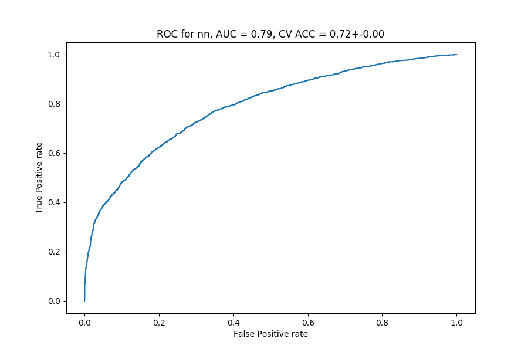
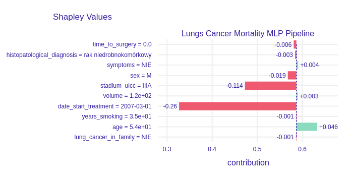
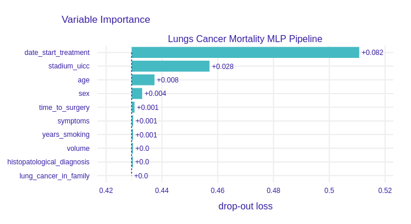
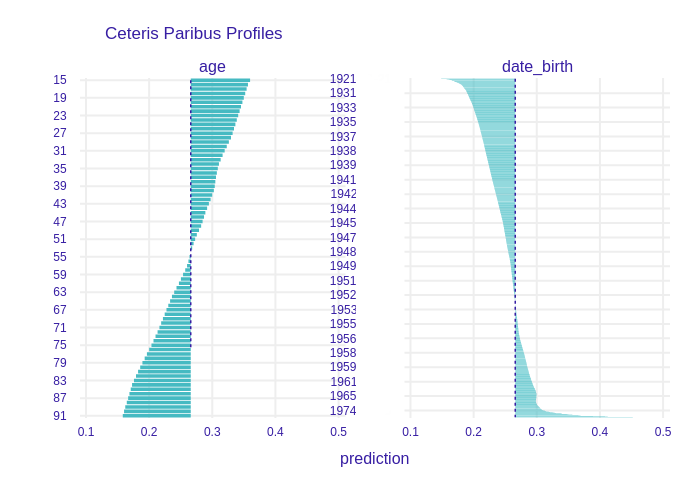
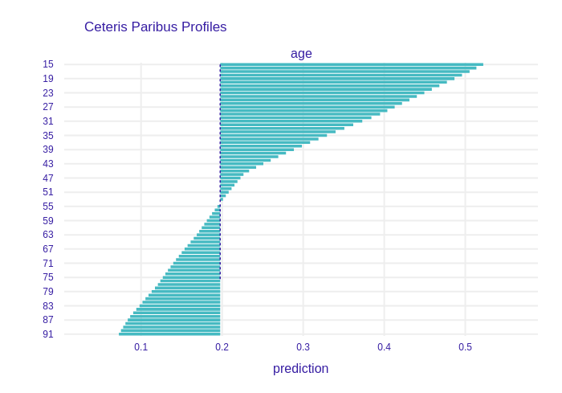

# Story lungs: eXplainable predictions for post operational risks {#story-lungs}

*Authors: Maciej Bartczak (UW), Marika Partyka (PW)*

*Mentors: Aleksandra Radziwiłł (McKinsey & Company), Maciej Krasowski (McKinsey & Company)*


## Introduction 
 Science allows us to understand the world better. New technologies, data collection solves the problems not only of large companies but also of ordinary people. Especially if human life is at stake.
 They say that cancer is the killer of the 21st century. That's why even small attempts to subdue this problem are important. 
 In our work, we deal with lung cancer. We try to predict the chances of survival of a patient who has had a tumor removal surgery. We try different approaches.

## Model 

The dataset consists of the following varaibles.

Numerical

Variable | Unit
--- | ---
`date_birth` | date
`date_start_treatment` | date
`date_surgery` | date
`tumor_size_x` | cm
`tumor_size_y` | cm
`tumor_size_z` | cm
`years_smoking` | years
`age` | years
`time_to_surgery` | years ("today" - date_surgery)

Categorical

Variable | Decription | Values
:--- | :--- | :---
`sex` | subject sex | male/female
`histopatological_diagnosis` | type of cancer | Rak płaskonabłonkowy, pleomorficzny, ...*
`symptoms` | whether symptoms were observed | yes/no
`lung_cancer_in_family` | whether family member had cancer | yes/no
`stadium_uicc` | severity of tumor | IA1, IA2, IA3, IB, IIA, IIB, IIIA, IIIB, IVA, IVB*
`alive` | whether subject is alive | yes/no (**target variable**)

About 1/3 af values of varaibles annotated with * was missing.

Survivability was registered `time_to_surgery` years after the procedure, for the majority of the subjects not later than 1 year after the procedure, and at most after 12 years.

We have tried out several models as well as different preprocessing strategies. However, all of the approaches yielded similar results differing no more than 0.01 of cross validation acuracy and 0.01 ROC AUC score. These are the models that were utilized:

- Logistic regression
- Logistic regression with hyperparameters cross validation
- Random Forest
- XGBoost
- Neural Net - 10 hidden neurons
- Neural Net - 30 hidden neurons
- Neural Net - 2 x 10 hidden neurons

As we have indentified higle defendent features as well as observed that tumor sizes disturbed the explaination we have employed following preprocessing strategies:

- encode and normalize
- encode, remove highly dependent features and normalize 
- encode, introduce tumor volume, discard tumor sizes, remove highly dependent features and normalize 

Finally we have settled on Neural Net with 10 hidden neurons with following receiver operating curve.

```{r, cache=FALSE, out.width="600", fig.align="center", echo=FALSE}

```


## Explanations

We are based on 3 methods of explaining models, mainly Ceteris Paribus as well as Shap and Variable Importance.
Of course, it is our goal to understand on what basis our model has found a chance of survival of a given patient. For example, let's take a patient with the following variable values: 
- `date_start_treatment` 2007-03-01
- `sex` M
- `histopatological_diagnosis` rak niedrobnokomórkowy
- `years_smoking` 35
- `lung_cancer_in_family` No
- `symptoms` No
- `stadium_uicc` IIIA
- `age` 54
- `time_to_surgery` 0
- `volume` 125
Our most recent model indicated that the chances of survival after surgery for such a patient are $24\%.$
Here we have an explanation of this result by SHAP.
```{r, cache=FALSE, out.width="600", fig.align="center", echo=FALSE}

```

According to our intuition, the lack of symptoms increases the chance of survival, quite advanced stage of UICC equal to IIIA reduces these chances. We may also notice that the prognosis is worse because our patient is a man. However, it will be best if we refer to the results of another method - Ceteris Paribus.
```{r, cache=FALSE, out.width="600", fig.align="center", echo=FALSE}
knitr::include_graphics('images/07_cp_1.png')
```
Here we see 3 variables that show well how a parameter change works for or against the patient. This confirms that women have a better prognosis of survival after surgery, the symptoms of the disease do not herald the best, and also the younger we are, the better we are able to cope with convalescence. 
```{r, cache=FALSE, out.width="600", fig.align="center", echo=FALSE}
knitr::include_graphics('images/07_cp_2.png')
```

Here too, the model shows that if our patient's cancer was classified as much lighter, his chances would increase.

Let's take a look at another method for the whole data set - Variable Importance.
```{r, cache=FALSE, out.width="600", fig.align="center", echo=FALSE}

```
 The most important one seems to be the variable that says when the patient started treatment. The second most important is the UICC stage. Interestingly, the period of time the patient smoked cigarettes does not affect the outcome too much.

 But using model explanations not only helps to explain the result of the prediction, it can also give a hint how to improve our model.
 
 When we built the model on all variables, the explanations allowed us to find correlations. Let's compare the CeterisParibus results for the full model and the deleted dependent variables.
 
```{r, cache=FALSE, out.width="600", fig.align="center", echo=FALSE}

```
 In the picture above you can see that the influence of two correlated variables was distributed between them, but after leaving only one of these variables, the influence accumulated on it (picture below).
 
```{r, cache=FALSE, out.width="600", fig.align="center", echo=FALSE}

```

At this stage we can already conclude that the techniques of model explanations are not only useful at the end of our journey. They can give us tips on how to transform data or which variables should be deleted.
 

## Summary and conclusions 

- XAI methods legitimised employed approach of pruning the dataset.
- XAI methods yielded explainations consistent with biological intuintion, what builds up trust in the model.
- As variety of modelling and preprocessing approaches resulted in similar predicitive performance we conclude there is not much more to squeeze out of the dataset.

