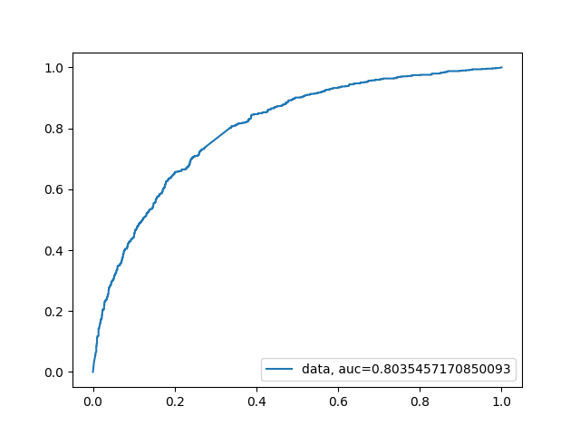
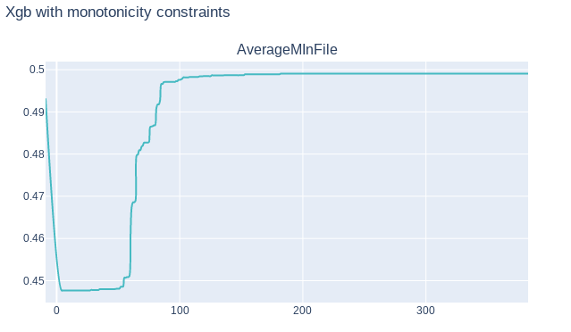
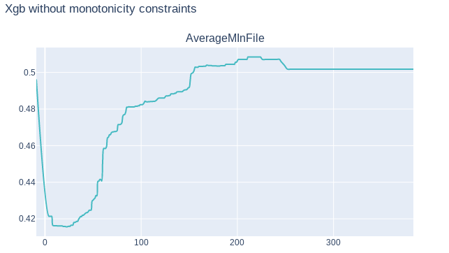
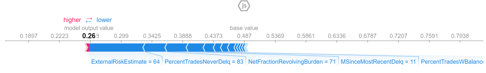
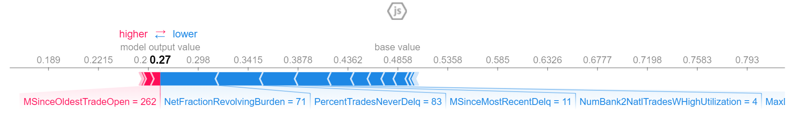
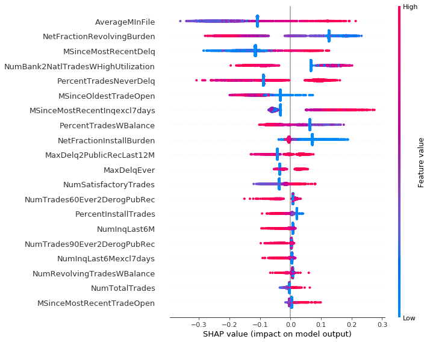
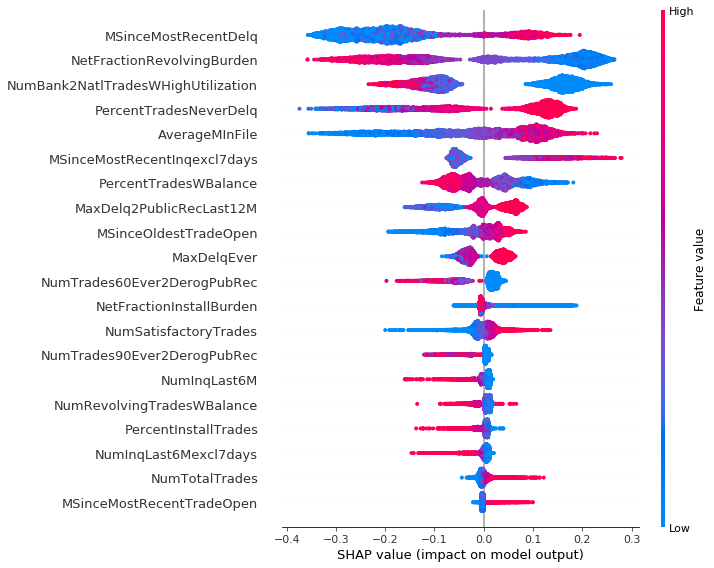
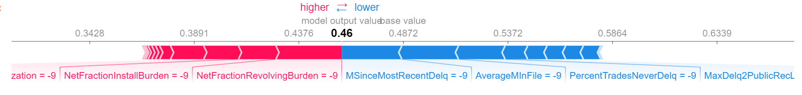
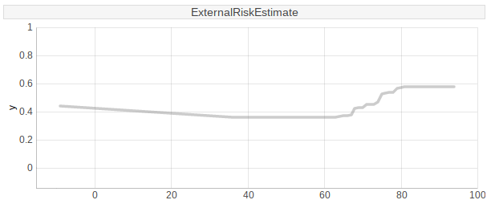

# Story HELOC Credits

*Authors: Tomasz Kurzelewski (University of Warsaw), Tomasz Radzikowski (Warsaw University of Technology)*

*Mentors: Marta Gajewska (McKinsey & Company), Amadeusz Andrzejewski (McKinsey & Company)*

## Introduction 
A home equity line of credit, or HELOC, is a loan in which the lender agrees to lend a maximum amount within an agreed period (called a term), where the collateral is the borrower's equity in his/her house (akin to a second mortgage). Because a home often is a consumer's most valuable asset, many homeowners use home equity credit lines only for major items, such as education, home improvements, or medical bills, and choose not to use them for day-to-day expenses.

Since amount of such credit is not small, banks carefully review financial situation of
applicants. Utmost care is taken so the whole process is transparent
and decision is easily explainable to the client. Because of that any automated process
also has to be explainable, and in this XAI methods may be helpful. 

### Dataset
Our dataset - Home Equity Line of Credit (HELOC) - originally comes from Explainable Machine Learning Challange organized by FICO company.  The data contains anonymized credit applications of HELOC credit lines, which are a type of loan, collateralized by a customer's property. There are 23 predictors in the dataset, which describe following features:

* `ExternalRiskEstimate` - consolidated indicator of risk markers (equivalent of polish BIK's rate)
* `MSinceOldestTradeOpen` - number of months that have elapsed since first trade
* `MSinceMostRecentTradeOpen` - number of months that have elapsed since last opened trade
* `AverageMInFile` - average months in file
* `NumSatisfactoryTrades` - number of satisfactory trades
* `NumTrades60Ever2DerogPubRec` - number of trades which are more than 60 past due
* `NumTrades90Ever2DerogPubRec` - number of trades which are more than 90 past due
* `PercentTradesNeverDelq` - percent of trades, that were not delinquent
* `MSinceMostRecentDelq` - number of months that have elapsed since last delinquent trade
* `MaxDelq2PublicRecLast12M` - the longest delinquency period in last 12 months
* `MaxDelqEver` - the longest delinquency period
* `NumTotalTrades` - total number of trades
* `NumTradesOpeninLast12M` - number of trades opened in last 12 months
* `PercentInstallTrades` - percent of installments trades
* `MSinceMostRecentInqexcl7days` - months since last inquiry (excluding last 7 days)
* `NumInqLast6M` - number of inquiries in last 6 months
* `NumInqLast6Mexcl7days` - number of inquiries in last 6 months (excluding last 7 days)
* `NetFractionRevolvingBurden` - revolving balance divided by credit limit
* `NetFractionInstallBurden` - installment balance divided by original loan amount
* `NumRevolvingTradesWBalance` - number of revolving trades with balance
* `NumInstallTradesWBalance` - number of installment  trades with balance
* `NumBank2NatlTradesWHighUtilization` - number of trades with high utilization ratio (credit utilization ratio - the amount of a credit card balance compared to the credit limit)
* `PercentTradesWBalance` - percent of trades with balance

Features containing data about delinquency are coded to numeric scale and missing values are labeled with negative integer number.  
The majority of features are monotonically decreasing or increasing.
Dataset has 10459 observations, 5000 of which belong to class 'Good', what means that clients repaid their HELOC account within 2 years, and 5459 belong to class 'Bad'.
This gives us distribution of 48% 'Good' individuals, and 52% 'Bad' individuals.
Although not all rows are unique. There is only 9871 unique rows in this set,
with same distribution of result classes as in whole dataset.


## Model 

Since credit decision takes into account many variables related to the customer's financial
situation, and many of them were not included into dataset, accuracy of built models was not
as good as we would want. Best results available in papers are around 0.84 AUC, while
our model based on XGBoost scored around 0.80 AUC, ROC curve is visible on figure \@ref(fig:modelRoc). We experimented with different models, such as based on SVM, Random Forest and XGBoost. The last two gave best results, both around 0.80 AUC, but we have chosen XGBoost since available implementation allowed us to reinforce monotonicity bounds arising from business interpretation of variables. It provided us with model better describing decision process. We have also experimented with variable 'ExternalRiskEstimate'. This variable representing external credit scoring must be based on other variables from the dataset, and because of that many trained models
were relying almost exclusively on this single variable, marginalising importance of other ones, and oversimplifying explanation. Such explanation wouldn't be in any way meaningful
to potential applicant. What's more, ExternalRiskEstimate can be explained with other
variables with mean absolute percentage error 5.5%

```{r modelRoc, out.height="360px", out.width="480px", fig.align="center", echo=FALSE, fig.cap='XGBoost model ROC curve'}

```

## Explanations


### Model explanations

Model explanation techniques were very useful in our work. As was mentioned in section Model,
we experimented with variable ExternalRiskEstimate and effects this variable had on trained model. We trained two XGBoost models, one with ExternalRiskEstimate variable, and one without this variable. Then we used Permutation Variable Importance to estimate variable importance in each model. In first model, with ExternalRiskEstimate variable, we observed that this variable clearly dominates others, with weight almost 9 times greater than weight of the second most important variable. On the other hand, in the second model three most important variables had similar weights of importance.
  
|      |Model with ExternalRiskEstimate   |      |Model without ExternalRiskEstimate|
|------|----------------------------------|------|----------------------------------|
|Weight|Variable                          |Weight|Variable                          |
|------|----------------------------------|------|----------------------------------|
|0.0857|ExternalRiskEstimate              |0.0250|NetFractionRevolvingBurden        |
|0.0094|NetFractionRevolvingBurden        |0.0168|PercentTradesNeverDelq            |
|0.0047|PercentTradesNeverDelq            |0.0130|MSinceMostRecentDelq              |
|0.0044|MSinceMostRecentInqexcl7days      |0.0076|AverageMInFile                    |
|0.0036|MSinceMostRecentDelq              |0.0072|NumBank2NatlTradesWHighUtilization|
|0.0025|PercentTradesWBalance             |0.0042|MaxDelq2PublicRecLast12M          |
|0.0021|NumSatisfactoryTrades             |0.0013|MSinceMostRecentInqexcl7days      |
|0.0016|AverageMInFile                    |0.0007|NumRevolvingTradesWBalance        |
|0.0014|NumTotalTrades                    |0.0004|NumInqLast6M                      |
|0.0013|NumBank2NatlTradesWHighUtilization|0.0003|NumTotalTrades                    |

Table: Importance of variables in models with and without ExternalRiskEstimate variable

Using this technique we can also discover which variables are most significant in our model, deepening our understanding of trained model.

To better understand our model we also attempted to use Partial Dependency Plots.
Unfortunately in our case these plots didn't give us any more information.
It confirmed that our model has correct monotonicity with respect to business
interpretation of variables, but that was all. Finally, this information wasn't
in any way helpful since we used a XGBoost model which reinforced monotonicity
of variables according to their's business interpretation. On following graphs
\@ref(fig:amifWConstr), \@ref(fig:amifWoConstr) we can see PDP plots for variable AverageMInFile in two XGBoost models,
one with monotonicity constraints, and other without constraints. As we can see both plots are quite similar.
Plot \@ref(fig:amifWoConstr) in some point is slightly decreasing, but in general we can say that is increasing, as it should be.


```{r amifWConstr, out.height="300px", out.width="600px", fig.align="center", echo=FALSE, fig.cap='PDP graph of variable AverageMInFile of XGBoost model with monotonicity constraints'}

```


```{r amifWoConstr, out.height="300px", out.width="600px", fig.align="center", echo=FALSE, fig.cap='PDP graph of variable AverageMInFile of XGBoost model without monotonicity constraints'}

```
### Explanation for clients

As a main goal we have chosen valuable explanations for clients, because of two factors: in many countries, including Poland, only explainable models are allowed to be used for customer credit scoring. Furthermore it is vital to provide clear and understandable responses for clients doubts concerning their financial rating, since it may increase an overall level of satisfaction with customers service.

#### SHAP values:

In order to ensure flexibility of the explanations system we have decided to use SHapley Additive exPlanations (SHAP). This method is model-agnostic, which means it provides explanations for various types of machine learning models. It increases a versatility of the technique that is an advantage for companies. Moreover SHAP is based on the game theory, where every observation from a dataset is another game. Therefore this technique is designed for local interpretation e.g. of every client's score.

Again, we have tested model including ExternalRiskEstimate feature and without them, comparing results. Eventually we decided to use model without ExternalRiskEstimate, because in many observations that variable has significant or even the greatest impact for an explanation. However ExternalRiskEstimate is synthetic, which means it is computed from other features and as such it is not providing any advice for customer, how they can increase a chance of getting a loan. Results of both models for one observation are shown below:

* With ExternalRiskEstimate




* without ExternalRiskEstimate




During the work we divided dataset into 3 clusters, using K-means algorithm. It showed a certain interesting remark: observations from first cluster often contained a lot of special or missing values, which are labeled in dataset. Results of summary plot for those data are different from two others. We can observe that second and third cluster are similar, thus their explanations are consistent.

Cluster 0:



Cluster 1:



Cluster 2:


Clustering dataset helped us to understand better SHAP plots for several observations, which was the main goal of this task. Thanks to `force plot` every client is able to understand his credit scoring upon one chart. For the purpose of this chapter we created three people: John, Grace and Frankie. If John comes to his consultant he doesn't receive any valuable information, because his record contains no usable data. One and only information for him is that he have to prepare more proofs of his positive credit situation.

Jonh's SHAP plot:



In case of Grace and Frankie things are different. Grace's situation is clear - she never had a delinquency and length of her credit history is quite long, which improves her situation. Unfortunately she still has a large amount of her loans to repay. Frankie is the opposite of Grace. Probably she never took care of her financial situation and only 6 of 10 her loans were repaid without delinquency. Her credit score is lower and the greatest positive impact has the fact, that for the last 6 months she did not try to get a loan. For both of them, SHAP explanation provides valuable information about reasons of the credit decision.

Grace's SHAP plot:


Frankie's SHAP plot:


#### Application for clients

While working on this project we tried to use SHAP values to change the particular feature in the observation, what should increase or decrease probability of a positive credit decision. Results were surprisingly bad. In some cases changing the most important feature in a reasonable range did not affect the output. In others, even a small change disrupted the whole SHAP model. Moreover some features are connected, for example if a client wants to improve percent trades without delinquency, he can get a new loan but it changes another features, such as number of months since last inquiry. An exemplary result of Ceteris Paribus plot, which shows change's range for one variable is shown below.



## Summary and conclusion 

Our results show that explainable artificial intelligence could be helpful for banking industry and could provide a valuable explanation for clients, what is necessary in many countries, including Poland. Unfortunately there are some drawbacks of those techniques, what was shown in previous sections. Although SHAP values present current client's situation, it is not possible to modify values of a certain feature causing a monotonical increase of probability of a positive credit decision.