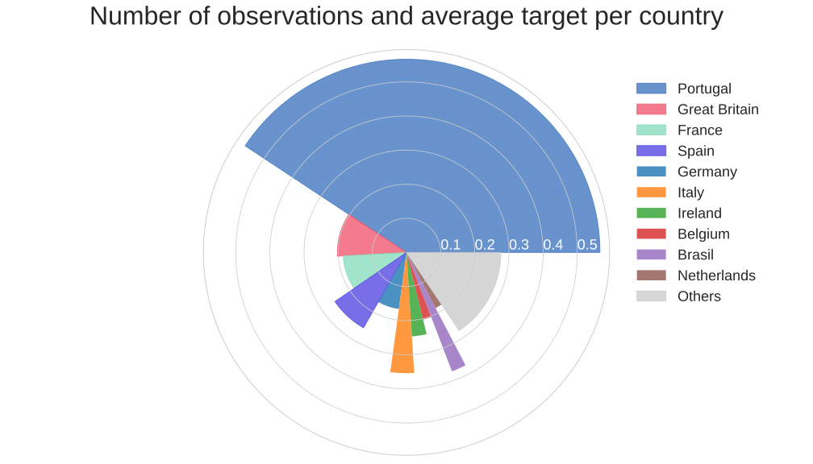

# Hotel booking cancellation story: eXplainable predictions for booking cancellation for a {#story-hotel-booking-2}

*Authors: Miłosz Michta (University of Warsaw), Kazimierz Wojciechowski (Warsaw University of Technology)*

*Mentors: Maciej Andrzejak (McKinsey & Company), Alicja Jośko (McKinsey & Company)*

Apr–Jun 2020

## Introduction

Imagine you are the owner of a portuguese hotel. You notice that some of the reservations are cancelled on a regular basis. To maximize revenue you plan to practice room overbooking strategy. How exactly would you approach this strategy? How many rooms to oversell? Which customers are most likely to cancel their reservation? What is the probability of cancellation? And most importantly: **what is the reason behind the prediction?** We will make an attempt to answer this question using explainable machine learning.

From the standpoint of a machine learning engineer one might want to find a model that not only is high-performing, but is also based on intuitive insights about the data. In the case of several competing

A persuasive manager of the facility might want to attempt to offer the booking on slightly different conditions to customers that are most prone to cancel their reservation e.g. by offering a non-refundable booking for customers from Portugal and Germany. It will be of crucial importance to determine which features to tweak to make the booking as secure as possible while trying not to make the customer feel too uncomfortable by insisting on too many changes. To solve this interesting problem we propose instance-specific explainable machine learning techniques.

## Target leak detection

At the beginning, we test how baseline models work without any feature engineering. Suprisingly, all models get 100% accuracy score both on training and validation score. This could mean three things:

* We are awesome
* We are lucky
* We have a target leakage in the dataset!

Firstly, let's see partial dependence profiles for each feature. If there is some leakage, then average prediction profile should distinguish itself amoung the others. At first glance, the `reservation status` feature has strange plot. It looks like we ommit the feature represents almost the same as target.

*Figure details partial dependence profiles for `reservation_status` feature using three different models: LightGBM, Naive Bayes and Logistic regression.*

We had to remove this feature from our dataset even if we loose high performance score, because of laking interpretation power.

## Bias correction

Since we have already remove leakage feature, lets figure out which variables are the most important.

It looks like, the country of origin is the most important and the most impactful for 2 out of 3 models. The others variables looks reasonable, but logically `country` should not be the most important feature for predicting booking cancellation. Lets figure out what what is the cause if results like that.

*Figure details dependency between number of observations (angle) and average prediction (radius) for each country*

The Portugal seems to be reason of the bias in the dataset. Around 40% of the data comes from Portugal and their average prediction equals 56%, where the average is around 38%. In this case, we split model on 2 parts:

* One model for portugals
* One model for other countries.

After splitting the dataset in each fold and training two distinct models, we get significant uplift in model accuracy for each model and fold.

## Offering different conditions

Here we will attempt to use a instance-specific explainable machine learning techniques in order to provide a similar offer that will reduce the probability of cancellation.
We will determine which methods, if any, might be applicable for real-time negotiation.

## Final remarks

Here we will summarize our findings and conclude the chapter.
Does XAI improve predictions?
