# Story COMPAS: recidivism reloaded {#story-compas}

*Authors: Łukasz Grad (University of Warsaw), Katarzyna Koprowska (Warsaw University of Technology)*

*Mentors: Michał Miktus (McKinsey & Company)*

### Take-away  messages {-}

* Based on limited publicly available data COMPAS scores can only be reconstructed approximately.
* Direct recidivism modelling provides better results than both raw COMPAS scores and models trained on COMPAS.
* Race is an influential factor when predicting recidivism.
* Removing bias from a model is a complex task.
* Our efforts to mitigate the racial bias resulted in a relatively fair model, but at the cost of decreased model performance, suggesting that some trade-offs are inevitable.

## Introduction 

The study covers the problem of assessing the likelihood of a defendant becoming a recidivist. One of the best known solutions currently used on a daily basis is COMPAS, an acronym for Correctional Offender Management Profiling for Alternative Sanctions, created by a for-profit company Northpointe.

COMPAS is a widely popular commercial algorithm used by judges and parole officers for scoring a criminal defendant’s likelihood of recidivism. It was designed to help judges identify potentially more dangerous individuals and award them with longer sentences. It is easy to notice that COMPAS results have fundamental consequences for the lives of many United States residents. 

However, the algorithm is, due to its proprietary nature, still a black-box for the wide audience – meaning that we cannot easily identify which factors did it consider when classifying an individual as a person with a high or low likelihood of reoffending. 

Consequently, many questions have arised about the fairness of the algorithm.

In this study, we try to answer the following questions:

- Can we reconstruct COMPAS scores given our limited data about defendants?
- What are important factors contributing to the COMPAS score?
- Can we improve on the COMPAS by using a more complex model?
- Is our model fair or does it show racial bias?
- How can we remove racial bias and what is the impact of such operation on model accuracy?

The rest of the article is organized as follows. Next subsection briefly discusses previous attempts at both analyzing COMPAS algorithm in the context of racial bias, as well as the COMPAS scores reconstruction. In section 2 we describe the data we used for modelling along with variable description. In section 3 we present the estimated models and detailed description of model fitting approach. Moreover, it contains results for direct recidivism modelling as well as attempts at COMPAS score reconstruction. In section 4 we show global and instance level explanations in order to assess the degree of racial bias present in our models. Section 5 contains quantitative fairness analysis augmented with an attempt to remove bias from our best-performing model. Lastly, we briefly mention potential next steps and finish with a summary of our results.

### Previous work on COMPAS algorithm

One of the first and most known investigators aiming to validate COMPAS results was ProPublica group @propublica. They have provoked a vigorous discussion about the fairness of black-box models with their 2016 study, which attempted to reconstruct COMPAS methodology. They have collected criminal records from Broward County FL for several thousand people, as well as reports about their offenses in a two-year follow-up period. The overall accuracy of ProPublica’s reconstructed model was only 61%, but their main discovery was a racial bias in favour of defendants of Caucasian origins over those of African-American origins. According to the study, black defendants were particularly likely to be falsely flagged as future criminals almost twice as often as white ones, who were also more often mislabeled as low risk. The researchers believed that the aforementioned disparity cannot be explained by either defendant’s prior crimes, their type, gender or age. 

The ProPublica study was, however, heavily criticized for its flawed methodology. One of the critics was Northpointe, the creator of the COMPAS algorithm, who defended the accuracy of its test, because the results from ProPublica do not precisely reflect their model.

After ProPublica’s publication, confusion and doubts whether COMPAS should still be relied on, began to appear among researchers, leading several of them to propose their own validations of the algorithm, based on data provided by ProPublica. One of the most reliable work seems to be the study “The age of secrecy and unfairness in recidivism prediction” by Rudin et al. [-@rudin2018age], which verified the analysis conducted by ProPublica, indicating cases where the results given by COMPAS may be non-intuitive and possible explanations. The authors believe that ProPublica has drawn conclusions from incorrect assumptions and lack of knowledge of all data. For instance, they assumed linearity in age (as stated in official COMPAS documentation from Northpointe described by Rudin et al.), which appeared to be untrue; they also did not have access to the answers from questionnaires given to defendants (also introduced by the Northpointe as predictors for their model), which can be highly correlated with race and, thus, shift the outcome. 

Disproving ProPublica’s study was not, however, the main objective of Rudin et al. They described what they believed was the real problem of COMPAS: its proprietary nature, which, along with over a hundred of (manually-entered) variables collected from questionnaires not publicly accessible, does not allow to identify data entry errors, data integration errors, missing data and other types of inaccuracies. The researchers even identified some individuals with a rich criminal history and low probability of recidivism given by model, highly suggesting that their scores were based on flawed data.
The main conclusion of this analysis was to replace black-box machine learning models by interpretable models, which, as Rudin et al. suggested, can be equally accurate for predicting recidivism.

## Data

Data we used was mainly derived from the “The age of unfairness” study dataset combined with several factors extracted from the raw Broward County FL database used by ProPublica for their analysis.

We gathered information about $5727$ subjects from Broward County FL, whose likelihood of recidivism and violent recidivism we were trying to predict. We have used $29$ variables in total: 

- **personal** ($6$) such as current age, age at first offence, sex, race, marital status, custody status
- **criminal involvement** ($20$) consisting of number and types of previous charges and arrests, as well as those leading to COMPAS screening 
- **history of non-compliance** ($3$) concerning behaviour while on probation.

In addition, the data also contained COMPAS scores for both recidivism and violent recidivism, together with ground truth about future offenses and violent offenses made by a person.

|Variable | Description|
|---------|------------|
|`current_age`| current age of offender|
|`age_first_offence`| age of offender at first offense|
|`charge_count`| number of charges against offender|
|`jail30_count`| number of times in jail at least 30 days long|
|`prison_sent_count`| number of prison sentences|
|`prob_count`| number of times on probation|
|`race`| race of offender|
|`gender`| gender of offender|
|`offense30_count`| number of offenses within 30 days before screening|
|`fel_count`| number of felonies|
|`misdem_count`| number of misdemeanours|
|`charge_viol_count`| number of violent charges against offender|
|`juvfel_count`| number of juvenile felonies|
|`prop_viol_count`| number of felony property violent arrests|
|`murder_arrest`| number of murder arrests|
|`felassault_arrest`| number of felony assault arrests|
|`misdem_arrest`| number of misdemeanours assault arrests|
|`famviol_arrest`| number of family violence arrests|
|`sex_arrest`| number of sex crime arrests|
|`weapon_arrest`| number of weapons arrests|
|`onprob_count`| number of offenses on probation|
|`onprob_current`| current offence on probation|
|`prob_revoke`| number of probation violation|
|`arrest_count`| total number of arrests|
|`prison30_count`| number of times in prison at least 30 days long|
|`scale_set`| scale set for COMPAS screening|
|`marital_status`| marital status|
|`custody_status`| custody status, e.g. pretrail defendant|

Table: Description of variables in the dataset.

## Models

We focused on both direct and indirect modelling of recidivism. As in original work by Northpointe, we distinguish between recidivism and violent recidivism, giving rise to a total of $4$ problems to tackle.

Our first approach focused on direct modelling of recidivism and violent recidivism in a two-year follow-up period after screening. Therefore, we modelled both problems as binary classification tasks.

In the second approach we focused on the prediction of raw COMPAS scores, again concerning  both recidivism and violent recidivism. We model it as a regression task with mean squared error as a loss function.

In all experiments we split our data set randomly into train set with $4588$ instances and separate test set with $1139$. All results presented below are calculated on the test set only in order to provide fair performance analysis.

In order to find well-performing models for each task, we have tried three different approaches: 

- Lasso Regression
- Random Forest
- Extreme Gradient Boosting (XGBoost)

We focused on tuning the XGBoost model, as it provides state-of-the-art results on many tabular datasets, and wanted to compare it with a white box logistic regression model along with out-of-the-box Random Forest. 

Comparison with a linear model can give us insights on whether the relationships between recidivism and given predictors is highly nonlinear or not. On the other hand, comparison with Random Forest model will reveal how important careful parameter tuning and control for overfitting are.

In next subsections, we briefly describe the fitting process of all models.

#### XGBoost

Since the volume of our datasets is not substantial, we performed  XGBoost tuning with exhaustive grid search method in a coarse-to-fine manner. With a coarse parameter search we assessed the relative importance of each parameter and narrowed down its potential range of values. Next, with a much finer search we obtained out final sets of parameters. As a metric during parameter tuning we used AUC for recidivism classification and MSE for COMPAS score prediction. Both metrics were calculated on the full training set with out-of-fold scores within a 5-fold CV scheme. In our analysis, we used `xgboost` package in R.

Below we show top performing models for both COMPAS score regression and recidivism binary classification.

| Model   | Tree Number | Max Depth | Eta  | Colsample | Subsample | Min Child Weight | Alpha | Lambda
|:----------:|:-----------:|:----------:|:-----:|:---------:|:---------:|:----------------:|:-----:|:-----:|
| XGB        |     12      | 3       | 0.3  |    1      |  0.8      |   3   |  1    |   1   |
| XGB Violent|      19     | 3       | 0.3  |    0.8    |  0.8      |   10  |  1    |   0   |

Table: Selected final parameter values for recidivism and violent recidivism XGBoost models

We can see that in case of recidivism and violent recidivism classification XGBoost was prone to the overfitting as the best models had very limited tree counts.

| Model   | Tree Number | Max Depth | Eta  | Colsample | Subsample | Min Child Weight | Alpha | Lambda
|:----------:|:-----------:|:----------:|:-----:|:---------:|:---------:|:----------------:|:-----:|:-----:|
| XGB        |     62      | 3       | 0.3  |    1      |  0.8      |   10   |  3    |   0   |
| XGB Violent|      57     | 3       | 0.3  |    0.8    |  0.8      |   1 |  3    |   0   |

Table: Selected final parameter sets for COMPAS score and violent COMPAS score XGBoost models

In case of COMPAS score regression we see a substantial increase in tree count, but still the chosen models have limited max tree depth to control for overfitting.

#### LASSO regression

Since we had strong suspicions about collinearity between predictors, we used Regression with L1 penalty (Lasso) as our linear model of choice. In case of recidivism classification we fit a Logistic Lasso model - a generalized linear model with binomial distribution. In case of COMPAS regression we utilize a standard Lasso with linear activation function (gaussian distribution).  

The penalty term $\lambda$, similarily to XGBoost, was tuned with 5-fold CV on the training set. We utilized a well known `glmnet` package in R to efficiently find optimal penalty terms using the *Lasso path*. 

Below we present the Lasso path for recidivism model (on the left) and COMPAS scores (on the right). We can notice that the selected model for recidivism prediction is simpler and that even simple linear models with more predictors lead to overfitting. On the other hand, we observe little to no overfitting for COMPAS regression. This is in line  with parameter tuning for XGBoost models, where  models selected for COMPAS score regression were more complex.

{width=360px} {width=360px}

*Left: Lasso path for recidivism model. At the top we see the number of non-zero weights. We can see the optimal penalty term chosen to be close to $e^{-5}$. Best model had 17 non-zero weights, although models with less than 10 chosen predictors also perform well. Right: Lasso path for COMPAS regression. Optimal model selected with 26 predictors, but simpler models with less than 18 features perform similarily*

#### Random Forest

As for the Random Forest model, we relied on the default implementation in `RandomForest` R package, without any fine tuning. We set the number of trees to $50$ observing that the chosen XGBoost models were also sparse in tree count.

### Results - COMPAS Regression

Below we present COMPAS regression results. In both cases of recidivism and violent recidivism tuned XGBoost models achieved highest Coefficient of determination (R-Squared). Random Forest models performed only a little worse,  followed by Lasso models. 

One may have expected higher results than $0.643$ and $0.711$ of the variance explained, for recidivism and violent recidivism respectively. Information available about the underlying COMPAS models suggest that they are most likely quite simple, statistical models. However, as disclosed by Nortpointe, their model has a substantially more information about the defender, e.g. from on-site questionnaires.

| Model   | R-Squared | MSE | RMSE  | MAD |
|:----------:|:-----------:|:----------:|:-----:|:------:|
| **XGB**        |     **0.643**      | 0.259       | 0.509  |    0.329     |
| Lasso        |     0.573      | 0.310       | 0.557  |    0.384      |
| RF        |     0.625      | 0.272      | 0.522  |    0.336      |
| **XGB Violent**|      **0.711**     | 0.228       | 0.478  |    0.275   |
| Lasso Violent|      0.644     | 0.281       | 0.531  |    0.336    |
| RF Violent|      0.693     | 0.242       | 0.492  |    0.296    |

Table: Summary of COMPAS regression results

Looking more closely at the histograms of residuals, we observe a much higher amount of instances with under-valued  than over-valued predictions. This observation is consistent for both recidivism and violent recidivism COMPAS scores, and for all our models.

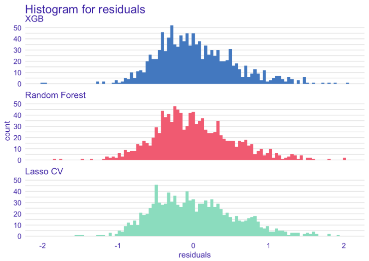{width=370px} 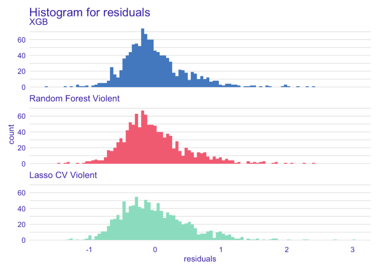{width=370px}

*Left: Histogram of residuals for COMPAS recidivism regression. Right: Histogram of residuals for violent COMPAS recidivism regression.*

### Results - Recidivism Classification

Below we present recidivism classification results. We decidecied to compare our models using a receiver operating characteristic or ROC curve in short, along with a couple other diagnostic metrics.  

| Model   | AUC | Accuracy | Precision  | Recall | F1 Score |
|:----------:|:-----------:|:----------:|:-----:|:---------:|
| **XGB**        |     **0.721**      | 0.66       | 0.51  |    0.71     |  0.59      |
| Lasso        |     0.707      | 0.65       | 0.50  |    0.68      |  0.58      |
| RF        |     0.671      | 0.63      | 0.48  |    0.64      |  0.55     |
| **XGB Violent**|      **0.718**     | 0.63       | 0.26  |    0.68   |  0.37      |
| Lasso Violent|      0.697     | 0.65       | 0.27  |    0.66    |  0.38      |
| RF Violent|      0.674     | 0.63       | 0.24  |    0.63    |  0.35    |

Table: Summary of recidivism classification results

As it turned out, the most accurate algorithm was XGBoost with AUC of $0.721$ for both recidivism and violent recidivism prediction.

{width=370px} {width=370px}
*Left: ROC curve for recidivism. Right: ROC curve for violent recidivism.*

In both cases, ROC AUC was much higher than ProPublica score and also significantly higher than the ROC AUC produced by raw COMPAS scores. Surprisingly, our models trained on the COMPAS scores (COMPAS model in the table below) achieved higher AUC on the test set than the raw COMPAS scores. This may suggest, that the additional variables extracted from e.g. questionnaires, may in fact harm the COMPAS predictions.

|         | Our model | raw COMPAS score | COMPAS model |
|:-------:|:----:|:-------:|:------:|
|  ROC AUC        | **0.721**     | 0.692     | 0.708
|  ROC AUC Violent| **0.718**     | 0.673     | 0.688

Table: Comparison of predictive performance of our XGBoost classification models and raw COMPAS scores

In the following analyses we will focus only on the models predicting recidivism.

## Explanations
In order to evaluate results, as well as test for potential biases, we examined both COMPAS scores and our model for recidivism prediction using several explanation techniques.

Before we begin with explanations, however, several terms should be clarified.

**Jail or prison?**

For many, especially non-English natives, jail and prison are interchangeable terms. It is, however, incorrect: jails are for people awaiting trial and those serving short (a year or less) sentences, while prisons are for long term (more than a year) convicts.

**Misdeameanor or felony?**

A felony is a more serious crime than a misdemeanor. There are more levels within these groups and each level differs in terms of consequences, but the rule of thumb is the following: felonies involve long prison sentences, large fines, or permanent loss of freedoms, while misdemeanors usually result in smaller fines and short jail time. 

### Model specific

In order to identify the effect of features on prediction we used Permutation Variable Importance.

{width=600px}

*Permutation Variable Importance -- our XGBoost model for predicting recidivism*

Not surprisingly, the most relevant variable for predicting recidivism turned out to be number of previous arrests. Another factor that is greatly affecting prediction is age and age at first offense, followed by the number of previous misdemeanors.

In the picture below we can see a little more detailed description of most important variables acquired with SHAP. Positive SHAP value indicates larger probability of recidivism, negative -- the opposite.

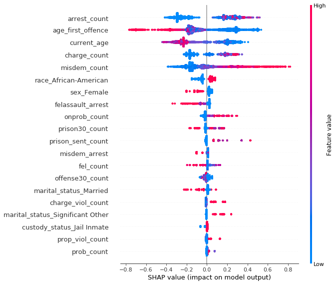{width=600px}

*SHAP summary plot ordered by variable importance -- our XGBoost model for predicting recidivism*

Several interesting conclusions can be drawn.

Quite intuitively, the higher the number of previous arrests, the more likely is the defendant to reoffend. Features standing for current age and age at first offence indicate that younger people tend to be much more likely to commit crime again, especially if their criminal history has started early. 
Higher number of previous misdemeanors affects "positively" the prediction, on the contrary to the features related to felonies (number of felony assault arrests and number of felonies), suggesting that people commiting lesser crimes are more likely to do it again, unlike those with more severe ones.

Unfortunately, sensitive information such as race and sex is very high on the list suggesting bias in favour of women and against African-Americans.

A little more digging reveals another interesting information -- an interaction between race and two of the three most important variables shows the opposite direction of feature's influence on prediction for black vs non-black defendants.

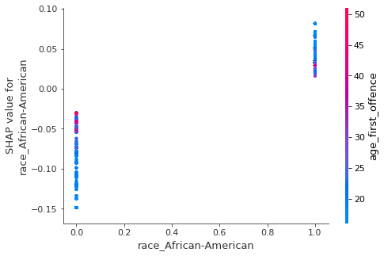{width=370px} 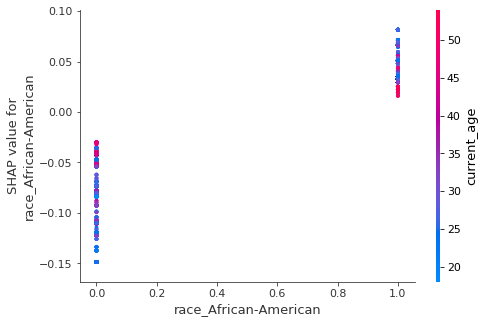{width=370px}

*Left: SHAP interactions for African-American race and age of first offense variables. Right: SHAP interactions for African-American race and current age variables. Based on our XGBoost model for predicting recidivism*

The figure above suggests that younger age (both at first offence and currently) generally increases the probability of recidivism among African-Americans, while lowering it for people of Caucasian origins and vice versa.

This insight is particularly disturbing considering the official documentation of COMPAS algorithm stating that COMPAS scores are linearly dependent on these two variables (scaled by combination of other factors). 

It can also mean something entirely different --particular characteristics of non-black defendants in Broward County, Florida are the reason why some of the previous analyses found COMPAS biased. 

It is impossible to prove any of the above with the information we currently possess, thus we leave these hypotheses for further investigation.

{width=600px}

*Average prediction for race variable grouped by gender based on XGBoost model for recidivism prediction*

Our model predicted African-Americans to be, on average, more likely to re-offend than individuals of any other race. 

In order to identify, whether it is not caused by other factors correlated with race, we used Partial Dependence Plots  and Accumulated Local Effects for binary variables associated with races.

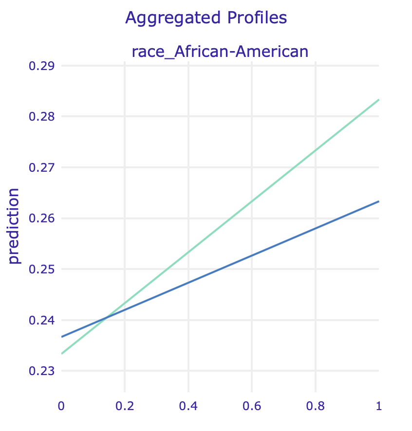{width=310px} {width=310px} {width=140px}

*PDP for two race variables for regular model and model fitted on data without sex*

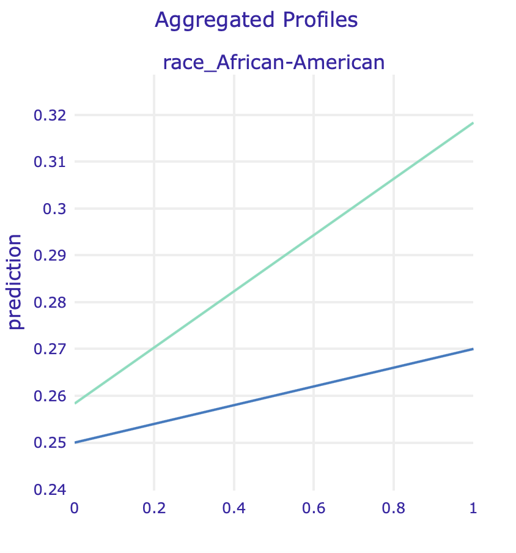{width=310px} 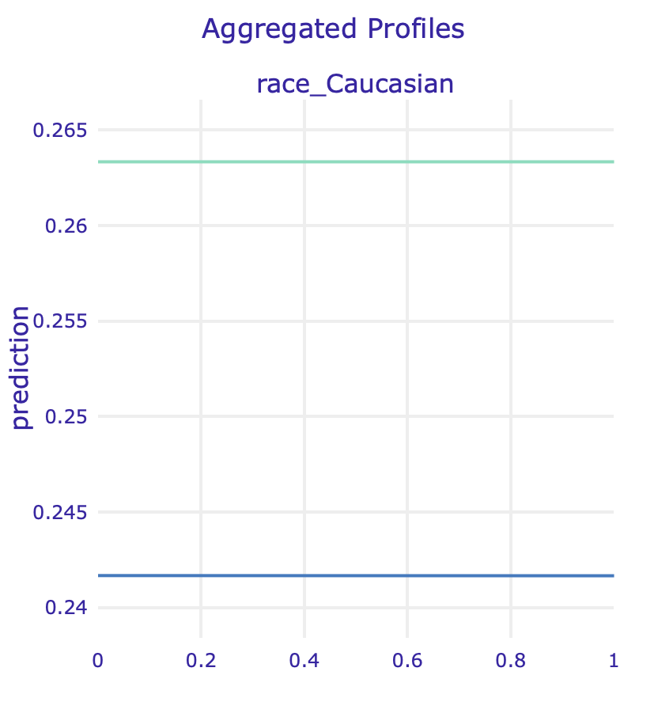{width=310px} {width=140px}
*ALE for two race variables for regular model and model fitted on data without sex*

### Instance specific

To further verify our claims we have performed an instance level analysis using Ceteris Paribus on observations with the most accurate predictions.

{width=370px} {width=370px}

*Left: Ceteris Paribus plots for race and sex variables for a selected true positive instance. Right: Ceteris Paribus plots for race and sex variables for a selected true negative instance. Based on our XGBoost model for predicting recidivism*

Our model has been fitted on real world data full of systematic bias, making it unfair towards African-Americans, as Ceteris Paribus freezes all the other factors.

Another question arises whether we observe a gender bias, because both models - ours and COMPAS - seem to drastically change their predictions for some of the male subjects when controlling for other factors.

From the perspective of a data scientist it might seem that bias is not such an important issue: if data shows that certain individuals are more likely to be classified as reoffending, then our models should include that information.

We do not know, however, how existing racial bias influenced the actual data: what if white people were simply less often arrested, had fewer charges and more let go with a warning? This scenario is not very difficult to imagine.

Since COMPAS is widely used by judges and parole officers, we need to include their viewpoint: they need a reliable, unbiased tool to help them determine the likelihood of individuals reoffending. 

It is therefore our social duty to attempt at creating such a tool and do our best to make sure no existing biases are further propagated.

### Models without protected attributes

One way of dealing with the sensitive information is to remove it from a dataset. In order to examine whether this practice is of any use, we analyzed three versions of models without sensitive information: without race, without sex, and without both race and sex.

Results in terms of mean cross-validational ROC AUC are very similar, which might suggest that we not much information is lost by dropping these sensitive variables.

|       | ALL   | NO RACE | NO SEX | NO RACE NO SEX  | 
|:-----:|:----------:|:-----------:|:----------:|:-----:|
| **ROC AUC** |   0.7162     |   0.7154     | 0.715   | 0.714 |

How is this possible since race was so high in the importance ranking? In the following analysis we will try to identify potential spots where this information could be hidden.

#### Model without race 
An XGBoost model with the same hyperparameters has been fitted to the data with race variables removed.

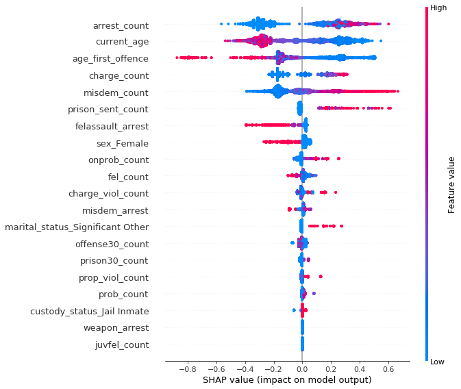{width=600px}

*SHAP summary plot for model predicting recidivism without race variables*

The most influencial attributes remain the same, but with no race present other variables like number of prison sentences (**prison_sent_count**) become much more important than before (6th position vs 11th in previous model), suggesting an association between them and race.

Similar conclusion comes from looking at the Partial Dependence Plot (left) and Accumulated Local Effect of this feature: its impact skyrockets for model without race.

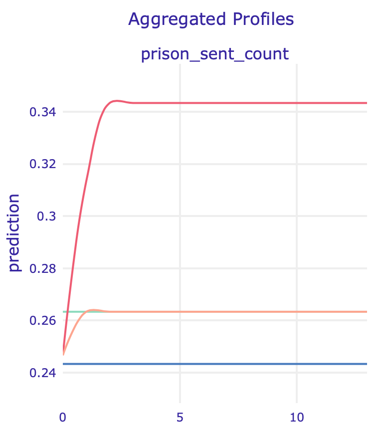{width=310px} 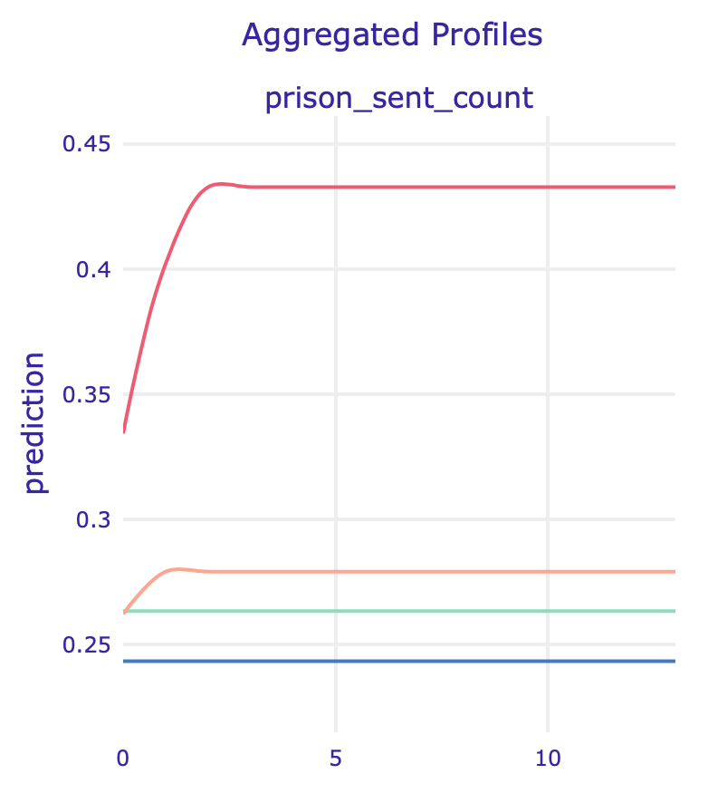{width=310px} {width=140px}

*PDP (left) and ALE (right) plots for number of prison sentences*

#### Model without sex 
Another XGBoost model with the same hyperparameters has been fitted to the data without sex variables.

{width=600px}

*SHAP summary plot for model predicting recidivism without sex variables*

One of the variables potentially "hiding" the impact of sex is marital status, but the effect is much harder to notice since the dataset is very imbalanced with the majority of male defendants.
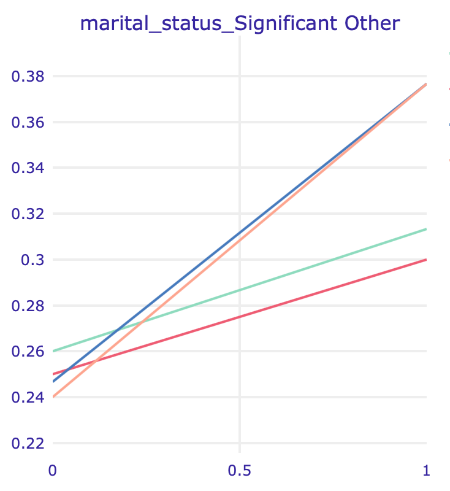{width=310px} 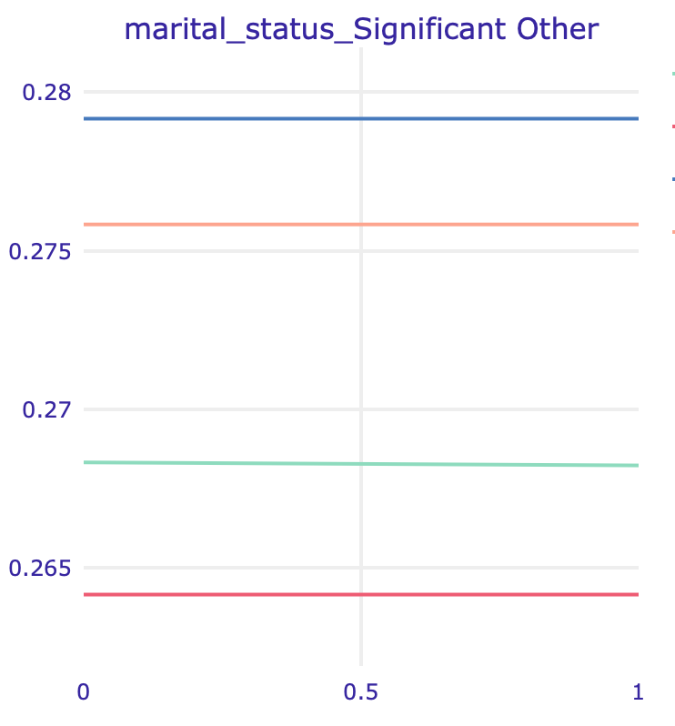{width=310px} {width=140px}

*PDP (left) and ALE (right) plots for marital status: Significant Other*

#### Model without both race and sex

{width=600px}

In this model, apart from the variables described above, a feature that suddenly got important is the number of times in prison at least 30 days (**prison30_count**). In the PDP (left) and ALE (right) plots below we can see another strange behaviour: models without sensitive information have strikingly different predictions for defendants with high values of this feature.

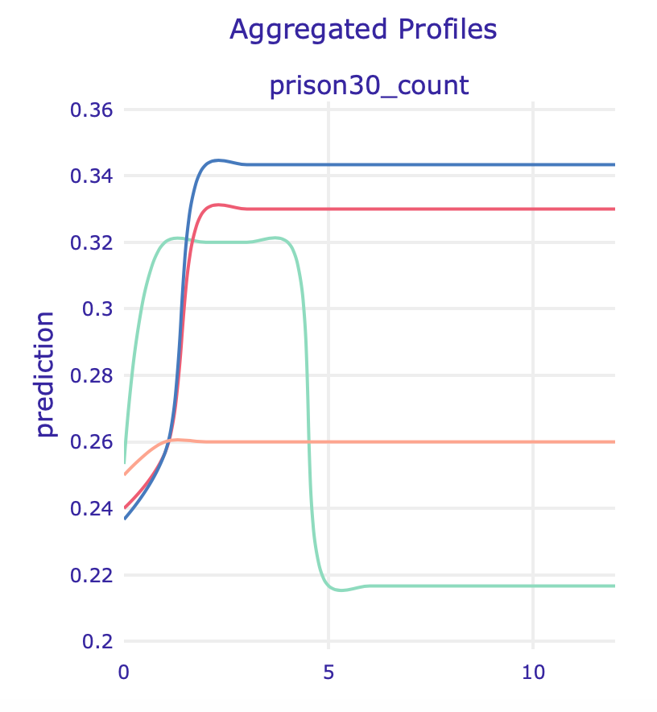{width=310px} 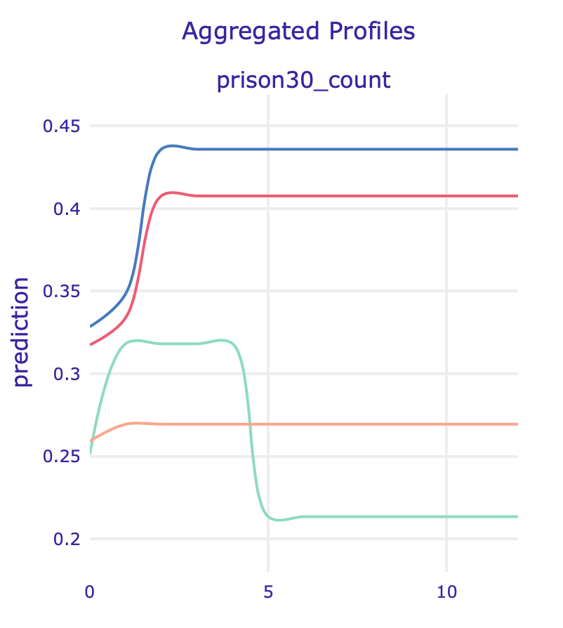{width=310px} {width=140px}

#### Summary
Removing each of the sensitive variables from the training dataset altered a little the model structure -- new features climbed up the feature importance ranking. More detailed analysis revealed potential spots in which sensitive information could have "hidden"", as models drastically changed behaviour after dataset modifications. Although some of them can be harmless or even valuable adjustments, model's creator should always have in mind potential consequences of downright removal of the attributes. In the following section we will try a different approach to bias mitigation, which does not include discarding any variables.

## Fairness

### Overview

The topic of fairness in machine learning has been widely studied and has progressed intensively in recent years. One of the tools that emerged was AIF360, described in @bellamy2018ai – an IBM package that assembles together the most important fairness metrics, explanation, and bias mitigating techniques, that will be used in the following analysis.

### Models
In order to mitigate bias in our model, we used an algorithm called Prejudice Remover, described in @prejudice_remover.
According to the authors, 
“prejudice means a statistical dependence between a sensitive variable, S, and the target variable, Y, or a non-sensitive variable, X.”

We analyzed the results using the following fairness metrics:

* **Average Odds Difference** 
$$ \frac{(FPR_{unpriv}-FPR_{priv})+(TPR_{unpriv}-TPR_{priv})}{2}$$
* **Statistical Parity Difference**, which stands for
probability of favorable outcome for unprivileged instances subtracted by probability of favorable outcome for privileged instances
* **Equal Opportunity Difference**, also called true positive rate difference: true positive rate on unprivileged instances minus true positive rate on privileged instances)
* **Theil Index** which is a special case of generalized entropy index with alpha = 1
* **1-min(DI, 1/DI) **
where DI stands for Disparate Impact -- probability of favorable outcome for unprivileged instances divided by probability of favorable outcome for privileged instances.

All metrics definitions are from AIF360 documentation.
For all of them, the value close to zero indicates a fair model. 

Model performance was measured with balanced accuracy defined as the average of recall (ratio of true positives / (true positives + false negatives) obtained on each class. Most of the metrics were significantly lowered by the Prejudice Remover.

| Model   | best balanced acc | AOD | SPD  | EOD | TI | 1-min(DI, 1/DI)
|:---------:|:----------------:|:------:|:------:|:------:|:------:|:------:|
|  before PR   | 0.696725 | 0.245144 | 0.273759 | 0.276377 | 0.159040 | 0.4581 |
|  after PR    | 0.630832 | 0.022063 | 0.051394 | 0.013318 | 0.223687 | 0.1240 |

**What does it mean for the defendants?**

The following analysis of mismatch was conducted using thresholds with the best balanced accuracy for both of the models on the test set with 1146 randomly chosen observations. 

PR -- model after using Prejudice Remover, 
XGB -- regular XGBoost model

|            | ALL PR | ALL XGB | BLACK PR  | BLACK XGB | WHITE PR | WHITE XGB
|:---------:|:----------------:|:------:|:------:|:------:|:------:|:------:|
|  Correctly classified as reoffending  | 30 | 293 | 9 | 198 | 19 | 73 |
|  Correctly classified as innocent   | 720 | 499 | 343 | 195 | 281 | 226 |
|  Incorrectly classified as reoffending  | **17** | **238** | **3** | **151** | **10** | **65** |
|  Incorrectly classified as innocent   | **379** | **116** | **229** | **40** | **97** | **43** |

As a result of prejudice removal we observe a large shift in classification: number of black people incorrectly classified as reoffending dropped from 151 to 3 (drop from 65 to 10 for white people), suggesting that the algorithm did in fact remove the negative bias towards them. Unfortunately, it is largely caused by PR's aversion to classify anyone as risky of recidivism, resulting in an increase of those misclassified as innocent from 116 (for regular model) to 379. 

Is saving potentially innocent people from being wrongfully misjudged more important than defending their community from possible future reoffences of those mistakenly classified as unlikely to reoffend? 
An answer to this question should be based on a careful evaluation of potential risks of propagating biases and prejudice and gains coming from model accurately predicting likelihood of recidivism, contributing to the safer society, it is, therefore, much beyond the scope of this analysis.

## Summary and conclusions 

In this paper we focused on COMPAS scores modelling and developing our own solutions for predicting recidivism. We explored model explanations in search of potential racial and gender biases present in our model along with potential ways to guarantee model fairness. 

Based on results, we conclude that the publicly available data is not rich enough to properly reconstruct COMPAS scores. However, our experiments show that our recidivism classification models yield better results not only than our models trained on COMPAS, but also the raw COMPAS scores, according to ROC AUC calculated on test set.

We also showed that the best-performing XGBoost models do indeed show racial bias, but using a Prejudice Remover approach we were able to significantly increase model fairness at the cost of reduced accuracy.

### Next steps

Potential next steps involve further research focused on identifying and mitigating biases -- AIF360 offers several debiasing algorithms that can be applied to this problem. It would also be very beneficial to acquire new, preferably larger datasets and use them to perform all of the analyses conducted previously on data from Broward County.

