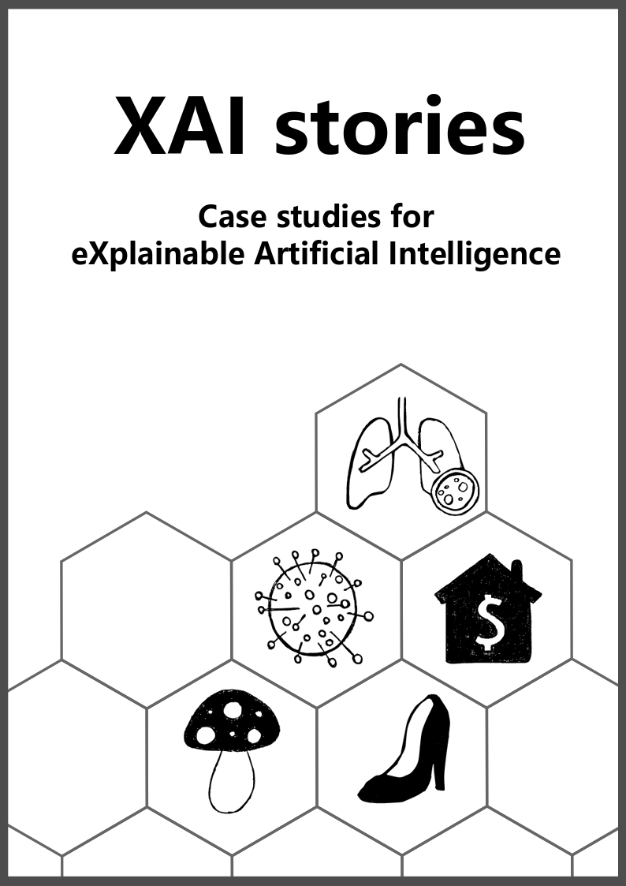

--- 
title: "XAI Stories"
author: ""
date: "`r Sys.Date()`"
documentclass: krantz
bibliography: [book.bib, packages.bib]
biblio-style: apalike
link-citations: yes
colorlinks: yes
lot: False 
lof: False
site: bookdown::bookdown_site
description: "Case studies for eXplainable Artificial Intelligence"
graphics: yes
cover-image: images/cover.png
---

```{r setup, include=FALSE}
options(
  htmltools.dir.version = FALSE, formatR.indent = 2, width = 55, digits = 4
)
output <- knitr::opts_knit$get("rmarkdown.pandoc.to")
is.html = !is.null(output) && output == "html"
```

# Preface {-}

```{r cover, cache=FALSE, out.width="500", fig.align="center", echo=FALSE, eval = is.html}

```


Machine learning has a number of applications. Very often, however, machine learning predictive models are treated as black boxes which can be automatically trained without worrying about the domain in which they are used.

The development of XAI tools allows to x-ray these black boxes. In the following chapters we show example applications of different XAI techniques to real-world problems.


TODO: write more about how the course

This book is the result of a student projects for [Interpretable Machine Learning](https://github.com/pbiecek/InterpretableMachineLearning2020) course at University of Warsaw and Warsaw University of Technology. Each team has prepares one case study for selected XAI technique.

This project is inspired by a fantastic book [Limitations of Interpretable Machine Learning Methods](https://compstat-lmu.github.io/iml_methods_limitations/) created at the Department of Statistics, LMU Munich.
We used the LIML project as cornerstone for this reopsitory.

Cover by @kozaka93


This book is licensed under the [Creative Commons Attribution-NonCommercial-ShareAlike 4.0 International License](http://creativecommons.org/licenses/by-nc-sa/4.0/).


\mainmatter

# Foreword {-}

TODO: write more about the book

<!-- Technical setup -->
## Technical Setup {-}
The book chapters are written in the Markdown language.
The simulations, data examples and visualizations were created with R [@rlang] and Python.
The book was compiled with the bookdown package.
We collaborated using git and github.
For details, head over to the [book's repository](https://github.com/pbiecek/xai_stories).


